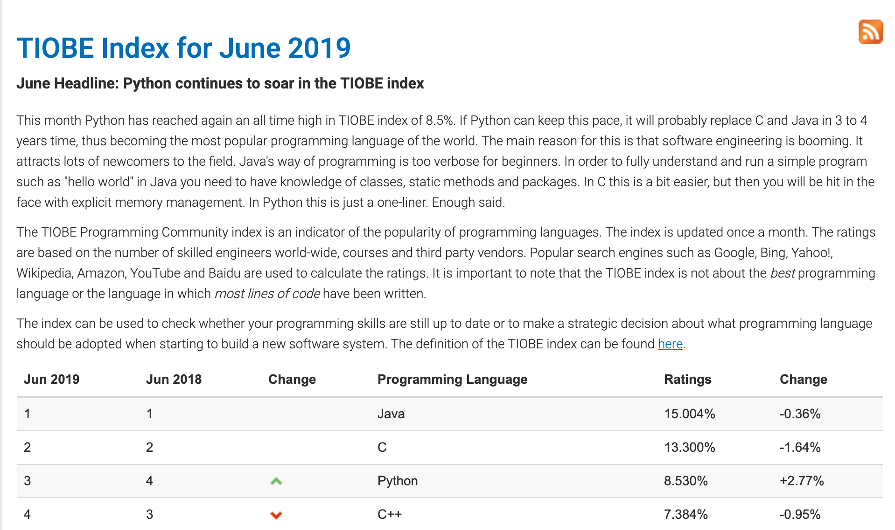
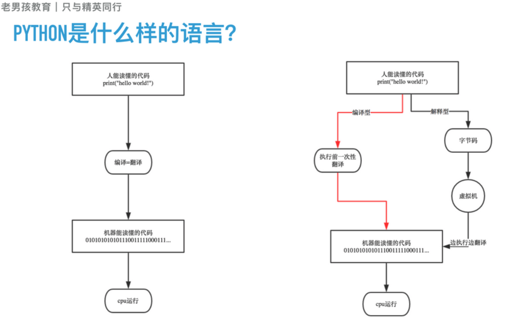
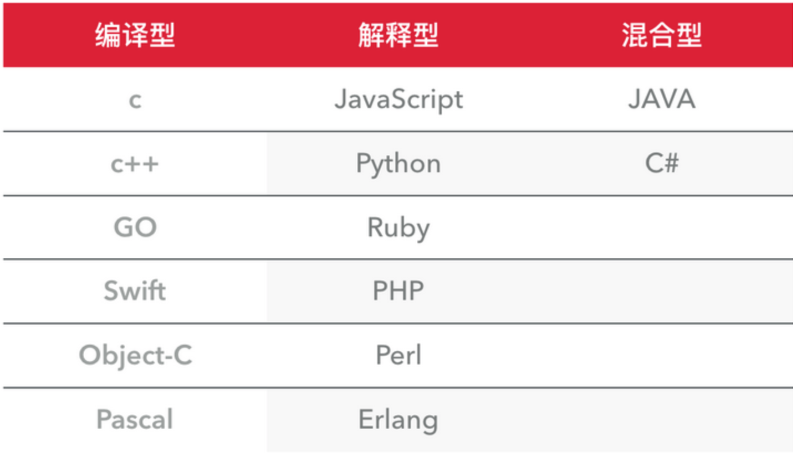
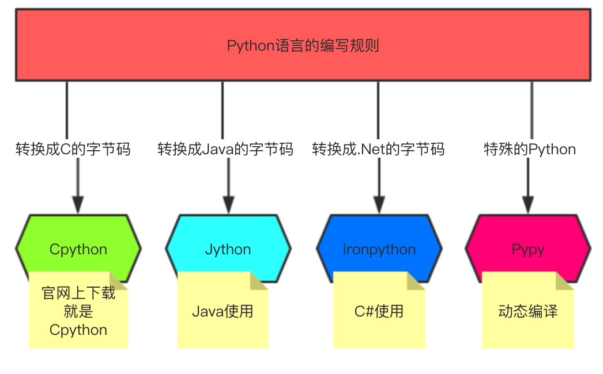

# 一. [Python 简介](01 Python简介.html)

   ### 1.1 Python的出生

​	python的创始人为吉多·范罗苏姆（Guido van Rossum）。1989年的圣诞节期间，吉多·范罗苏姆（中文名字：龟叔）为了在阿姆斯特丹打发时间，决心开发一个新的脚本解释程序，作为ABC语言的一种继承。  

（龟叔：2005年加入谷歌至2012年，2013年加入Dropbox直到现在，依然掌握着Python发展的核心方向，被称为仁慈的独裁者）。

### 1.2 Python的今世

2019年6月的TIOBE排行榜，Python占据第三的位置， Python崇尚优美、清晰、简单，是一个优秀并广泛使用的语言。

​	据当前来看Python在TIORB排行榜中,位居第三.Python崇尚优美、清晰、简单，是一个优秀并广泛使用的语言.

​	Python整体呈上升趋势，反映出Python应用越来越广泛并且也逐渐得到业内的认可！

####  1.2.1 Python的主要应用领域:

- **云计算**: 云计算最火的语言， 典型应用OpenStack

- **WEB开发**: 众多优秀的WEB框架，众多大型网站均为Python开发，Youtube, Dropbox, 豆瓣。。。典型WEB框架有Django

- **科学运算、人工智能**: 典型库NumPy, SciPy, Matplotlib, Enthought librarys,pandas

- **系统运维**: 运维人员必备语言

- **爬虫**:通过代码来模拟人进行页面访问,对信息进行批量的获取

- **金融**：量化交易，金融分析，在金融工程领域，Python不但在用，且用的最多，而且重要性逐年提高。原因：作为动态语言的Python，语言结构清晰简单，库丰富，成熟稳定，科学计算和统计分析都很牛逼，生产效率远远高于c,c++,java,尤其擅长策略回测'

- **图形GUI**: PyQT, WxPython,TkInter

#### 1.2.2 Python在哪些公司被使用:

- 谷歌：Google App Engine 、code.google.com 、Google earth 、谷歌爬虫、
- Google广告等项目都在大量使用Python开发
- CIA: 美国中情局网站就是用Python开发的
- NASA: 美国航天局(NASA)大量使用Python进行数据分析和运算
- YouTube:世界上最大的视频网站YouTube就是用Python开发的
- Dropbox:美国最大的在线云存储网站，全部用Python实现，每天网站处理10亿个文件的上传和下载
- Instagram:美国最大的图片分享社交网站，每天超过3千万张照片被分享，全部用python开发
- Facebook:大量的基础库均通过Python实现的
- Redhat: 世界上最流行的Linux发行版本中的yum包管理工具就是用python开发的
- 豆瓣: 公司几乎所有的业务均是通过Python开发的
- 知乎: 国内最大的问答社区，通过Python开发(国外Quora)
- 春雨医生：国内知名的在线医疗网站是用Python开发的
- 除上面之外，还有搜狐、金山、腾讯、盛大、网易、百度、阿里、淘宝 、土豆、新浪、果壳等公司都在使用Python完成各种各样的任务。

### 1.3 Python的历史

- 1989年，为了打发圣诞节假期，Guido开始写Python语言的编译器。Python这个名字，来自Guido所挚爱的电视剧Monty Python’s Flying Circus。他希望这个新的叫做Python的语言，能符合他的理想：创造一种C和shell之间，功能全面，易学易用，可拓展的语言。
- 1991年，第一个Python编译器诞生。它是用C语言实现的，并能够调用C语言的库文件。从一出生，Python已经具有了：类，函数，异常处理，包含表和词典在内的核心数据类型，以及模块为基础的拓展系统。
- Granddaddy of Python web frameworks, Zope 1 was released in 1999
- Python 1.0 - January 1994 增加了 [lambda](https://en.wikipedia.org/wiki/Lambda_calculus), [map](https://en.wikipedia.org/wiki/Map_(higher-order_function)), [filter](https://en.wikipedia.org/wiki/Filter_(higher-order_function)) and [reduce](https://en.wikipedia.org/wiki/Fold_(higher-order_function)).
- Python 2.0 - October 16, 2000，加入了内存回收机制，构成了现在Python语言框架的基础
- Python 2.4 - November 30, 2004, 同年目前最流行的WEB框架Django 诞生
- Python 2.5 - September 19, 2006
- Python 2.6 - October 1, 2008
- Python 2.7 - July 3, 2010
- In November 2014, it was announced that Python 2.7 would be supported until 2020, and reaffirmed that there would be no 2.8 release as users were expected to move to Python 3.4+ as soon as possible
- Python 3.0 - December 3, 2008
- Python 3.1 - June 27, 2009
- Python 3.2 - February 20, 2011
- Python 3.3 - September 29, 2012
- Python 3.4 - March 16, 2014
- Python 3.5 - September 13, 2015
- Python 3.6 - December 16,2016

### 1.4  Python是什么编程语言

​	编程语言主要从以下几个角度为进行分类，编译型和解释型、静态语言和动态语言、

​	强类型定义语言和弱类型定义语言，我们主要通过编译型和解释性来划分Python是什么编程语言

#### 1.4.1 **编译型与解释型**

​	**编译器**是把源程序的每一条语句都编译成机器语言,并保存成二进制文件,这样运行时

​	计算机可以直接以机器语言来运行此程序,速度很快; 

​	而**解释器**则是只在执行程序时,才一条一条的解释成机器语言给计算机来执行,

​	所以运行速度是不如编译后的程序运行的快的. 

​	为什么会有编译型好解释型语言是因为计算机不能直接认识并执行我们写的语句,它只能认识机器语言(是二进制	的形式)	

**编译型**
　　  优点：编译器一般会有预编译的过程对代码进行优化。因为编译只做一次，运行时不需要编译，所以编译型语言的程序执行效率高。可以脱离语言环境独立运行。

　　  缺点：编译之后如果需要修改就需要整个模块重新编译。编译的时候根据对应的运行环境生成机器码，不同的操作系统之间移植就会有问题，需要根据运行的操作系统环境编译不同的可执行文件。

**解释型**
　　  优点：有良好的平台兼容性，在任何环境中都可以运行，前提是安装了解释器（虚拟机）。灵活，修改代码的时候直接修改就可以，可以快速部署，不用停机维护。

　　  缺点：每次运行的时候都要解释一遍，性能上不如编译型语言。

#### 1.4.2 **动态语言和静态语言**

​	通常我们所说的动态语言、静态语言是指动态类型语言和静态类型语言。

​	(1）动态类型语言：动态类型语言是指在运行期间才去做数据类型检查的语言，也就是说，

​	在用动态类型的语言编程时，永远也不用给任何变量指定数据类型，该语言会在你第一次赋值给变量时，

​	在内部将数据类型记录下来。Python和Ruby就是一种典型的动态类型语言，其他的各种脚本语言如

​	VBScript也多少属于动态类型语言。

(2）静态类型语言：静态类型语言与动态类型语言刚好相反，它的数据类型是在编译其间检查的，

也就是说在写程序时要声明所有变量的数据类型，C/C++是静态类型语言的典型代表，

 其他的静态类型语言还有C#、JAVA等。

#### 1.4.3 **强类型定义语言和弱类型定义语言**

(1）强类型定义语言：强制数据类型定义的语言。也就是说，一旦一个变量被指定了某个数据类型，

 如果不经过强制转换，那么它就永远是这个数据类型了。

举个例子：如果你定义了一个整型变量a,那么程序根本不可能将a当作字符串类型处理。

强类型定义语言是类型安全的语言。

(2）弱类型定义语言：数据类型可以被忽略的语言。它与强类型定义语言相反, 

一个变量可以赋不同数据类型的值。

强类型定义语言在速度上可能略逊色于弱类型定义语言，但是强类型定义语言带来的严谨性能够有效的避  

免许多错误。另外,“这门语言是不是动态语言”与“这门语言是否类型安全”之间是完全没有联系的！

例如：Python是动态语言，是强类型定义语言（类型安全的语言）; VBScript是动态语言，是弱类型定义语

言（类型不安全的语言）; JAVA是静态语言，是强类型定义语言（类型安全的语言）。

通过上面这些介绍，我们可以得出. **Python是一门动态解释性的强类型定义语言。**

### 1.5 Python的种类

- **Cpython**

　　Python的官方版本，使用C语言实现，使用最为广泛，CPython实现会将源文件（py文件）

​        转换成字节码文件（pyc文件），然后运行在Python虚拟机上。

- **Jyhton**

　　Python的Java实现，Jython会将Python代码动态编译成Java字节码，然后在JVM上运行。

- **IronPython**

   　Python的C#实现，IronPython将Python代码编译成C#字节码，然后在CLR上运行。（与Jython类似）

- **PyPy（特殊）**

　　Python实现的Python，将Python的字节码字节码再编译成机器码。

看了这么多内容,感觉好厉害已近迫不及待的想要动手去试试了,我不得不说,还是需要在稍等一下.我们需要安装一下Python解释器
