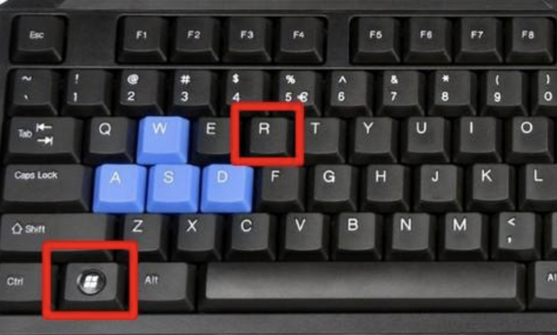
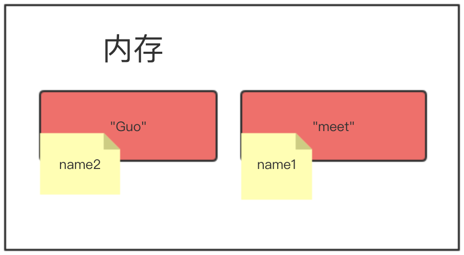
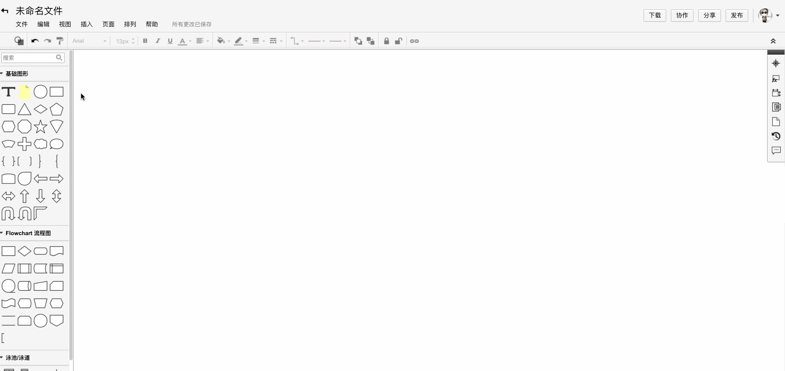

## 一. Python入门

### 1.1 输出

使用Windows系统使用**Notepad++**创建一个文本,文本中的内容如下:

```python
print("hello world")
```

写完后一定要记得保存,保存完后我们打开我们的终端,Windows系统的找到图下的两个键:



使用Mac系统的电脑首先打开 启动台 — 其他 — 终端 — 输入 vim 文件名字 然后按键盘i 进行输入然后退出的时候按一下esc键 发现文件的左下角有个**:** 然后在这个位置输入wq! 回车就行了,具体的请看图下实例


我们现在都打开了终端后再终端中输入以下命令:

```python
python 文件名.py
```

注意点:python和文件名是有空格的,再次确定一下大家的现在是不是都是这个样子的:


print() 括号里面的内容就是要输出的内容,如果是文字和字母需要用英文的引号引起来,数字直接写就可以啦

```PYTHON
python2写法:      
     print  'hello world'

python3写法:    
     print('hello world')
我们学习的python3版本,python2版本是什么样也要知道
```

我们现在成功的将英文的打印出来了,现在我们使用这种方式打印一下中文的内容吧!

```python
print("你好 世界")
```

然后将文件保存了,保存后我们在来终端上运行一次.是不是都出现报错了,出现报错这个是正常的,我们只需要在加上一句话就可以了.

```python
#conding:utf-8
```

这局话必须要加在文件的第一行,这个是告诉解释器当文件中出现中文的时候使用utf-8的编码进行查看

### 1.2 变量

 什么是变量?

**变量**就是把程序运行的中间结果临时存在内存中,以便后续代码使用

这个知识点用在哪呢?
变量在程序中经常会被使用

变量如何使用?

```
name = "meet"  
```

这样就是在定义一个变量,我们具体说一下定义变量

```python
name 是一个变量名
=    是一个赋值操作  赋值就是将值交给name
'Meet'  是一个值
```

变量的作用:**昵称,就是代指内存中某个地址中的内容**


我们定义变量的时候,可以任意起名字吗? 应该是有规则的吧,我们来看看变量定义的规则

#### 1.2.1 变量的定义规则

- 变量名由字母,数字,下划线组成

- 变量名禁止使用数字开头

- 禁止使用Python中的关键字以及内置函数的名字

  关键字如下:

  ```
  ['False', 'None', 'True', 'and', 'as', 'assert', 'break', 'class', 'continue', 'def', 'del', 'elif', 'else', 'except', 'finally', 'for', 'from', 'global', 'if', 'import', 'in', 'is', 'lambda', 'nonlocal', 'not', 'or', 'pass', 'raise', 'return', 'try', 'while', 'with', 'yield']
  ```

- 不建议使用中文和拼音
- 变量名要具有意义
- 变量名区分大小写
- 推荐写法:
  
  - 驼峰体: AgeOfOldboy = 56
  - 下划线:age_of_oldboy = 56

这是两种写法,你们觉得那种的比较清晰.是不是第二种看着比较清晰,第一种猛的一看还以为是AngelaBaby呢

我们现在定义一个变量知道了,看看定义多个变量

#### 1.2.2 变量的赋值

```python
name1  =  'Meet'
name2  =  'Guo'
```

此时的name1的值是Meet,name2的值是Guo,我们来看看下边的这个变量



现在我们在内存中开辟了两个空间,分别给不同的内存地址贴上不同的标签,我们来看看下边的代码

```python
name1  =  'Meet'
name2  =  name1
```


现在的这个name1是meet,name2是name1 也就是name2现在用的是name1的值,name2的值就是meet

我们在来看一下变量的小高级使用:

#### 1.2.3 变量的小高级

```python
age1 = 18
age2 = age1
age1 = 12
age3 = age2
print(age1,age2,age3)
```

我们先来分析一下这个结果是怎样的,在运行看结果是否和你想的一样

如果结果和你想的不一致,你需要注意了.咱们代码的运行是从上至下的执行,并且在内存中只能用一个名字相同的标签.



```python
age = 12
age = 12 + 1
age1 = age + 1
print("我今年:",age1)
name1 = 'alex'
name2 = name1
name1 = 'wusir'
name3 = name2
打印name1,name2name3分别对应的值是什么
```

通过上边的小高级和练习我们可以得出一个宗旨,代码是从上向下执行,并且便签只能有一份,相当于一个变量名只能代指一个值

### 1.3常量

   常量就是将变量名大写,尽量保持不更改的一种量
   这个常量有是干什么的呢   其实我生活中就有一些定死了的量
   比如生日,身份证等
   咱们代码中，也应该有一些这样的东西，咱们从设计之初就是不让任何人改变的，所以这个东西就是常量。

### 1.4注释

   在你写代码时，有些代码写的比较经典，或者过于复杂，你一眼看不出来，怎么办，比如在文言文中，有些出处或者偏难怪的文字，你是不是不理解？
   那么怎么办呢？是不是就得有简单说明。

   注释就是做这个的,我们来看一下怎么用

```python
   # 这个就是给这一行进行注释,注释后的代码不会执行
   '''
   这种的是多行注释, 什么是多行注释啊,其实很简单就是咱们注释的内容可以
   进行换行
   '''
```

看个示例:

```python
# print('hello') 这样就是对这个代码进行注释,并且这个代码不会执行

'''
print(1)
print(2)
这种就是多行注释,这样的注释也不会执行
'''
```

### 1.5 基础数据类型:

什么是数据类型？

我们人类可以很容易的分清数字与字符的区别，但是计算机并不能呀，计算机虽然很强大，但从某种角度上看又很傻，除非你明确的告诉它，1是数字，“汉”是文字，否则它是分不清1和‘汉’的区别的，因此，在每个编程语言里都会有一个叫数据类型的东西，其实就是对常用的各种数据进行了明确的划分，你想让计算机进行数值运算，你就传数字给它，你想让他处理文字，就传字符串类型给他。Python中常用的数据类型有多种，今天我们暂只讲3种， 数字、字符串、布尔类型

int是整型;也就是我们从小就接触的数学中的整数,整型在计算机中运于计算和比较

在32位机器上int的范围是:   -2\*\*31～2**31-1，即-2147483648～2147483647

在64位机器上int的范围是: -2\*\*63～2**63-1，即-9223372036854775808～9223372036854775807

目前这些数字已经够你用了吧. 注意这些是整数.

#### 1.5.1 整型

```python
num1 = 2
num2 = 3
print(num1 + num2)
# 结果: 5   
# 整型就和我们学的数学一样可以进行加减乘除

```

str是字符串;也就是我们从小就接触的中文,如果我们在程序中直接把中文写入,程序是不能分辨这是个什么鬼东西.所以我们要遵循一种规则让计算机能够识别,这个规则就是只要是用引号引起来就是字符串

在Python中,凡是用引号引起来的,全是字符 .

字符  可以用单引号，双引号，或者三引号引起来，没有什么区别，只是一些特殊的格式需要不用的引号 比如：

```python
msg = "My name is Alex , I'm 22 years old!" 这个就需要单双引号配合。
msg =

""" 今天我想写首小诗，

来歌颂我的同桌，

你看他那乌黑的短发，

好像一只炸毛鸡。

"""
想写多个内容还需要使用换行的时候,就需要三引号。
```

数字类型可以做运算,字符串可以吗??

#### 1.5.2 字符串

字符串加法

```python
#字符串的拼接
s1 = 'a' 
s2 = 'bc'
print(s1 + s2)
```

字符串乘法

```PYTHON
str*int name = '坚强'
print(name*8)
```

#### 1.5.3 布尔值

bool是布尔值,布尔值中一共分为俩个状态

True    就是真

False   就是假

例如我们想让计算机帮我们计算一下两个数的比较大小

```python
print(3>7)
 
结果: False
 
print(7>3)
 
结果: True

```

我们现在简单的认识了这三个基础数据类型,我们在学习一下用户输入

### 1.6  输入

咱们在登录一些网页和QQ的时候是不是常常会让咱们输入账户或者密码的情况,

这样的情况在程序中会大量的存在，接下来咱们自己实现一个登录时候要输入的功能

```PYTHON
s = input('请输入你喜欢的东西') 
```

input就是固定格式,他是输入的意思 括号里边的内容是提示是给用户看的提示语句,用户输入的内容让input接收了然后赋值给了字符串s

#### 2.6.1 输入用户名


```PYTHON
#!/usr/bin/env python
#-*- coding:utf-8 -*-

#将用户输入的内容赋值给name变量
python2的写法
name = raw_input("请输入用户名:")
print name

python3的写法
name = input("请输入用户名:")
print(name)
```

需要注意的是input程序交互获取到的内容都是字符串,我们看下面的简单示例:

```PYTHON
num = input('请输入数字:')
print(num + 5)

结果:
请输入数字:6
Traceback (most recent call last):
  File "D:/python_object/test.py", line 350, in <module>
    print(num + 5)
TypeError: must be str, not int
```

报错了,提示我们类型错误,数字和字符串是不能相加的.可是我们输入的明明是数字啊.其实我们看着输入的是
数字,但是input获取到的都是字符串

这个知识点用在哪里?

在工作中如果需要用户输入一些个人信息比如账号，密码，性别，爱好等，即是你需要将你输入的信息传递给程序当中，那么就需要用到用户交互input。

**注意**   

```PYTHON
在Python2 中使用raw_input              获取的都是字符串

在Python3 中使用input                  获取的都是字符串
```

### 1.7 流程控制

你在生活中是不是经常遇到各种选择，比如玩色子，猜大小，比如选择走那条路回家？Python程序中也会遇到这种情况，这就用到了if语句。

这个功能就是Python中的流程控制语句if。
那么如何使用这个功能呢？（下面就是）

```PYTHON
if 条件: #引号是将条件与结果分开。
	结果# 四个空格，或者一个tab键，这个是告诉程序满足这个条件的结果。切记空格和tab键不能混合使用
```

#### 1.7.1 判断条件 if

```PYTHON
age = input("输入年龄:")
if int(age) >= 18:
    print("成年了,能干成年人的事了")
```

#### 1.7.2 二选一 if else

```PYTHON
age = input('请输入您的年龄:')
if int(age) > 18:
    print('你可以去网吧尽情的嗨皮了')
else:
    print('你现在还不行啊!')
```

以上这种写法是让用户输入内容,然后进行比较,如果一个条件成立那就执行print,为了明确的区分改执行哪些部分,当条件成立后执行缩进的代码

然后程序就退出了.下边的else就不会在执行了

#### 1.7.3 多个选项进行单选或不选 if elif 

```PYTHON
num = input('请输入要比较的数字:')
if int(num) >= 22:
    print('可以扯证了')
elif int(num) >= 18:
    print('成年了,可以干一些成年的事了')
elif int(num) < 18:
    print('还是小屁孩')
```

以上写法就是我们做的单选题一样,三个分支判断中只要有个成立,其余都不在执行  

#### 1.7.4 多个选项进行单选(必选) if elif else

```python
num = input("请输入要比较的数字:")
if num > 60:
	print("大了")
elif num < 60:
	print("小了")
else:
	print("猜对了")
```

#### 1.7.5 嵌套if 

```PYTHON
name = input('请输入名字:')
if name == 'meet':
    age = input('请输入年龄:')
    if int(age) == 18:
        print('输入全部正确')
    else:
        print('年龄输入错误!')
else:
    print('名字输入错误!')
```

这样写法很常用,这样我们就可以明确的知道用户输入的名字和年龄那个是错误的,并且还做一个判断如果名字正确后在进行判断密码

