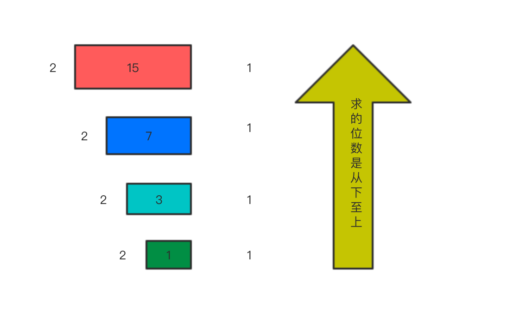
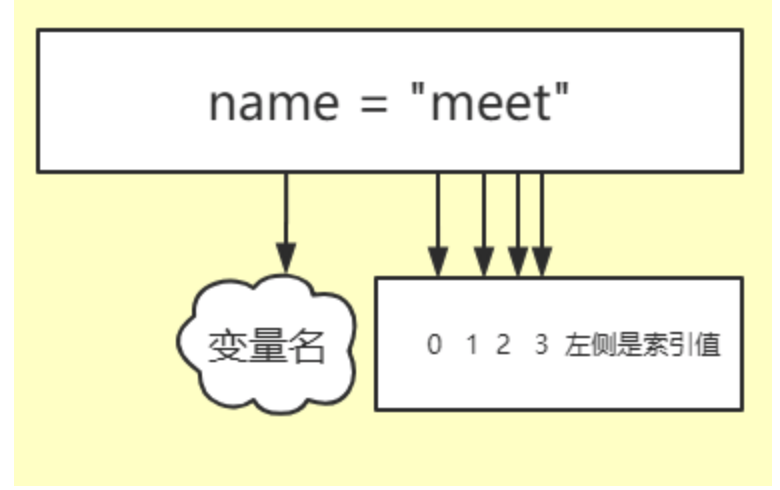
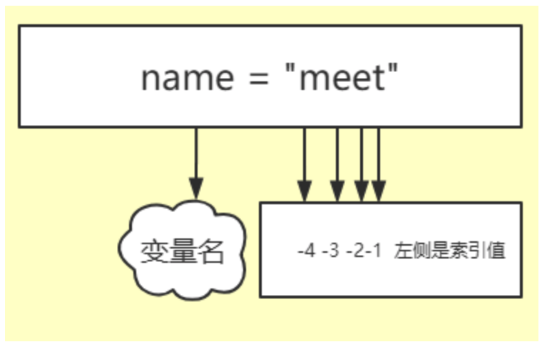
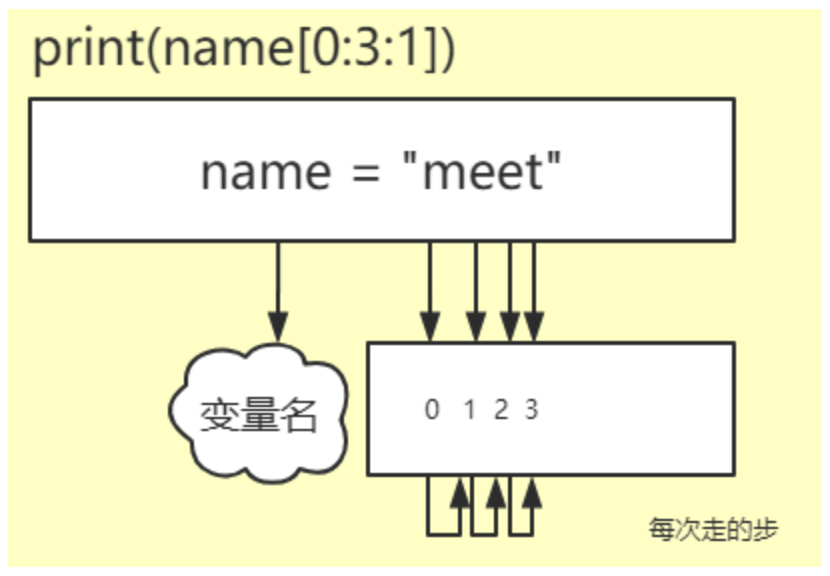
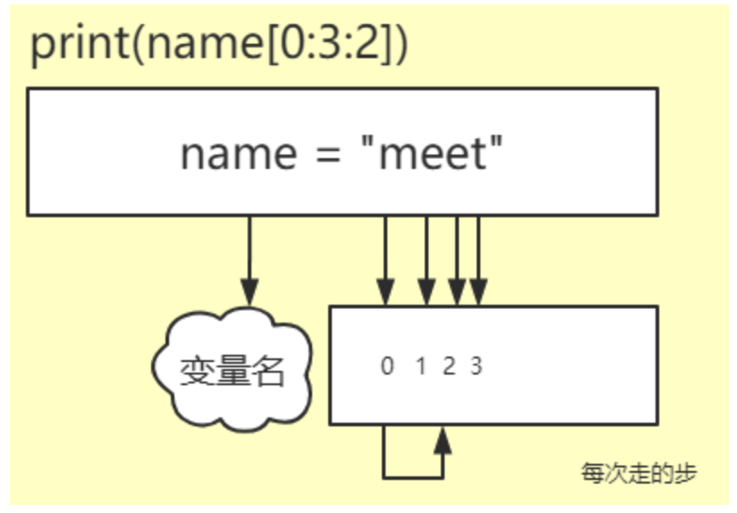
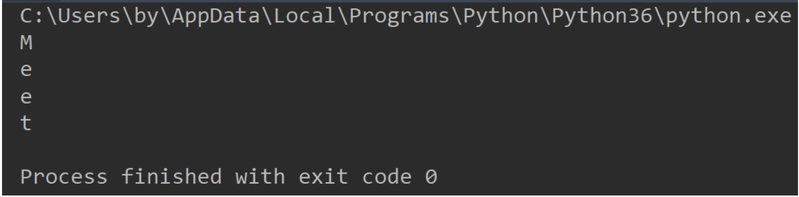

# Python基础数据类型一

## 一. 整型(int)

整型在Python中的关键字用int来表示; 整型在计算机中是用于计算和比较的

在python3中所有的整数都是int类型. 但在python2中如果数据量比较大. 会使用long类型.

在python3中不存在long类型 整数可以进行的操作:

### 1.1 整数的加

```PYTHON
a = 10
b = 20
print(a + b)
结果:
30
```

### 1.2 整数的减

```PYTHON
a = 10
b = 20
print(b - a)
结果
10
```

### 1.3 整数的乘

```PYTHON
a = 10
b = 20
print(a * b)
结果:
200
```

### 1.4 整数的除

```PYTHON
a = 10
b = 20
print(b / a)
结果:
2.0
# 注意点:当我们使用Python3的时候我们除法获取到时浮点数,也就是小数,但是使用Python2的时候使用除法获取的就是整数
```

### 1.5 整数的整除

```PYTHON
a = 10
b = 20
print(b // a)
结果:
2
```

### 1.6 整数的取余

```PYTHON
a = 5
b = 2
print(a % b)
结果:
1
```

### 1.7 整数的次方(幂)

```PYTHON
a = 5
b = 2
print(a ** b)
结果:
25
```

注意点: 在Python2中存在long(长整型) 但是在Python3中long(长整型)不存在

我们常说的数字都是10进制的,数字表示的形式有很多种,我们今天就简单的说一下十进制数和二进制数

他们之间是如何转换,我们先来看看十进制转换二进制,使用一种整除法,例如十进制的数是15我们想要知道15的二进制是多少就除以2获取他的余数然后从下向上将这些余数拼到一起,就是用以下的方法



我们现在知道怎么将十进制的数转换成二进制,那就再来看看怎样将二进制的数转换成十进制.

我们使用110001来举例,现在想要获取到这个二进制的数然后转换成十进制 要进行如下操作

```python
接下来的计算我们就从右向左计算,用最右侧的数乘以2的0次方,依次向左推
1*2**0 + 0*2**1 + 0*2**2 + 0*2**3 + 1*2**4 + 1*2**5    换算下来就是
  1    +    0   +   0    +   0    +   16   +   32 =  49 
```

我们使用这种办法就能将二进制的数转换成十进制的数

## 二. 布尔值(bool)

布尔值(bool) 判断真假

```PYTHON
python语法      人类语言       计算语言
   True           真            1
   False          假            0
```

### 2.1 字符串转换数字

```PYTHON
n = int('22')
print(n)
结果:22
#注意点:字符串中的内容必须是阿拉伯数字才能强行转换
```

### 2.2 数字转换字符串

```PYTHON
n = str(22)
print(n)
结果:
2   看到的效果是像是数字,实际上就是字符串,我们可以使用type查看类型
```

### 2.3 数字转换布尔值

```PYTHON
n = bool(4)  # bool(-1) 结果也是True
print(n)
结果:
True
注意点: 使用bool转换的时候只要是非0的都为True
```

### 2.4 布尔值转换数字

```PYTHON
n = int(True) # int(False) 结果是0
print(n)
结果:
1
```

### 2.5 字符串转换布尔值

```PYTHON
n = bool(' ')
print(n)
结果:
True   
注意点: 只要字符串中的内容不为空,所得到的结果就是True
```

### 2.6 布尔值转换字符串

```PYTHON
n = str(True)
print(n)
结果:
True　这是一个字符串的True
```

## 一.字符串(str)

字符串, 用于存储一些少量的数据,在Pyhton当中只要是用引号引起来的就是字符串,字符串中的每个单独的字母汉字都是一个元素.

在第一天的时候咱们简单的认识了下字符串,今天我们好好的来认识一下这个让你又喜又优的字符串

我们来回忆下字符串是不是可以进行加减乘除

### 1.1 字符串加

```PYTHON
a = '世界'
b = '你好'
print(a + b)
结果:
世界你好
```

通过刚刚我们的测试发现字符串也是可以进行加法操作的,字符串相加其实有个专业的名词 --- 字符串拼接;相加的规则就是必须都是字符串才能相加

字符串中是不能进行减法和除法操作的,通过这句话就能得知字符串是可以进行乘法操作的,我们立马来看一下:

### 1.2 字符串乘

```PYTHON
a = '坚强'
print(a * 8)
结果:
坚强坚强坚强坚强坚强坚强坚强坚强
```

字符串的乘法就是将多个字符串拼接到一起,乘法的规则:只能是字符串和数字相乘

我们回顾完第一天的字符的内容,那就来看看咱们今天要讲的内容是什么??

### 1.3 索引(下标)

大家在上学的时候就会发现在一个班有的同学的名字是一样的,最后大家为了好区分就有了外号,我们每个人都有个学号,其实学校就是为了防止重名找错人,

学号就是一种能够保证唯一且准确的手段,这种手段在计算机中存在,这种手段叫做索引,也有人称之为下标.



图上就是对"meet"字符串进行索引排号,其实图上有一点大家不难看出m对应的是数字0,如果让我们人来给排号.下意识的会从1开始.

因为我们从小的时候就是从1开始数数的,但是在计算机中数数确实要从0开始,其实这个点也是对程序的入门.

以后在碰到这种类似的问题我们就知道是从0开始计数,废话不多说我们来看看,我说的到底行不行.

```PYTHON
name = 'meet'
# 索引  0123
print(name[0])
结果:
m　

```

细心的老铁们会发现这[ ]是干啥的,这个是一个查找,我不知道字符串中第一个是什么,但是我知道第一个的索引,我就可以通过这个方式来查看

比方:我不知道这个学生叫什么,但是我知道他的学号.我也可以通过学号找到这个同学.

图上这个是从左到右的一种排序,其实还有一种从右像左的排序,看下图:



这个查看和上边的一样,只不过是索引排序的方式不一样,他这次的排列序号是从右向左并且还是以-1开始,这里的-1其实就是表示我们的倒数第一个

-2表示倒数第二个,这样排列,如果我们的字符串比较长的时候想要获取最后一个就完全可以使用-1,看以下示例:

```PYTHON
name = 'meet'
# 索引 -4-3-2-1
print(name[-1])
结果:
t

```

告诉大家一个小技巧,刚开始的我们不能明确的区分这个字符串中的每个索引的时候,我们就先把每个字母对应的索引写下来,这样就方便我们查找

上边我们说完了索引,你们就以为完事了是吗?不是滴,咱们还有来个内容没有进行讲解,分别是切片和步长

### 1.4 切片

切片又是什么呢?我们先来看一个示例:

```PYTHON
name = 'meet'
# 索引  0123
print(name[0:3])
结果:
mee

```

[第一个位置是开始:第二个位置是终止]中间必须使用分号,这样的写法就是从索引0开始获取到索引3结束　　

这个结果是不是和大家想的有点出入啊,大家肯定认为获取到的内容是meet,但是为什么是mee呢,因为终止的索引是不包含的获取的是这个区间的内容

想想咱们在买肉的时候,有一个块整肉,这块整肉就后边有点肥,不想要是不是就让老板给切掉了,我们就买前边的部分啊.在生活中这种神操作就是切片

我也知道你们刚接过这些东西,使用起来不是很熟悉,尤其是切片这部分,在悄悄的告诉你们个小技巧,下次当看到切片中终止位置的时候把这个数减一就ok啦

### 1.5 步长

步长又是什么呢?先看示例:

```PYTHON
name = 'meet'

# 索引  0123

print(name[0:3:1])

结果:

mee

```



发现我在中括号中最后一个位置写了一个东西,也没什么变化,是的没有变化,因为我们不写的时候他默认就是1,我们换个数字在来看看

```PYTHON
name = 'meet'

# 索引  0123

print(name[0:3:2])

结果:

me　

```

这又是啥情况呢?想想我开始告诉大家的中括号里第一个参数是起始位置,第二参数是终止位置,第三个参数现在告诉大家是步长(每次走几步)



当步长设置为2的时候,咱们只需要用起始位置0加上步长2,结果也就2然后在把索引为2的找到,2在加上步长2就是4,当要查找索引4是发现终止索引就是3,

所有不会进行查找.最终的结果就是me.

### 1.6 字符串方法详解

#### 1.6.1 全部大写

```PYTHON
name = 'alex'
new_name = name.upper()
print(new_name)
# 把这个字符串全部变成大写

```

#### 1.6.2 全部小写

```PYTHON
name = 'ALEX'
new_name = name.lower()
print(new_name)
# 把这个字符串全部变成小写　　

```

**应用场景:**

```PYTHON
# 字符串大小写做验证码
y_z_m = 'O98k'
y_z_m_input = input("请输入验证码(O98k)")
user = input('请输入账号:')
pwd = input('请输入密码:')
if y_z_m == y_z_m_input:
    if user == 'alex' and pwd == '8520':
        print('登陆成功!')
    else:
        print('登录失败')
else:
    print('验证码错误!')

```

#### 1.6.3 以什么开头　　

```PYTHON
name = 'alex'
new_name = name.startswith('a')
if new_name:
    print('是以a开头')
# 判断这是不是字符串是不是以a开头的

name = 'alex'
new_name = name.startswith('e',2,5)
if new_name:
    print('是以e开头')
    
# 我们可以指定从哪个位置开始哪个位置结束
```

#### 1.6.4 以什么结尾　　

```PYTHON
name = 'alex'
new_name = name.endswith('x')
if new_name:
    print('是以x结尾')
# 判断这是不是字符串是不是以x结尾的

name = 'alex'
new_name = name.endswith('x',2,5)
if new_name:
    print('是以x结尾')
# 判断这是不是字符串是不是以x结尾的
```

#### 1.6.5 统计出现的次数

```PYTHON
name = 'alexdasx'
new_name = name.count('a')
print(new_name)
# 统计name这个字符串中a出现的次数　　

```

#### 1.6.6 字符串替换　　

```PYTHON
name = 'alexdasx'

new_name = name.replace('sx','sb',1)

print(new_name)

# 替换字符串中的内容以外 我们可以指定要替换的次数

```

#### 1.6.7 去除头尾两边的空格  换行符/制表符　　

```PYTHON
name = ' alexdasx '
new_name = name.strip() # 默认去除的头尾两端的空格,换行符,制表符 也可以自己指定
print(new_name)
# 去除头尾俩遍的空格和换行符

```

#### 1.6.8 分割

```PYTHON
name = 'alexdasx'
new_name = name.split("x")  # 默认以空格,换行符,制表符分隔
print(new_name)
# 也可以通过x将字符串name进行切割

name = 'alexdasx'
new_name = name.split("x",maxsplit=1)  # 默认以空格,换行符,制表符分隔
print(new_name)
# 切割后的内容是一个列表
```

#### 1.6.9 字符串格式化

```PYTHON
name = 'alexdasx{}'
new_name = name.format('说的对')
print(new_name)
# 字符串格式化
# 可以按照顺序去填充,也可以按照索引去填充,也可以按照关键字填充
```

**练习**　　

```PYTHON
将 name 变量对应的值中所有的"l"替换为 "p",并输出结果
将name变量对应的值中的第一个"l"替换成"p",并输出结果
将 name 变量对应的值根据所有的"l"进行分割,并输出结果。
将name变量对应的值根据第一个"l"分割,并输出结果。
请输出 name 变量对应的值的第2个字符?
请输出 name 变量对应的值的前3个字符?
请输出 name 变量对应的值的后2个字符?
```

#### 1.6.10 is系列

 判断是不是十进制的数字,返回的是布尔值

```PYTHON
name = 'alexdasx'
new_name = name.isdecimal()
print(new_name)

# 判断是不是十进制的数字,返回结果是布尔值
```

判断是不是数字和字母以及中文,返回的是布尔值

```PYTHON
name = 'alex7dasx'
new_name = name.isalnum()
print(new_name)

# 判断是不是数字和字母以及中文,返回结果是布尔值
```

判断是不是字母和汉字,返回的是布尔值

```PYTHON
name = 'alexdasx'
new_name = name.isalpha()
print(new_name)

# 判断是不是纯字母和汉字,返回的是布尔值
```

**练习**

```PYTHON
输⼊⼀个字符串，要求判断在这个字符串中⼤写字⺟，⼩写字⺟，数字， 其它字符共出现了多少次，并输出
```

#### 3.6.11 获取长度

目前我们写的内容还比较少,如果有一个很长很长的字符串,要是一个一个数是不是很累呢,Python给咱们提供了一个方法就是获取长度的.

长度获取示例:

```PYTHON
name = "Meet"
print(len(name))
结果:
4　
这里需要大家清楚一点的就是,len是一个公共的方法,不是字符串的方法只有用字符串.的方式使用的才是字符串的方法
```

我们现在能够轻松的获取到到长度,现在我有这么一个字符串 name = "Meet",请使用while循环获取到字符串中每个元素并打印,效果图入下:



#### 3.6.12 使用while循环打印单个元素

```PYTHON
name = "Meet"
count = 0
while count < len(name):
    print(name[count])
    count = count + 1
```

以上这个写法是没有问题的,你们来看下边这个会不会简单些

#### 3.6.13 for循环

```PYTHON
name = "Meet"
for i in name:
    print(i)
    
for i in "Meet":
    print(i)
```

上边的这个东西叫做for循环, for是关键字    i是一个变量    后边的name是要被循环的内容,他会把这个name指向的字符串里的每个元素打印出来

 for循环是可以循环的数据结构:

- 字符串(str)
- 列   表(list)
- 元   祖(tuple)
- 字   典(dict)
- 集   合(set)

唯独不能进行循环的就是 整型(int)和布尔值(bool)