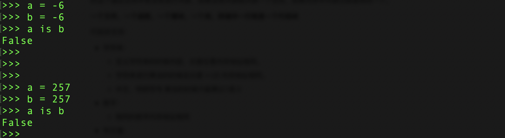

# 小数据池

## 一、==  id is

我们讲解一下小数据池,这个东西不是咱们开发中需要使用的,那为什么要进行讲解呢,第一个是要解决你的疑问,第二个是现在面试会问.那我们就正式开始讲解了

两个等于我们都用过了，就是进行判断的。判断两边的值是否一样，例如

```python
a = 10
b = 10
print(a == b) 

a = "alex"
b = "alex"
print(a == b)
```

这样就是查看==两边的值是否一样.

我们再来看看id是个什么东西，我们知道在定义一个变量的时候，内存空间中其实是开辟了一块空间，这个开辟的空间是有号码的，我们来试一下

```python
name = "alex"
print(id(name))  
# 4327876736
```

is 也是判断,只不过这次判断的是两边值得内存地址是否相同,我们来看看

```python
a = 10
b = 10
print(id(a))  # 4304849568
print(id(b))  # 4304849568
print(a is b)  # True
# 获取的结果是True是因为a和b的内存地址是相同的
```

发现一个问题 == 和 is 都是True啊,这个is是判断内存地址是否一样,Python考虑到我们会经常定义一些值,需要开辟空间和销毁空间,它底层就维护了一个小数据池,这个小数据就是规定一个区间使用的是同一个内存地址,比如小数据池中数字的区间范围是 -5 ~ 256,我们刚刚测试的10在区间内,所以获取到的是相同的内存地址,我们试一试不在范围的数字

```python
a = 500
b = 500
print(id(a)) # 4344811120
print(id(b)) # 4344811120
print(a is b) # True
```

不再区间内，怎么内存地址还是一样的啊。这就要说说python的另一个机制 — 代码块

代码块是防止我们频繁的开空间降低效率设计的，当我们定一个变量需要开辟空间的时候，它会先去检测我们定义的这个值在空间中有没有进行开辟，如果没有开辟就开辟一个空间，如果内存中开辟过就使用同一个。

**一个文件，一个函数，一个模块，一个类，终端中一行就是一个代码块**

代码块支持：

- 字符串：
  - 定义字符串的时候内容，长度任意内存地址相同。
  - 字符串进行乘法的时候总长度 <=20 内存地址相同。
  - 中文，特舒符号 乘法的时候只能乘以1或 0
- 数字：
  - 相同的数字内存地址相同
- 布尔值：
  - 相同的内存地址相同

这就是我们为什么在pycharm中测试的时候都是True，我们现在去终端上测试一下数字的范围



当代码块和小数据池两个在一起，先执行代码块

我们知道了代码块支持的数据类型和支持怎样的操作，现在来看看小数据池的支持数据类型和范围：

小数据支持：

- 字符串：
  - 纯字母和数字的时候长度任意，内存地址相同。
  - 纯字母和数字乘法总长度 <= 20 内存地址相同。
  - 中文和特殊符号乘法的时候只能乘以 0 内存地址相同
- 数字：
  - -5 ～ 256 
- 布尔值：
  - True
  - False


小数据池和代码块都是Python内置的,咱们开发的时候不使用,他们统称为驻留机制,有了小数据池和代码块能够提升Python的效率

# 二.深浅拷贝

往往到了深浅拷贝的时候,就是大家最容易蒙的地方,这个比较重要为什么这么说呢,因为面试的时候必问

都认真听,争取一遍就过,一般面试的时候都结合着赋值一起问

我们先说赋值,赋值就是一个容器有多个标签

```
lst = [1,2,3,[6,7,8]]
```

我们在程序这样写,当成程序执行完这两行的时候,内容空间发生的变化就是下图:


一个列表用两个标签,通过标签lst 找到的和标签lst1找到的是同一个,图中的那些一长串数字就是内存地址,Python中是通过内存地址来查看值

```
lst1 = lst
lst.append(9)
```


我们通过lst这个标签找到这个列表然后添加一个9,再通过lst1找到这个列表也就多了一个9 因为lst和lst1都是贴在一个地方

我们再来说说浅拷贝,浅拷贝就是只拷贝第一层的元素

看例子:

```python
lst = [1,2,3,[6,7,8]]
# lst2 = lst[:] # 浅拷贝
lst2 = lst.copy()
```


**图中橙色的是新开辟的空间,浅蓝色的是数字类型,红色的列表类型**

这样就是浅拷贝,浅拷贝只把原列表中记录的内存地址拿到一个新开辟的列表中

```python
lst = [1,2,3,[6,7,8]]
lst2 = lst[:]
lst.append(9)
```


为什么lst1中没有添加,是因为咱们先进行的浅拷贝,浅拷贝把原列表中有的内存地址复制了一份放到新开辟的空间中,后期对原列表添加的内容新列表是不会有的,再看看下边的例子

```python
lst = [1,2,3,[6,7,8]]
lst2 = lst.copy()
lst[1] = "22"
```


我们修改成字符串"22" 就是在列表中将以前的内存地址更换成新开辟的空间地址

```python
lst = [1,2,3,[6,7,8]]
lst1 = lst.copy()
lst[-1].append(0)
```


因为我们对里边的列表进行修改,列表本身就是可变的数据类型,我们通过原列表修改最里层的小列表,小列表进行变化,新开辟的列表里存放就是小列表中的内存地址.在去查看的时候就有变动

我们接下来,来看看深拷贝是怎样的操作

```python
import copy
lst = [1,2,3,[6,7,8]]
lst3 = copy.deepcopy(lst)
```


我们通过上图可以发现浅拷贝和深拷贝在最后列表的位置内存地址不一样,深拷贝是自己单独开辟了一个新的空间,我们现在修改原列表和新开辟的列表没有任何影响.

通过上面的各种测试,总结以下规律:

- 赋值:
  - 两个或多个变量名指向同一个内存地址,有一个操作内存地址的值进行改变,其余的变量名在查看的时候都进行更改
- 浅拷贝:
  - 只拷贝列表中第一层的内存地址,原列表修改了不可变数据类型,新开辟的列表不进行变动,因为只是在原列表中将内存地址进行修改了,新开辟的列表中的内存地址还是用的之前的内存地址
  - 原列表对可变数据类型进行了添加,新开辟的列表中存放就是可变数据类型的地址,在去查看的时候就发现进行更改了
- 深拷贝:
  - 不管你修改原数据的不可变类型还是可变类型,新开辟的空间中都不会进行改变,因为可变数据类型新开辟了一个空间

# 三.集合

集合在python中也是一个数据类型,我们只用它自带的特性,其余的操作很少使用

集合在Pyhton中的关键字是set,也是以{}的形式展示 只不过集合是一个没有值得字典,为什么这么说呢??

因为集合中的元素要求是不可变的并且还是唯一的,我们就利用它是唯一来做去重

```python
lst = [1,3,4,112,23,1,3,1,41,12,3,1]
print(set(lst))  # 这样就没有重复的元素出现了,我们在将集合抓换成列表
list(set(lst)) # 这样就把没有重复的集合转成列表了
print(list(set(lst)))
```

集合是无序,可变的数据类型,说到可变我们就知道集合是能够增加和删除等操作的,我们来看看怎么操作

## set集合增删改查

增加

```python
s = {"刘嘉玲", '关之琳', "王祖贤"}
s.add("郑裕玲")
print(s)
s.add("郑裕玲") # 重复的内容不会被添加到set集合中
print(s)
s = {"刘嘉玲", '关之琳', "王祖贤"}
s.update("麻花藤") # 迭代更新
print(s)
s.update(["张曼⽟", "李若彤","李若彤"])
print(s)
```

删除　　

```python
s = {"刘嘉玲", '关之琳', "王祖贤","张曼⽟", "李若彤"}
item = s.pop() # 随机弹出⼀个.
print(s)
print(item)
s.remove("关之琳") # 直接删除元素
# s.remove("⻢⻁疼") # 不存在这个元素. 删除会报错
print(s)
s.clear() # 清空set集合.需要注意的是set集合如果是空的. 打印出来是set() 因为要和
dict区分的.
print(s) # set()
```

修改

```python
# set集合中的数据没有索引. 也没有办法去定位⼀个元素. 所以没有办法进⾏直接修改.
# 我们可以采⽤先删除后添加的⽅式来完成修改操作
s = {"刘嘉玲", '关之琳', "王祖贤","张曼⽟", "李若彤"}
# 把刘嘉玲改成赵本⼭
s.remove("刘嘉玲")
s.add("赵本⼭")
print(s)
```

查询　　

```python
# set是⼀个可迭代对象. 所以可以进⾏for循环
for el in s:
 print(el)
```

常⽤操作　　

```python
s1 = {"刘能", "赵四", "⽪⻓⼭"}
s2 = {"刘科⻓", "冯乡⻓", "⽪⻓⼭"}
# 交集
# 两个集合中的共有元素
print(s1 & s2) # {'⽪⻓⼭'}
print(s1.intersection(s2)) # {'⽪⻓⼭'}
# 并集
print(s1 | s2) # {'刘科⻓', '冯乡⻓', '赵四', '⽪⻓⼭', '刘能'}
print(s1.union(s2)) # {'刘科⻓', '冯乡⻓', '赵四', '⽪⻓⼭', '刘能'}
# 差集
print(s1 - s2) # {'赵四', '刘能'} 得到第⼀个中单独存在的
print(s1.difference(s2)) # {'赵四', '刘能'}
# 反交集
print(s1 ^ s2) # 两个集合中单独存在的数据 {'冯乡⻓', '刘能', '刘科⻓', '赵四'}
print(s1.symmetric_difference(s2)) # {'冯乡⻓', '刘能', '刘科⻓', '赵四'}
s1 = {"刘能", "赵四"}
s2 = {"刘能", "赵四", "⽪⻓⼭"}
# ⼦集
print(s1 < s2) # set1是set2的⼦集吗? True
print(s1.issubset(s2))
# 超集
print(s1 > s2) # set1是set2的超集吗? False
print(s1.issuperset(s2))
```

set集合本⾝是可以发⽣改变的. 是不可hash的. 我们可以使⽤frozenset来保存数据. frozenset是不可变的. 也就是⼀个可哈希的数据类型

```python
s = frozenset(["赵本⼭", "刘能", "⽪⻓⼭", "长桂"])
dic = {s:'123'} # 可以正常使⽤了
print(dic)
```

这个不是很常⽤. 了解⼀下就可以了

