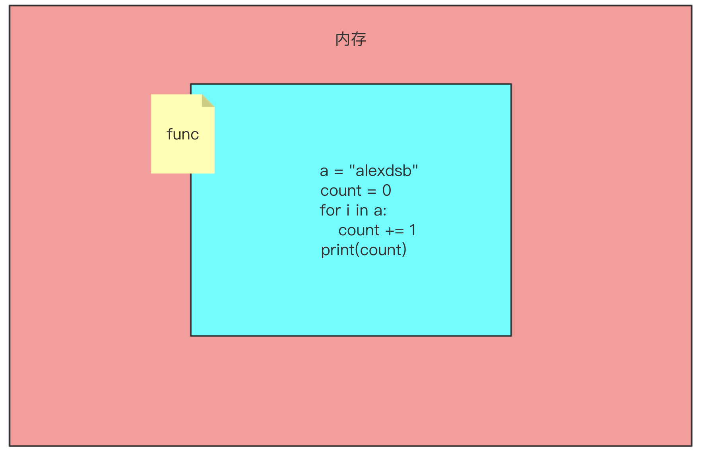
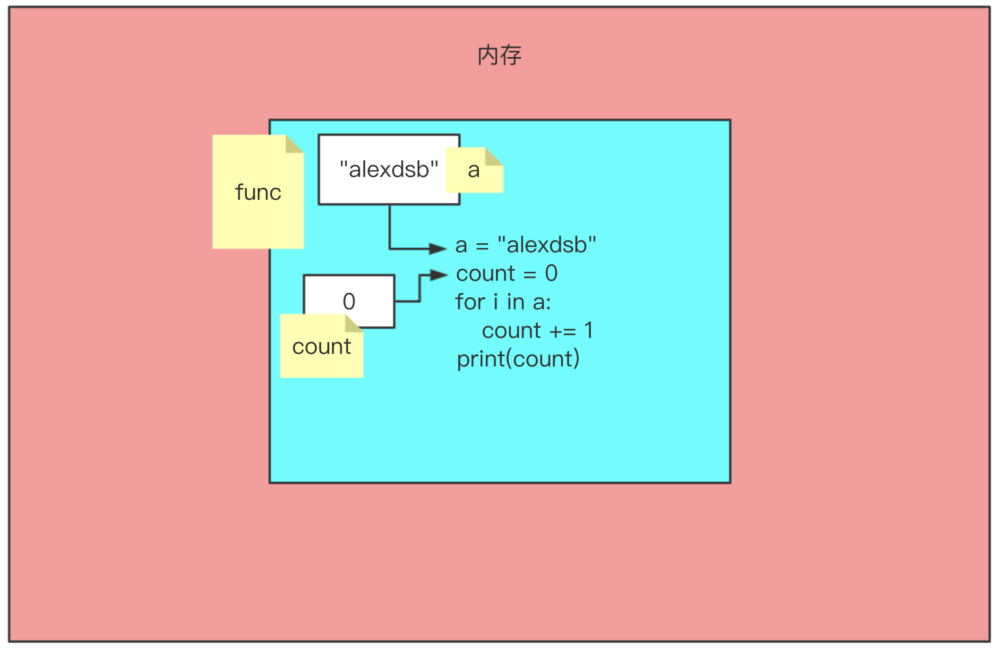

# Python 初始函数

## 一.函数介绍

我们目前为止,已经可以完成一些软件的基本功能了,现在我们自己来实现一个len,但是不能使用len

```python
a = "alexdsb"
count = 0
for i in a:
    count += 1
print(count)
```

我们现在实现了一个求长度,我还想让你们求一下列表和元组的长度 是不是就要将我们写的内容再次拿过来

我们在求一个字典的长度,也需要将我们写好的内容拿过来使用 好像咱们这个程序中好多都是一样的啊,我们能不能把这些代码封装起来,用的时候拿过来就用啊

## 二.函数定义

def 是python中关键字主要用来定义函数的

len这个是函数的名字

()这个括号是个神奇的东西,咱们后边会详细**盘**它

: 冒号是表示咱们这个语句写完了

函数体就是有4个空格的缩进

```python
def len():
  a = "alexdsb"
  count = 0
  for i in a:
      count += 1
  print(count)
```

我们来看一下函数的定义在内存空间发生了什么:



是的你没有看错,内存开辟了一个空间,但是里边存放是代码.

这样我就将咱们写的代码封装起来了,我们现在执行一下程序看看它会不会进行求长度,它并没有执行,我们来看看怎么能够执行上呢?

## 三.函数的调用

使用函数名加小括号就可以调用了  写法:函数名()  这个时候函数的函数体会被执行

```
def len():
  a = "alexdsb"
  count = 0
  for i in a:
      count += 1
  print(count)
 
len()  # 函数的调用
```

当我们调用执行的时候,才会执行func这个空间里的代码,执行的时候在开辟空间,这次是在func里边开辟的空间



现在就实现了求一次长度,我想要多求几次我就只需要

```
len()
len()
len()
```

直接调用定义好的函数就可以了 **大家都练习一下**

当我们执行完函数后,函数里开辟的空间就销毁了,我们如果想用函数里的值就需要从函数中传递出来

## 四. 函数的返回值

我们现在换一下例子,都是男同胞 大家都有哪方面的想法,就需要使用交友社交软件,我们现在来模拟一下使用社交软件的流程吧

```python
 def yue():
    print("掏出手机")
    print("打开默默")
    print("约一个妹子")  
yue()
```

咱们约完之后的得有个结果吧, 比如约的是萝莉小姐姐,还是大妈啊总得有个结果,那么这个结果

怎么来描述和获得呢? 这就涉及到函数的返回值啦

执行完函数之后,我们可以使用return来返回结果

```python
def yue():
    print("约你")
    print("约我")
    print("约他")
    return   
yue()
```

返回的是什么结果,返回的东西给谁了?? 返回值返回给了函数调用者 yue()就是函数的调用者 那就是返回给它了,我们来看看返回的什么

```python
def yue():
    print("约你")
    print("约我")
    print("约他")
    return   
ret = yue()
print(ret)
```

返回的结果是None,想想我们有的时候操作列表的方法 打印的结果就是None,我们所有用的字符串,列表的方法都是函数.

函数中遇到return,此函数就立马结束了.不在继续执行

```python
def yue():
    print("约你")
    print("约我")
    print("约他")
    return
  	print("大家一起约")
yue()
```

我们现在给return后边写一个返回值,我们试试返回个东西

```python
def yue():
    print("约你")
    print("约我")
    print("约他")
    return  "美女一枚"   
yue()
```

我们现在返回了一个字符串,我们来看一下

```python
def yue():
    print("约你")
    print("约我")
    print("约他")
    return '美女一枚'
girl =  yue()
print(girl)

结果:
约你
约我
约他
美女一枚
```

肯定好多朋友还是不明白上边怎么就打印美女一枚了,莫慌看下图:


```
1.定义了一个函数yue
2.调用函数
3.执行函数里的约你
4.执行函数里的约我
5.执行函数里的约他
6.返回给调用者一个字符串,这个调用者就是yue()
7.将返回的字符串通过一个等号赋值给白变量girl
8.打印变量girl的值
```

**函数的返回值可以有多个结果:**

```python
def yue():   
    print("约你")   
    print("约我")   
    print("约他")   
    return "美女一枚", "萝莉一枚"
girl = yue()
print(type(girl))   # tuple
```

当函数的返回值是多个的时候,返回的就是一个元组

### 4.1 总结

　　1.遇到return,此函数结束,return下面的代码将不会在执行

　　2.return 返回值

　　　　关于返回值:

　　　　　　如果return什么都不写或者干脆就没写return,返回的结果就是None

　　　　　　如果return后面写了一个值,返回给调用者这个值

　　　　　　如果return后面写了多个结果,返回给调用者一个tuple(元祖),调用者可以直接使用解构获取多个变量


OK,完美 可以得到结果了 但是我们约的方式是不是有点问题啊?陌陌现在还能约到吗?约不到了 我们换探探 那要是过几天探探也不行了

是不是会有一个新的替代品,那你们想有一个替代的,你就需要去改代码.是不是有点不合适了  最好的方式是想用什么约就用什么约  ok 我们也是可以实现的 ,我们就要在函数后边的括号里搞点事情了.

## 五.函数的参数

参数,也就是函数括号里的内容 函数在调用的时候指定一个具体的变量的值 就是参数.写法如下:

```
def 函数名(参数):

    函数体　
```

我们应该把代码改一下,能够实现我刚说的那种效果

```python
def yue(chat):

    print("拿出⼿手机")

    print("打开"+chat)

    print("找个漂亮的妹⼦子")

    print("约不约")


yue("陌陌")
yue("微信")
yue("探探")

结果:
拿出手机
打开陌陌
找个漂亮的妹⼦
约不约


拿出⼿机
打开微信
找个漂亮的妹⼦
约不约


拿出手机
打开探探
找个漂亮的妹⼦
约不约　

搞定了. 我们在调用yue的时候给chat一个值. 然后再执行函数体.  
```

如果我们再定函数的时候写了形参,在调用函数的时候没有传递值,调用的时候右边括号会发黄,所以我们必须要传递参数,参数要一一对应,不能多不能少.

### 5.1 参数

　　1.形参

　　　　写在函数声明的位置的变量叫形参,形式上的一个完整.表示这个函数需要xxx

　　2.实参

　　　　在函数调用的时候给函数传递的值.加实参,实际执行的时候给函数传递的信息.表示给函数xxx

　　3.传参

　　　　从调用函数的时候将值传递到定义函数的过程叫做传参

```python
def yue(chat):    # chat  形参   

    print("拿出手机")   

    print("打开"+chat)   

    print("找个漂亮的妹子")   

    print("约不约")

     

yue("陌陌")     # "陌陌"在这里就是实参

len("字符串")    # "字符串"在这里就是实参

print("麻花藤")    # "麻花藤"就是实参
```

### 5.2 参数的分类

#### 5.2.1 位置参数

　　约到现在,有没有想过这么一个问题,啥样的都约么? 哪里的都约么? 不一定吧.比如我现在在北京,我很寂寞,我喜欢小姐姐 

　　alex 在泰国,很寂寞 人妖就行了 .需求是不一样的 而我们现在的函数没有这些功能 那怎么办呢? 很简单 多来几个参数就好了

```python
def yue(chat,addr,age):    # chat  形参

    print("拿出手机")

    print("打开"+chat)

    print("找个" + addr +"附近漂亮的" + str(age) + "岁妹子")

    print("约不约")


yue("陌陌","北京",18)    # 实参

结果:

拿出手机

打开陌陌

找个北京附近漂亮的18岁妹子

约不约
```

上述代码分析: 在访问yue()的时候,我们按照位置的顺序分别把"陌陌","北京",18赋值给了chat,addr,age,在传参过程中.系统会按照位置把实参赋值到形参.

**形参就是一个变量名,实参就是值 传参就是在赋值**

```python
def func(addr,age):
	addr = "北京"
  age = 18      # 从实参到形参的过程中,函数体内部帮我做了变量的赋值
  print(addr)
  print(age)

func("北京",18)
```


**练习**

编写函数,给函数传递两个参数a,b  a,b相加 返回a参数和b参数相加的和

```
def f(a,b):
    c = a+b
    return c

num_sum = f(5,8)
print(num_sum)
结果: 13
```

编写函数,给函数传递两个参数a,b 比较a,b的大小 返回a,b中最大的那个数

```
def f(a,b):

    if a>b:

        return a

    else:

        return b

num_sum = f(5,8)

print(num_sum)
结果:8
```

比较大小的这个写法有点麻烦,我们在这里学一个三元运算符

```
def f(a,b):

    c = a if a > b else b  #当a>b就把a赋值给c,否则就把b赋值给c

    return c

msg = f(5,7)

print(msg)

结果:

7
```

#### 5.2.2 关键字参数

位置参数好不好呢?  如果是少量的参数还算OK, 没有问题. 但是如果函数在定义的时候参数非常多怎么办? 程序员必须记住, 我有哪些参数, 而且还有记住每个参数的位置, 否则函数就不能正常调用了. 那则么办呢? python提出了一种叫做关键字参数. 我们不需要记住每个参数的位置. 只要记住每个参数的名字就可以了 

```
def yue(chat, address, age):

    print("拿出手机")

    print("打开"+chat)

    print("找个"+address+"附近漂亮的"+str(age)+"岁妹子")

    print("约不约")


yue(chat="微信", age=18, address="北京")       # 关键字参数.

结果:

拿出手机

打开微信

找个北京附近漂亮的18岁妹子

约不约　
```

搞定, 这样就不需要记住繁琐的参数位置了.

#### 5.2.3 混合参数

可以把上面两种参数混合着使用. 也就是说在调用函数的时候即可以给出位置参数, 也可以指定关键字参数. 

```
# 混合参数 
yue("微信", age=18, address="上海")    # 正确.第一个位置赋值给chat, 后面的参数开始指定关键字.

yue(age="18", "微信", address="广州")  # 错误, 最开始使用了关键字参数, 那么后面的 微信的位置就串了, 容易出现混乱
```

注意: 在使用混合参数的时候, 关键字参数必须在位置参数后面

#### 5.2.4 总结

综上: 在实参的⾓角度来看. 分为三种:

　　1. 位置参数

　　2. 关键字参数

　　3. 混合参数,  位置参数必须在关键字参数前面

位置参数:

　　位置参数,按照位置来赋值,到目前为止,我们编写的函数都是这种

```
def yue(chat, address, age):   

    print("拿出手机")   

    print("打开"+chat)   

    print("找个"+address+"附近漂亮的"+str(age)+"岁妹子")   

    print("约不约")
```

默认值参数:

　　在函数声明的时候, 就可以给出函数参数的默认值. 在调用的时候可以 给出具体的值, 也可以不给值, 使⽤用默认值. 比如, 我们录入咱们班学生的基本信息. 通过调查发现. 我们班大部分学生都是男生. 这个时 候就可以给出⼀一个sex='男'的默认值. 

```
def stu_info(name, age, sex='男'):   

    print("录入学生信息")

    print(name, age, sex)   

    print("录入完毕")


stu_info("张强", 18)
```

注意:必须先声明在位置参数,才能声明关键字参数

 综上:在形参的角度来看

1. 位置参数

2. 默认值参数(大多数传进来的参数都是一样的, 一般用默认参数