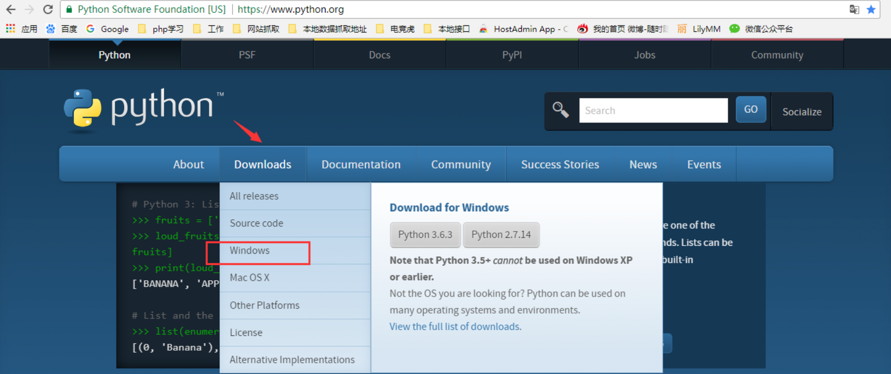
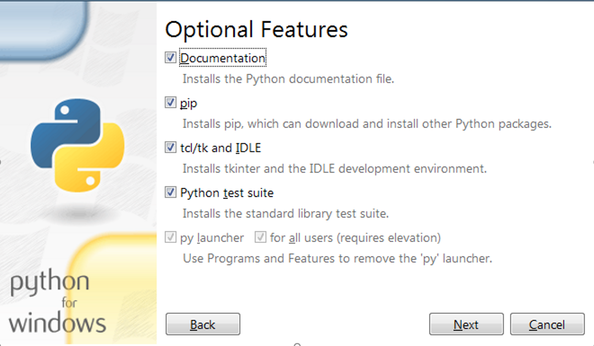
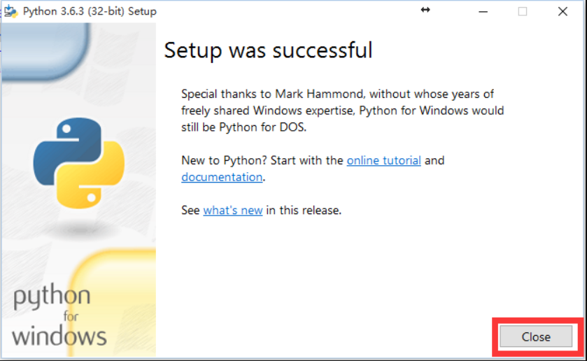
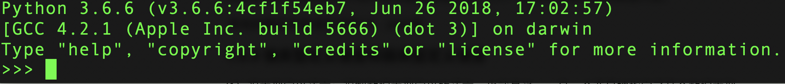
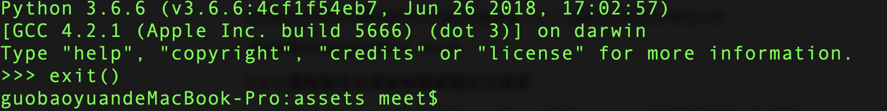

### 一.Python环境安装

#### 1.1打开官网：http://www.python.org 点击`Downloads`下载,如下图

#### 1.2下拉页面，选择对应版本：Python3.6.3，如下图

向下查找,找到Python 3.6.3

#### 1.3  根据系统选择对应的安装包,如下图

 根据当前系统的选择对用的,红色的是windows32位,绿色的是windows64位

#### 1.4下载完成，如下图

下载完成后找到下载的目录,然后用鼠标左键双击

#### 1.5 安装

#### 1.6 执行下一步

#### 1.7 勾选安装

#### 1.8 安装进度

#### 1.9 安装成功

#### 1.10 验证是否配置成功

打开电脑的终端(黑窗口),输入 python回车进去python解释器,返回的结果入下图:

#### 1.11 退出终端中的python

在终端中 >>> 输入exit() 如下图:

