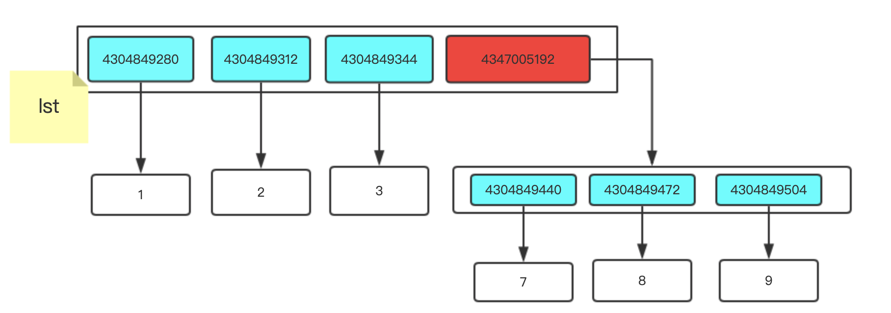
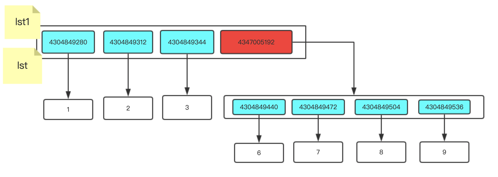
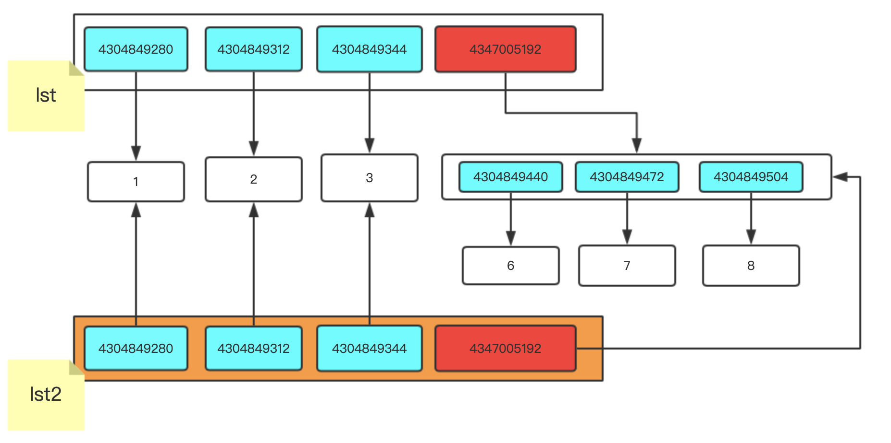
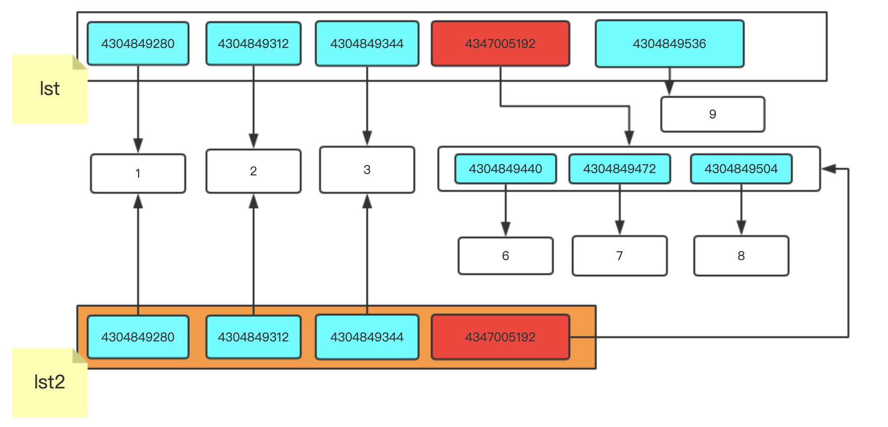
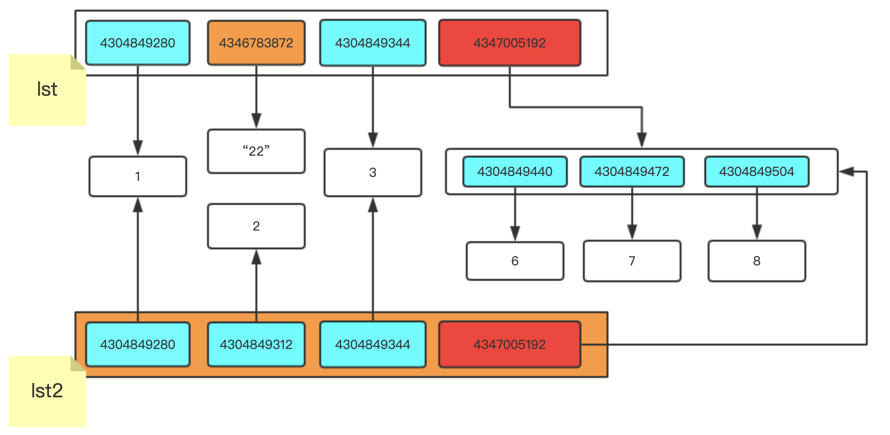
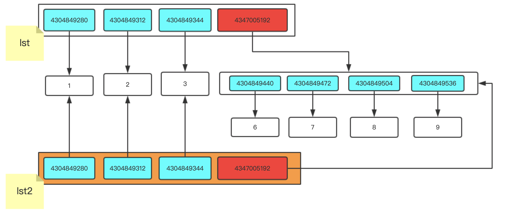
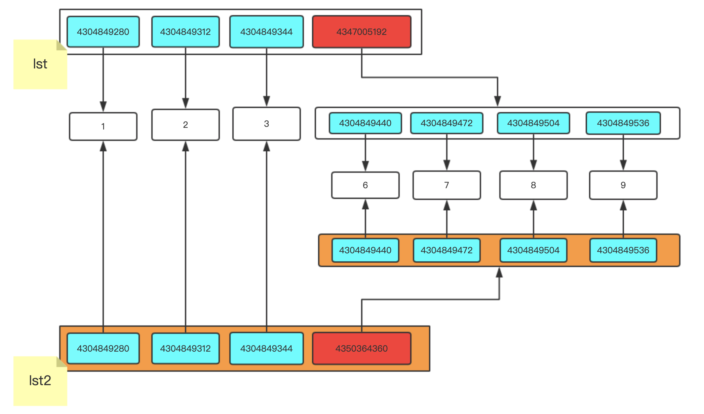

# 一.深浅拷贝

往往到了深浅拷贝的时候,就是大家最容易蒙的地方,这个比较重要为什么这么说呢,因为面试的时候必问

都认真听,争取一遍就过,一般面试的时候都结合着赋值一起问

我们先说赋值,赋值就是一个容器有多个标签

```
lst = [1,2,3,[6,7,8]]
```

我们在程序这样写,当成程序执行完这两行的时候,内容空间发生的变化就是下图:



一个列表用两个标签,通过标签lst 找到的和标签lst1找到的是同一个,图中的那些一长串数字就是内存地址,Python中是通过内存地址来查看值

```
lst1 = lst
lst.append(9)
```



我们通过lst这个标签找到这个列表然后添加一个9,再通过lst1找到这个列表也就多了一个9 因为lst和lst1都是贴在一个地方

我们再来说说浅拷贝,浅拷贝就是只拷贝第一层的元素

看例子:

```python
lst = [1,2,3,[6,7,8]]
# lst2 = lst[:] # 浅拷贝
lst2 = lst.copy()
```



**图中橙色的是新开辟的空间,浅蓝色的是数字类型,红色的列表类型**

这样就是浅拷贝,浅拷贝只把原列表中记录的内存地址拿到一个新开辟的列表中

```python
lst = [1,2,3,[6,7,8]]
lst2 = lst[:]
lst.append(9)
```



为什么lst1中没有添加,是因为咱们先进行的浅拷贝,浅拷贝把原列表中有的内存地址复制了一份放到新开辟的空间中,后期对原列表添加的内容新列表是不会有的,再看看下边的例子

```python
lst = [1,2,3,[6,7,8]]
lst2 = lst.copy()
lst[1] = "22"
```



我们修改成字符串"22" 就是在列表中将以前的内存地址更换成新开辟的空间地址

```python
lst = [1,2,3,[6,7,8]]
lst1 = lst.copy()
lst[-1].append(0)
```



因为我们对里边的列表进行修改,列表本身就是可变的数据类型,我们通过原列表修改最里层的小列表,小列表进行变化,新开辟的列表里存放就是小列表中的内存地址.在去查看的时候就有变动

我们接下来,来看看深拷贝是怎样的操作

```python
import copy
lst = [1,2,3,[6,7,8]]
lst3 = copy.deepcopy(lst)
```



我们通过上图可以发现浅拷贝和深拷贝在最后列表的位置内存地址不一样,深拷贝是自己单独开辟了一个新的空间,我们现在修改原列表和新开辟的列表没有任何影响.

通过上面的各种测试,总结以下规律:

- 赋值:
  - 两个或多个变量名指向同一个内存地址,有一个操作内存地址的值进行改变,其余的变量名在查看的时候都进行更改
- 浅拷贝:
  - 只拷贝列表中第一层的内存地址,原列表修改了不可变数据类型,新开辟的列表不进行变动,因为只是在原列表中将内存地址进行修改了,新开辟的列表中的内存地址还是用的之前的内存地址
  - 原列表对可变数据类型进行了添加,新开辟的列表中存放就是可变数据类型的地址,在去查看的时候就发现进行更改了
- 深拷贝:
  - 不管你修改原数据的不可变类型还是可变类型,新开辟的空间中都不会进行改变,因为可变数据类型新开辟了一个空间