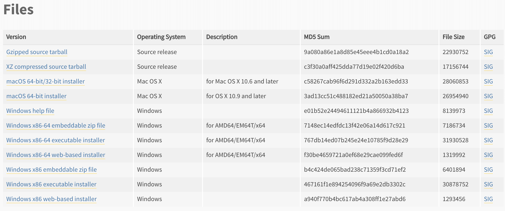
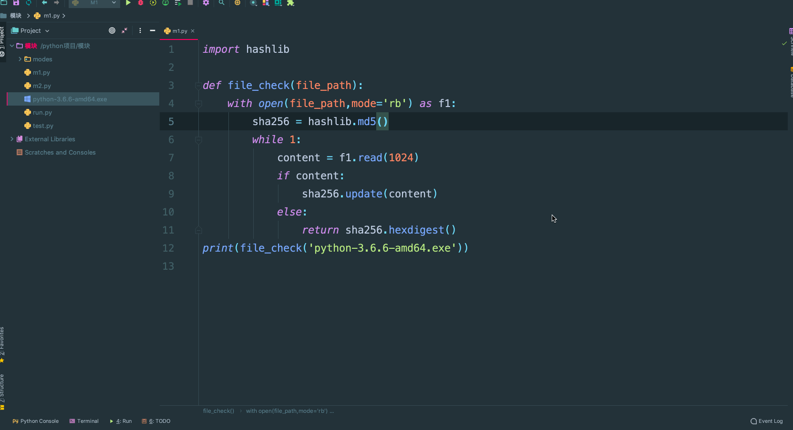

## 一. 模块一

### 1. 序列化模块

我们今天学习下序列化,什么是序列化呢? 序列化的本质就是将一种数据结构（如字典、列表)等转换成一个特殊的序列（字符串或者bytes）的过程就叫做序列化。那么有同学就会问了，为什么要转化成这个序列，我们不是学过么？

```
dic = {'name': '郭宝元'}
ret = str(dic)
print(ret,type(ret))  
```

首先你要看清楚！我说的是一个特殊的序列，而不是我们常用的str这种字符串。

#### **为什么要有序列化模块？**

其次，将这个数据结构转化成这个特殊的序列有什么用呢？ 这个才是序列化的关键所在，这个特殊的序列大有用处。举例说明：

比如，你的程序中需要一个字典类型的数据存放你的个人信息：

```
 dic = {'username':'宝元', 'password': 123,'login_status': True}
```

　　你的程序中有一些地方都需要使用这个dic数据，登录时会用到，注册时也会用到。那么我们之前就是将这个dic写在全局里，但是这样是不合理的，应该是将这数据写入一个地方存储（还没有学数据库）先存放在一个文件中，那么程序中哪里需要这个数据了，你就读取文件取出你需要的信息即可。**那么有没有什么问题？** 你将这个字典直接写入文件是不可以的，必须转化成字符串的形式，而且你读取出来也是字符串形式的字典（可以用代码展示）。

那么你拿到一个str(dic)有什么用？他是根本转化不成dic的（不能用eval很危险），所以很不方便。那么这时候序列化模块就起到作用了，如果你写入文件中的字符串是一个序列化后的特殊的字符串，那么当你从文件中读取出来，是可以转化回原数据结构的。这个就很牛逼了。

下面说的是json序列化，pickle序列化有所不同。

json序列化除了可以解决写入文件的问题，还可以解决网络传输的问题，比如你将一个list数据结构通过网络传给另个开发者，那么你不可以直接传输，之前我们说过，你要想传输出去必须用bytes类型。但是bytes类型只能与字符串类型互相转化，它不能与其他数据结构直接转化，所以，你只能将list ---> 字符串 ---> bytes 然后发送，对方收到之后，在decode() 解码成原字符串。此时这个字符串不能是我们之前学过的str那种字符串，因为它不能反解，必须要是这个特殊的字符串，他可以反解成list 这样开发者之间就可以借助网络互传数据了，不仅仅是开发者之间，你要借助网络爬取数据这些数据多半是这种特殊的字符串，你接受到之后，在反解成你需要的数据类型。

对于这个序列化模块我们做一个小小总结：

序列化模块就是将一个常见的数据结构转化成一个特殊的序列，并且这个特殊的序列还可以反解回去。它的主要用途：文件读写数据，网络传输数据。

Python中这种序列化模块有三种：

​    json模块 :（**重点**）

1. 不同语言都遵循的一种数据转化格式，即不同语言都使用的特殊字符串。（比如Python的一个列表[1, 2, 3]利用json转化成特殊的字符串，然后在编码成bytes发送给php的开发者，php的开发者就可以解码成特殊的字符串，然后在反解成原数组(列表): [1, 2, 3]）
2. json序列化只支持部分Python数据结构：dict,list, tuple,str,int, float,True,False,None

  

​    pickle模块：

1. 只能是Python语言遵循的一种数据转化格式，只能在python语言中使用。

2. 支持Python所有的数据类型包括实例化对象。

    

​    shelve模块：类似于字典的操作方式去操作特殊的字符串（不讲，可以课下了解）。

**当然序列化模块中使用最多的的就是json模块，那么接下来，我们讲一下json与pickle模块。**

#### **1.1 json模块**

**json模块是将满足条件的数据结构转化成特殊的字符串，并且也可以反序列化还原回去。**

上面介绍我已经说过了，序列化模块总共只有两种用法，要不就是用于网络传输的中间环节，要不就是文件存储的中间环节，所以json模块总共就有两对四个方法：

​    **用于网络传输：dumps、loads**

​    **用于文件写读：dump、load**

**dumps、loads**

1. 将字典类型转换成字符串类型

```python
import json
dic = {'k1':'v1','k2':'v2','k3':'v3'}
str_dic = json.dumps(dic)  #序列化：将一个字典转换成一个字符串
print(type(str_dic),str_dic)  #<class 'str'> {"k3": "v3", "k1": "v1", "k2": "v2"}
#注意，json转换完的字符串类型的字典中的字符串是由""表示的
```

2. 将字符串类型的字典转换成字典类型

```python
import json
dic2 = json.loads(str_dic)  #反序列化：将一个字符串格式的字典转换成一个字典
#注意，要用json的loads功能处理的字符串类型的字典中的字符串必须由""表示
print(type(dic2),dic2)  #<class 'dict'> {'k1': 'v1', 'k2': 'v2', 'k3': 'v3'}
```

3. 还支持列表类型

```python
list_dic = [1,['a','b','c'],3,{'k1':'v1','k2':'v2'}]
str_dic = json.dumps(list_dic) #也可以处理嵌套的数据类型 
print(type(str_dic),str_dic) #<class 'str'> [1, ["a", "b", "c"], 3, {"k1": "v1", "k2": "v2"}]
list_dic2 = json.loads(str_dic)
print(type(list_dic2),list_dic2) #<class 'list'> [1, ['a', 'b', 'c'], 3, {'k1': 'v1', 'k2': 'v2'}]
```

**dump、load**

1. 将对象转换成字符串写入到文件当中

```python
import json
f = open('json_file.json','w')
dic = {'k1':'v1','k2':'v2','k3':'v3'}
json.dump(dic,f)  #dump方法接收一个文件句柄，直接将字典转换成json字符串写入文件
f.close()
# json文件也是文件，就是专门存储json字符串的文件。
```

2. 将文件中的字符串类型的字典转换成字典

```python
import json
f = open('json_file.json')
dic2 = json.load(f)  #load方法接收一个文件句柄，直接将文件中的json字符串转换成数据结构返回
f.close()
print(type(dic2),dic2)
```

**其他参数说明**

`ensure_ascii`:，当它为True的时候，所有非ASCII码字符显示为\uXXXX序列，只需在dump时将ensure_ascii设置为False即可，此时存入json的中文即可正常显示。 

`separators`：分隔符，实际上是(item_separator, dict_separator)的一个元组，默认的就是(,,:)；这表示dictionary内keys之间用“,”隔开，而KEY和value之间用“：”隔开。 

`sort_keys`：将数据根据keys的值进行排序。 剩下的自己看源码研究

**json序列化存储多个数据到同一个文件中**

对于json序列化，存储多个数据到一个文件中是有问题的，默认一个json文件只能存储一个json数据，但是也可以解决，举例说明：

```python
对于json 存储多个数据到文件中
dic1 = {'name':'oldboy1'}
dic2 = {'name':'oldboy2'}
dic3 = {'name':'oldboy3'}
f = open('序列化',encoding='utf-8',mode='a')
json.dump(dic1,f)
json.dump(dic2,f)
json.dump(dic3,f)
f.close()

f = open('序列化',encoding='utf-8')
ret = json.load(f)
ret1 = json.load(f)
ret2 = json.load(f)
print(ret)
```

上边的代码会报错,解决方法:

```python
dic1 = {'name':'oldboy1'}
dic2 = {'name':'oldboy2'}
dic3 = {'name':'oldboy3'}
f = open('序列化',encoding='utf-8',mode='a')
str1 = json.dumps(dic1)
f.write(str1+'\n')
str2 = json.dumps(dic2)
f.write(str2+'\n')
str3 = json.dumps(dic3)
f.write(str3+'\n')
f.close()
​
f = open('序列化',encoding='utf-8')
for line in f:
    print(json.loads(line))
```

**1.2 pickle模块**

**pickle模块是将Python所有的数据结构以及对象等转化成bytes类型，然后还可以反序列化还原回去。**

​    刚才也跟大家提到了pickle模块，pickle模块是只能Python语言识别的序列化模块。如果把序列化模块比喻成全世界公认的一种交流语言，也就是标准的话，json就是像是英语，全世界（python，java，php，C，等等）都遵循这个标准。而pickle就是中文，只有中国人（python）作为第一交流语言。

​    既然只是Python语言使用，那么它支持Python所有的数据类型包括后面我们要讲的实例化对象等，它能将这些所有的数据结构序列化成特殊的bytes，然后还可以反序列化还原。使用上与json几乎差不多，也是两对四个方法。

​    **用于网络传输：dumps、loads**

​    **用于文件写读：dump、load**

**dumps、loads**

```python
import pickle
dic = {'k1':'v1','k2':'v2','k3':'v3'}
str_dic = pickle.dumps(dic)
print(str_dic)  # bytes类型

dic2 = pickle.loads(str_dic)
print(dic2)    #字典
```

```python
# 还可以序列化对象
import pickle
def func():
    print(666)
    
ret = pickle.dumps(func)
print(ret,type(ret))  # b'\x80\x03c__main__\nfunc\nq\x00.' <class 'bytes'>
f1 = pickle.loads(ret)  # f1得到 func函数的内存地址
f1()  # 执行func函数
```

**dump、load**

```python
dic = {(1,2):'oldboy',1:True,'set':{1,2,3}}
f = open('pick序列化',mode='wb')
pickle.dump(dic,f)
f.close()
with open('pick序列化',mode='wb') as f1:
    pickle.dump(dic,f1)
```

**pickle序列化存储多个数据到一个文件中**

```python
dic1 = {'name':'oldboy1'}
dic2 = {'name':'oldboy2'}
dic3 = {'name':'oldboy3'}
​
f = open('pick多数据',mode='wb')
pickle.dump(dic1,f)
pickle.dump(dic2,f)
pickle.dump(dic3,f)
f.close()
​
f = open('pick多数据',mode='rb')
while True:
    try:
        print(pickle.load(f))
    except EOFError:
        break
f.close()
```

这时候机智的你又要说了，既然pickle如此强大，为什么还要学json呢？这里我们要说明一下，json是一种所有的语言都可以识别的数据结构。如果我们将一个字典或者序列化成了一个json存在文件里，那么java代码或者js代码也可以拿来用。但是如果我们用pickle进行序列化，其他语言就不能读懂这是什么了～所以，如果你序列化的内容是列表或者字典，我们非常推荐你使用json模块，但如果出于某种原因你不得不序列化其他的数据类型，而未来你还会用python对这个数据进行反序列化的话，那么就可以使用pickle。

### **2. os模块**

os模块是与操作系统交互的一个接口,它提供的功能多与工作目录，路径，文件等相关。接下来这些方法我会带着大家演示一遍，重点的一些方法最好记住，剩下的记好笔记，以后需要时随时查阅即可。

讲这些方法前先给大家普及一下专用名词：

目录指的是:文件夹 当前目录，工作目录，父级目录：指的都是一个，就是本文件所在的文件夹。

接下来带着学生讲解下面的这些方法：**按照星的等级划分,三颗星是需要记住的**

当前执行这个python文件的工作目录相关的工作路径

```python
os.getcwd() 获取当前工作目录，即当前python脚本工作的目录路径  ** 
os.chdir("dirname")  改变当前脚本工作目录；相当于shell下cd  **
os.curdir  返回当前目录: ('.')  **
os.pardir  获取当前目录的父目录字符串名：('..') **
```

文件夹相关

```python
os.makedirs('dirname1/dirname2')    可生成多层递归目录  ***
os.removedirs('dirname1') 若目录为空，则删除，并递归到上一级目录，如若也为空，则删除，依此类推 ***
os.mkdir('dirname')    生成单级目录；相当于shell中mkdir dirname ***
os.rmdir('dirname')    删除单级空目录，若目录不为空则无法删除，报错；相当于shell中rmdir dirname ***
os.listdir('dirname')    列出指定目录下的所有文件和子目录，包括隐藏文件，并以列表方式打印 **
```

文件相关

```python
os.remove()  删除一个文件  ***
os.rename("oldname","newname")  重命名文件/目录  ***
os.stat('path/filename')  获取文件/目录信息 **
```

路径相关

```python
os.path.abspath(path) 返回path规范化的绝对路径  ***
os.path.split(path) 将path分割成目录和文件名二元组返回 ***
os.path.dirname(path) 返回path的目录。其实就是os.path.split(path)的第一个元素  **
os.path.basename(path) 返回path最后的文件名。如何path以／或\结尾，那么就会返回空值，即os.path.split(path)的第二个元素。 **
os.path.exists(path)  如果path存在，返回True；如果path不存在，返回False  ***
os.path.isabs(path)  如果path是绝对路径，返回True  **
os.path.isfile(path)  如果path是一个存在的文件，返回True。否则返回False  ***
os.path.isdir(path)  如果path是一个存在的目录，则返回True。否则返回False  ***
os.path.join(path1[, path2[, ...]])  将多个路径组合后返回，第一个绝对路径之前的参数将被忽略 ***
os.path.getatime(path)  返回path所指向的文件或者目录的最后访问时间  **
os.path.getmtime(path)  返回path所指向的文件或者目录的最后修改时间  **
os.path.getsize(path) 返回path的大小 ***
```

操作系统相关(了解)

```python
os.sep    输出操作系统特定的路径分隔符，win下为"\\",Linux下为"/" *
os.linesep    输出当前平台使用的行终止符，win下为"\t\n",Linux下为"\n" 
os.pathsep    输出用于分割文件路径的字符串 win下为;,Linux下为: *
os.name    输出字符串指示当前使用平台。win->'nt'; Linux->'posix' *
# 和执行系统命令相关
os.system("bash command")  运行shell命令，直接显示  **
os.popen("bash command).read()  运行shell命令，获取执行结果  **
os.environ  获取系统环境变量  **
```

os.stat('path/filename') 获取文件/目录信息 的结构说明(了解)

```python
stat 结构:
st_mode: inode 保护模式
st_ino: inode 节点号。
st_dev: inode 驻留的设备。
st_nlink: inode 的链接数。
st_uid: 所有者的用户ID。
st_gid: 所有者的组ID。
st_size: 普通文件以字节为单位的大小；包含等待某些特殊文件的数据。
st_atime: 上次访问的时间。
st_mtime: 最后一次修改的时间。
st_ctime: 由操作系统报告的"ctime"。在某些系统上（如Unix）是最新的元数据更改的时间，在其它系统上（如Windows）是创建时间（详细信息参见平台的文档）。
```

### 3. **sys模块**

sys模块是与python解释器交互的一个接口，这个模块功能不是很多，练习一遍就行。

```python
sys.argv           命令行参数List，第一个元素是程序本身路径
sys.exit(n)        退出程序，正常退出时exit(0),错误退出sys.exit(1)
sys.version        获取Python解释程序的版本信息
sys.path           返回模块的搜索路径，初始化时使用PYTHONPATH环境变量的值  ***
sys.platform       返回操作系统平台名称
```

### **4. hashlib模块**

​    此模块有人称为摘要算法，也叫做加密算法，或者是哈希算法，散列算法等等，这么多title不用大家记，那么有同学就问他到底是干啥的？ 简单来说就是做加密和校验使用，它的工作原理给大家简单描述一下：它通过一个函数，把任意长度的数据按照一定规则转换为一个固定长度的数据串（通常用16进制的字符串表示）。

比如：之前我们在一个文件中存储用户的用户名和密码是这样的形式：

​    宝元|123456

有什么问题？你的密码是明文的，如果有人可以窃取到这个文件，那么你的密码就会泄露了。所以，一般我们存储密码时都是以密文存储，比如：

​    宝元|4665ace0eb5d3d6a2822a7c455587e47

那么即使是他窃取到这个文件，他也不会轻易的破解出你的密码，这样就会保证了数据的安全。

hashlib模块就可以完成的就是这个功能。

hashlib的特征以及使用要点：

1. bytes类型数据 ---> 通过hashlib算法 ---> 固定长度的字符串
2. 不同的bytes类型数据转化成的结果一定不同。
3. 相同的bytes类型数据转化成的结果一定相同。
4. 此转化过程不可逆。

那么刚才我们也说了，hashlib的主要用途有两个：

​    **密码的加密。**

​    **文件一致性校验。**

hashlib模块就相当于一个算法的集合，这里面包含着很多的算法，算法越高，转化成的结果越复杂，安全程度越高，相应的效率就会越低。

**普通加密：**

我们以常见的摘要算法MD5为例，计算出一个字符串的MD5值：

```
import hashlib

md5 = hashlib.md5()
md5.update('123456'.encode('utf-8')) # 必须是bytes类型才能够进行加密
print(md5.hexdigest())

# 计算结果如下：
'e10adc3949ba59abbe56e057f20f883e'

# 验证：相同的bytes数据转化的结果一定相同

import hashlib
md5 = hashlib.md5()
md5.update('123456'.encode('utf-8'))
print(md5.hexdigest())

# 计算结果如下：
'e10adc3949ba59abbe56e057f20f883e'

# 验证：不相同的bytes数据转化的结果一定不相同
import hashlib

md5 = hashlib.md5()
md5.update('12345'.encode('utf-8'))
print(md5.hexdigest())

# 计算结果如下：
'827ccb0eea8a706c4c34a16891f84e7b'
```

上面就是普通的md5加密，非常简单，几行代码就可以了，但是这种加密级别是最低的，相对来说不很安全。虽然说hashlib加密是不可逆的加密方式，但也是可以破解的，那么他是如何做的呢？你看网上好多MD5解密软件，他们使用撞库的方式。他们会把常用的一些密码比如：123456,111111,以及他们的md5的值做成对应关系，类似于字典，

dic = {'e10adc3949ba59abbe56e057f20f883e': 123456}

循环他们那定义的字典中的键和咱们生成的密文进行比较,比较成功后通过你的密文获取对应的密码。

所以针对刚才说的情况，我们有更安全的加密方式：加盐。

**加盐加密**

​    **固定的盐**

什么叫加盐？加盐这个词儿来自于国外，外国人起名字我认为很随意，这个名字来源于烧烤，俗称BBQ。我们烧烤的时候，一般在快熟的时候，都会给肉串上面撒盐，增加味道，那么这个撒盐的工序，外国人认为比较复杂，所以就将比较复杂的加密方式称之为加盐。

其实代码非常简单：

```
ret = hashlib.md5('xx教育'.encode('utf-8'))  # xx教育就是固定的盐
ret.update('a'.encode('utf-8'))
print(ret.hexdigest())
```

上面的xx教育就是固定的盐，比如你在一家公司，公司会将你们所有的密码在md5之前增加一个固定的盐，这样提高了密码的安全性。但是如果黑客通过手段窃取到你这个固定的盐之后，也是可以破解出来的。所以，我们还可以加动态的盐。

​    **动态的盐**

```python
username = '宝元666'
ret = hashlib.md5(username[::2].encode('utf-8'))  # 针对于每个账户，每个账户的盐都不一样
ret.update('a'.encode('utf-8'))
print(ret.hexdigest())
```

这样，安全性能就大大提高了。

那么我们之前说了hahslib模块是一个算法集合，他里面包含很多种加密算法，刚才我们说的MD5算法是比较常用的一种加密算法，一般的企业用MD5就够用了。但是对安全要求比较高的企业，比如金融行业，MD5加密的方式就不够了，得需要加密方式更高的，比如sha系列，sha1,sha224,sha512等等，数字越大，加密的方法越复杂，安全性越高，但是效率就会越慢。

```python
ret = hashlib.sha1()
ret.update('guobaoyuan'.encode('utf-8'))
print(ret.hexdigest())

#也可加盐
ret = hashlib.sha384(b'asfdsa')
ret.update('guobaoyuan'.encode('utf-8'))
print(ret.hexdigest())

# 也可以加动态的盐
ret = hashlib.sha384(b'asfdsa'[::2])
ret.update('guobaoyuan'.encode('utf-8'))
print(ret.hexdigest())
```

不过一般我们用到MD5加密就可以了。

**4.42 文件的一致性校验**

hashlib模块除了可以用于密码加密之外，还有一个常用的功能，那就是文件的一致性校验。

​    linux讲究：一切皆文件，我们普通的文件，是文件，视频，音频，图片，以及应用程序等都是文件。我们都从网上下载过资源，比如我们刚开学时让大家从网上下载Python解释器，当时你可能没有注意过，其实你下载的时候都是带一个MD5或者shax值的，为什么？ 我们的网络世界是很不安全的，经常会遇到病毒，木马等，有些你是看不到的可能就植入了你的电脑中，那么他们是怎么来的？ 都是通过网络传入来的，就是你在网上下载一些资源的时候，趁虚而入，当然大部分被我们的浏览器或者杀毒软件拦截了，但是还有一部分偷偷的进入你的磁盘中了。那么我们自己如何验证我们下载的资源是否有病毒呢？这就需要文件的一致性校验了。在我们下载一个软件时，往往都带有一个MD5或者shax值，当我们下载完成这个应用程序时你要是对比大小根本看不出什么问题，你应该对比他们的md5值，如果两个md5值相同，就证明这个应用程序是安全的，如果你下载的这个文件的MD5值与服务端给你提供的不同，那么就证明你这个应用程序肯定是植入病毒了（文件损坏的几率很低），那么你就应该赶紧删除，不应该安装此应用程序。

我们之前说过，md5计算的就是bytes类型的数据的转换值，同一个bytes数据用同样的加密方式转化成的结果一定相同，如果不同的bytes数据（即使一个数据只是删除了一个空格）那么用同样的加密方式转化成的结果一定是不同的。所以，hashlib也是验证文件一致性的重要工具。



我们在安装python解释器的时候,在安装python解释器的时候计算本地的md5值是否一致,一致安装,不一致的删除.

我将文件校验写在一个函数中

**low版文件校验：**

```python
def func(file):
    with open(file,mode='rb') as f1:
        ret = hashlib.md5()
        ret.update(f1.read())
        return ret.hexdigest()

print(func('hashlib_file1'))
```

这样就可以计算此文件的MD5值，从而进行文件校验。但是这样写有一个问题，有什么问题？如果文件过大，全部读取出来直接就会撑爆内存的，所以我们要分段读取，那么分段读取怎么做呢？

hashlib还可以这样玩：

```python
import hashlib
# 直接 update
md5obj = hashlib.md5()
md5obj.update('宝元 is a old driver'.encode('utf-8'))
print(md5obj.hexdigest())  # da525c66739e6baa8729332f8bae8e0f

# 分段update
md5obj = hashlib.md5()
md5obj.update('宝元 '.encode('utf-8'))
md5obj.update('is '.encode('utf-8'))
md5obj.update('a '.encode('utf-8'))
md5obj.update('old '.encode('utf-8'))
md5obj.update('driver'.encode('utf-8'))
print(md5obj.hexdigest())  # da525c66739e6baa8729332f8bae8e0f
# 结果相同
```

我们现在知道可以进行分段update后,我们就可以迭代的获取文件中的内容,现在来做一个高大上版文件校验

**高大上版文件校验**

**校验Pyhton解释器的Md5值是否相同**

```python
import hashlib

def file_check(file_path):
    with open(file_path,mode='rb') as f1:
        sha256 = hashlib.md5()
        while 1:
            content = f1.read(1024)
            if content:
                sha256.update(content)
            else:
                return sha256.hexdigest()
print(file_check('python-3.6.6-amd64.exe'))
```



### 5. collections模块

在内置数据类型（dict、list、set、tuple）的基础上，collections模块还提供了几个额外的数据类型：Counter、deque、defaultdict、namedtuple和OrderedDict等。

1.namedtuple: 生成可以使用名字来访问元素内容的tuple

2.deque: 双端队列，可以快速的从另外一侧追加和推出对象

3.Counter: 计数器，主要用来计数

4.OrderedDict: 有序字典

5.defaultdict: 带有默认值的字典

#### namedtuple

我们知道tuple可以表示不变数据，例如，一个点的二维坐标就可以表示成：

```
p = (1, 2)
```

但是，看到(1, 2)，很难看出这个tuple是用来表示一个坐标的。

这时，namedtuple就派上了用场：

```python
from collections import namedtuple
Point = namedtuple('Point', ['x', 'y'])
p = Point(1, 2)
print(p)
```

结果：Point(x=1, y=2)

类似的，如果要用坐标和半径表示一个圆，也可以用namedtuple定义：

```
namedtuple('名称', [属性list]):
Circle = namedtuple('Circle', ['x', 'y', 'r'])
```

#### deque

使用list存储数据时，按索引访问元素很快，但是插入和删除元素就很慢了，因为list是线性存储，数据量大的时候，插入和删除效率很低。

deque是为了高效实现插入和删除操作的双向列表，适合用于队列和栈：

```python
from collections import deque
q = deque(['a', 'b', 'c'])
q.append('x')
q.appendleft('y')
q
deque(['y', 'a', 'b', 'c', 'x'])
```

deque除了实现list的append()和pop()外，还支持appendleft()和popleft()，这样就可以非常高效地往头部添加或删除元素。

#### OrderedDict

使用dict时，Key是无序的。在对dict做迭代时，我们无法确定Key的顺序。

如果要保持Key的顺序，可以用OrderedDict：

```python
from collections import OrderedDict
d = dict([('a', 1), ('b', 2), ('c', 3)]) # 另一种定义字典的方式
print(d)
# 结果:
{'a': 1, 'c': 3, 'b': 2}

od = OrderedDict([('a', 1), ('b', 2), ('c', 3)])
print(od)
# 结果:
OrderedDict([('a', 1), ('b', 2), ('c', 3)])
```

注意，OrderedDict的Key会按照插入的顺序排列，不是Key本身排序：

```python
>>> od = OrderedDict()
>>> od['z'] = 1
>>> od['y'] = 2
>>> od['x'] = 3
>>> od.keys() # 按照插入的Key的顺序返回
['z', 'y', 'x']
```

#### defaultdict

有如下值集合 [11,22,33,44,55,66,77,88,99,90...]，将所有大于 66 的值保存至字典的第一个key中，将小于 66 的值保存至第二个key的值中。

即： {'k1': 大于66 , 'k2': 小于66}

```python
li = [11,22,33,44,55,77,88,99,90]
result = {}
for row in li:
    if row > 66:
        if 'key1' not in result:
            result['key1'] = []
        result['key1'].append(row)
    else:
        if 'key2' not in result:
            result['key2'] = []
        result['key2'].append(row)
print(result)


from collections import defaultdict
values = [11, 22, 33,44,55,66,77,88,99,90]
my_dict = defaultdict(list)

for value in  values:
    if value>66:
        my_dict['k1'].append(value)
    else:
        my_dict['k2'].append(value)
```

使用dict时，如果引用的Key不存在，就会抛出KeyError。如果希望key不存在时，返回一个默认值，就可以用defaultdict：

```python
from collections import defaultdict
dd = defaultdict(lambda: 'N/A')
dd['key1'] = 'abc'
 # key1存在
print(dd['key1'])
dd['key2'] # key2不存在，返回默认值
print(dd['key2'])
```

#### Counter

Counter类的目的是用来跟踪值出现的次数。它是一个无序的容器类型，以字典的键值对形式存储，其中元素作为key，其计数作为value。计数值可以是任意的Interger（包括0和负数）。Counter类和其他语言的bags或multisets很相似。

```pyhton
c = Counter('abcdeabcdabcaba')
print c
输出：Counter({'a': 5, 'b': 4, 'c': 3, 'd': 2, 'e': 1})
```

