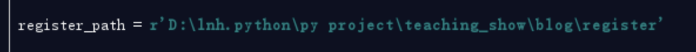
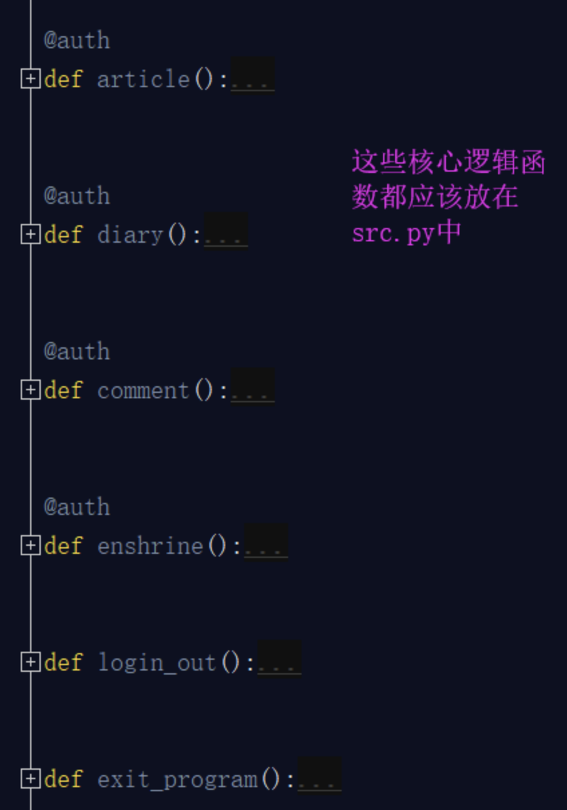
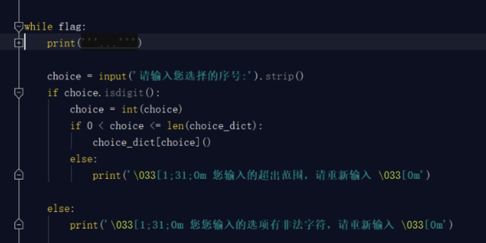
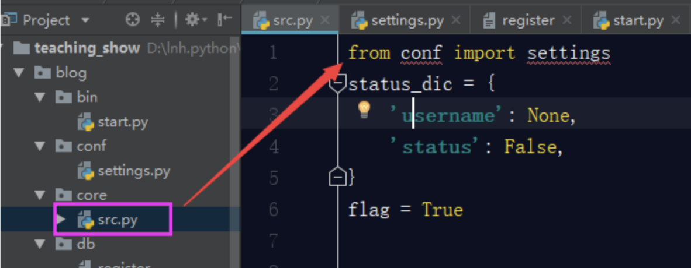
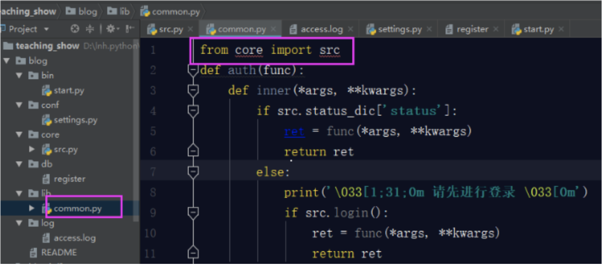

## 一. 软件的开发规范

**什么是开发规范?为什么要有开发规范呢?**

你现在包括之前写的一些程序，所谓的'项目'，都是在一个py文件下完成的，代码量撑死也就几百行，你认为没问题，挺好。但是真正的后端开发的项目，系统等，少则几万行代码，多则十几万，几十万行代码，你全都放在一个py文件中行么？当然你可以说，只要能实现功能即可。咱们举个例子，如果你的衣物只有三四件，那么你随便堆在橱柜里，没问题，咋都能找到，也不显得特别乱，但是如果你的衣物，有三四十件的时候，你在都堆在橱柜里，可想而知，你找你穿过三天的袜子，最终从你的大衣口袋里翻出来了，这是什么感觉和心情......

　　软件开发，规范你的项目目录结构，代码规范，遵循PEP8规范等等，让你更加清晰滴，合理滴开发。

那么接下来我们以博客园系统的作业举例，将我们之前在一个py文件中的所有代码，整合成规范的开发。

首先我们看一下，这个是我们之前的目录结构（简化版）：


py文件的具体代码如下：

```python
status_dic = {
    'username': None,
    'status': False,
}
flag = True

def login():
    i = 0
    with open('register', encoding='utf-8') as f1:
        dic = {i.strip().split('|')[0]: i.strip().split('|')[1] for i in f1}
    while i < 3:
        username = input('请输入用户名：').strip()
        password = input('请输入密码：').strip()
        if username in dic and dic[username] == password:
            print('登录成功')
            return True
        else:
            print('用户名密码错误，请重新登录')
            i += 1


def register():
    with open('register', encoding='utf-8') as f1:
        dic = {i.strip().split('|')[0]: i.strip().split('|')[1] for i in f1}
    while 1:
        print('\033[1;45m 欢迎来到注册页面 \033[0m')
        username = input('请输入用户名：').strip()
        if not username.isalnum():
            print('\033[1;31;0m 用户名有非法字符，请重新输入 \033[0m')
            continue
        if username in dic:
            print('\033[1;31;0m 用户名已经存在，请重新输入 \033[0m')
            continue
        password = input('请输入密码：').strip()
        if 6 <= len(password) <= 14:
            with open('register', encoding='utf-8', mode='a') as f1:
                f1.write(f'\n{username}|{password}')
            status_dic['username'] = str(username)
            status_dic['status'] = True
            print('\033[1;32;0m 恭喜您，注册成功！已帮您成功登录~ \033[0m')
            return True
        else:
            print('\033[1;31;0m 密码长度超出范围，请重新输入 \033[0m')


def auth(func):
    def inner(*args, **kwargs):
        if status_dic['status']:
            ret = func(*args, **kwargs)
            return ret
        else:
            print('\033[1;31;0m 请先进行登录 \033[0m')
            if login():
                ret = func(*args, **kwargs)
                return ret
    
    return inner


@auth
def article():
    print(f'\033[1;32;0m 欢迎{status_dic["username"]}访问文章页面\033[0m')


@auth
def diary():
    print(f'\033[1;32;0m 欢迎{status_dic["username"]}访问日记页面\033[0m')


@auth
def comment():
    print(f'\033[1;32;0m 欢迎{status_dic["username"]}访问评论页面\033[0m')


@auth
def enshrine():
    print(f'\033[1;32;0m 欢迎{status_dic["username"]}访问收藏页面\033[0m')


def login_out():
    status_dic['username'] = None
    status_dic['status'] = False
    print('\033[1;32;0m 注销成功 \033[0m')


def exit_program():
    global flag
    flag = False
    return flag


choice_dict = {
    1: login,
    2: register,
    3: article,
    4: diary,
    5: comment,
    6: enshrine,
    7: login_out,
    8: exit_program,
}


while flag:
    print('''
    欢迎来到博客园首页
    1:请登录
    2:请注册
    3:文章页面
    4:日记页面
    5:评论页面
    6:收藏页面
    7:注销
    8:退出程序''')
    
    choice = input('请输入您选择的序号:').strip()
    if choice.isdigit():
        choice = int(choice)
        if 0 < choice <= len(choice_dict):
            choice_dict[choice]()
        else:
            print('\033[1;31;0m 您输入的超出范围，请重新输入 \033[0m')
    
    else:
        print('\033[1;31;0m 您您输入的选项有非法字符，请重新输入 \033[0m')
```

此时我们是将所有的代码都写到了一个py文件中，如果代码量多且都在一个py文件中，那么对于代码结构不清晰，不规范，运行起来效率也会非常低。所以我们接下来一步一步的修改：

1. **程序配置.**


   你项目中所有的有关文件的操作出现几处，都是直接写的register相对路径，如果说这个register注册表路径改变了，或者你改变了register注册表的名称，那么相应的这几处都需要一一更改，这样其实你就是把代码写死了，那么怎么解决？ 我要统一相同的路径，也就是统一相同的变量，在文件的最上面写一个变量指向register注册表的路径，代码中如果需要这个路径时，直接引用即可。



2. **划分文件**


一个项目的函数不能只是这些，我们只是举个例子，这个小作业函数都已经这么多了，那么要是一个具体的实际的项目，函数会非常多，所以我们应该将这些函数进行分类，然后分文件而治。在这里我划分了以下几个文件：

**settings.py**: 配置文件，就是放置一些项目中需要的静态参数，比如文件路径，数据库配置，软件的默认设置等等

类似于我们作业中的这个：


**common.py**:公共组件文件，这里面放置一些我们常用的公共组件函数，并不是我们核心逻辑的函数，而更像是服务于整个程序中的公用的插件，程序中需要即调用。比如我们程序中的装饰器auth，有些函数是需要这个装饰器认证的，但是有一些是不需要这个装饰器认证的，它既是何处需要何处调用即可。比如还有密码加密功能，序列化功能，日志功能等这些功能都可以放在这里。


**src.py**:这个文件主要存放的就是核心逻辑功能，你看你需要进行选择的这些核心功能函数，都应该放在这个文件中。



**start.py**:项目启动文件。你的项目需要有专门的文件启动，而不是在你的核心逻辑部分进行启动的，有人对这个可能不太理解，我为什么还要设置一个单独的启动文件呢？你看你生活中使用的所有电器基本都一个单独的启动按钮，汽车，热水器，电视，等等等等，那么为什么他们会单独设置一个启动按钮，而不是在一堆线路板或者内部随便找一个地方开启呢？ 目的就是放在显眼的位置，方便开启。你想想你的项目这么多py文件，如果src文件也有很多，那么到底哪个文件启动整个项目，你还得一个一个去寻找，太麻烦了，这样我把它单独拿出来，就是方便开启整个项目。

那么我们写的项目开启整个项目的代码就是下面这段： 



你把这些放置到一个文件中也可以，但是没有必要，我们只需要一个命令或者一个开启指令就行，就好比我们开启电视只需要让人很快的找到那个按钮即可，对于按钮后面的一些复杂的线路板，我们并不关心，所以我们要将上面这个段代码整合成一个函数，开启项目的''按钮''就是此函数的执行即可。


这个按钮要放到启动文件start.py里面。

除了以上这几个py文件之外还有几个文件，也是非常重要的：

**类似于register文件**：这个文件文件名不固定，register只是我们项目中用到的注册表，但是这种文件就是存储数据的文件，类似于**文本数据库**，那么我们一些项目中的数据有的是从数据库中获取的，有些数据就是这种文本数据库中获取的，总之，你的项目中有时会遇到将一些数据存储在文件中，与程序交互的情况，所以我们要单独设置这样的文件。

**log文件**：log文件顾名思义就是存储log日志的文件。日志我们一会就会讲到，日志主要是供开发人员使用。比如你项目中出现一些bug问题，比如开发人员对服务器做的一些操作都会记录到日志中，以便开发者浏览，查询。

至此，我们将这个作业原来的两个文件，合理的划分成了6个文件，但是还是有问题的，如果我们的项目很大，你的每一个部分相应的你一个文件存不下的，比如你的src主逻辑文件，函数很多，你是不是得分成：src1.py src2.py？

你的文本数据库register这个只是一个注册表，如果你还有个人信息表，记录表呢？ 如果是这样，你的整个项目也是非常凌乱的： 


**3. 划分具体目录**

上面看着就非常乱了，那么如何整改呢？ 其实非常简单，原来你就是30件衣服放在一个衣柜里，那么你就得分类装，放外套的地方，放内衣的地方，放佩饰的地方等等，但是突然你的衣服编程300件了，那一个衣柜放不下，我就整多个柜子，分别放置不同的衣物。所以我们这可以整多个文件夹，分别管理不同的物品，那么标准版本的目录结构就来了：

**为什么要设计项目目录结构？**

"设计项目目录结构"，就和"代码编码风格"一样，属于个人风格问题。对于这种风格上的规范，一直都存在两种态度:

1. 一类同学认为，这种个人风格问题"无关紧要"。理由是能让程序work就好，风格问题根本不是问题。
2. 另一类同学认为，规范化能更好的控制程序结构，让程序具有更高的可读性。

我是比较偏向于后者的，因为我是前一类同学思想行为下的直接受害者。我曾经维护过一个非常不好读的项目，其实现的逻辑并不复杂，但是却耗费了我非常长的时间去理解它想表达的意思。从此我个人对于提高项目可读性、可维护性的要求就很高了。"项目目录结构"其实也是属于"可读性和可维护性"的范畴，我们设计一个层次清晰的目录结构，就是为了达到以下两点:

1. 可读性高: 不熟悉这个项目的代码的人，一眼就能看懂目录结构，知道程序启动脚本是哪个，测试目录在哪儿，配置文件在哪儿等等。从而非常快速的了解这个项目。
2. 可维护性高: 定义好组织规则后，维护者就能很明确地知道，新增的哪个文件和代码应该放在什么目录之下。这个好处是，随着时间的推移，代码/配置的规模增加，项目结构不会混乱，仍然能够组织良好。

所以，我认为，保持一个层次清晰的目录结构是有必要的。更何况组织一个良好的工程目录，其实是一件很简单的事儿。


上面那个图片就是较好的目录结构。


## 二. 按照项目目录结构,规范博客园系统

接下来，我就带领大家把具体的代码写入对应的文件中，并且将此项目启动起来，一定要跟着我的步骤一步一步去执行：

1. **配置start.py文件**

我们首先要配置启动文件，启动文件很简答就是将项目的启动执行放置start.py文件中，运行start.py文件可以成功启动项目即可。 那么项目的启动就是这个指令run() 我们把这个run()放置此文件中不就行了？


这样你能执行这个项目么？肯定是不可以呀，你的starts.py根本就找不到run这个变量，肯定是会报错的。

NameError: name 'run' is not defined 本文件肯定是找不到run这个变量也就是函数名的，不过这个难不倒我们，我们刚学了模块， 另个一文件的内容我们可以引用过来。但是你发现import run 或者 from src import run 都是报错的。为什么呢？ 骚年，遇到报错不要慌！我们说过你的模块之所以可以引用，那是因为你的模块肯定在这个三个地方：内存，内置，sys.path里面，那么core在内存中肯定是没有的，也不是内置，而且sys.path也不可能有，因为sys.path只会将你当前的目录（bin）加载到内存，所以你刚才那么引用肯定是有问题的，那么如何解决？内存，内置你是左右不了的，你只能将core的路径添加到sys.path中，这样就可以了。

```python
import sys
sys.path.append(r'D:\lnh.python\py project\teaching_show\blog\core')
from src import run
run()
```

这样虽然解决了，但是你不觉得有问题么？你现在从这个start文件需要引用src文件，那么你需要手动的将src的工作目录添加到sys.path中，那么有没有可能你会引用到其他的文件？比如你的项目中可能需要引用conf，lib等其他py文件，那么在每次引用之前，或者是开启项目时，全部把他们添加到sys.path中么？

```python
sys.path.append(r'D:\lnh.python\py project\teaching_show\blog\core')
sys.path.append(r'D:\lnh.python\py project\teaching_show\blog\conf')
sys.path.append(r'D:\lnh.python\py project\teaching_show\blog\db')
sys.path.append(r'D:\lnh.python\py project\teaching_show\blog\lib')
```

这样是不是太麻烦了？ 我们应该怎么做？我们应该把项目的工作路径添加到sys.path中，用一个例子说明：你想找张三，李四，王五，赵六等人，这些人全部都在一栋楼比如在汇德商厦，那么我就告诉你汇德商厦的位置：北京昌平区沙河镇汇德商厦。 你到了汇德商厦你在找具体这些人就可以了。所以我们只要将这个blog项目的工作目录添加到sys.path中，这样无论这个项目中的任意一个文件引用项目中哪个文件，就都可以找到了。所以：

```Python
import sys
sys.path.append(r'D:\lnh.python\py project\teaching_show\blog')
from core.src import run
run()
```

上面还是差一点点，你这样写你的blog的路径就写死了，你的项目不可能只在你的电脑上，项目是共同开发的，你的项目肯定会出现在别人电脑上，那么你的路径就是问题了，在你的电脑上你的blog项目的路径是上面所写的，如果移植到别人电脑上，他的路径不可能与你的路径相同， 这样就会报错了，所以我们这个路径要动态获取，不能写死，所以这样就解决了：

```python
import sys
import os
# sys.path.append(r'D:\lnh.python\py project\teaching_show\blog')
print(os.path.dirname(__file__))
# 获取本文件的绝对路径  # D:/lnh.python/py project/teaching_show/blog/bin
print(os.path.dirname(os.path.dirname(__file__)))
# 获取父级目录也就是blog的绝对路径  # D:/lnh.python/py project/teaching_show/blog
BATH_DIR = os.path.dirname(os.path.dirname(__file__))
sys.path.append(BATH_DIR)
from core.src import run
run()
```

那么还差一个小问题，这个starts文件可以当做脚本文件进行直接启动，如果是作为模块，被别人引用的话，按照这么写，也是可以启动整个程序的，这样合理么？这样是不合理的，作为启动文件，是不可以被别人引用启动的，所以我们此时要想到 \_\_name\_\_了：

```python
import sys
import os
# sys.path.append(r'D:\lnh.python\py project\teaching_show\blog')
# print(os.path.dirname(__file__))
# 获取本文件的绝对路径  # D:/lnh.python/py project/teaching_show/blog/bin
# print(os.path.dirname(os.path.dirname(__file__)))
# 获取父级目录也就是blog的绝对路径  # D:/lnh.python/py project/teaching_show/blog
BATH_DIR = os.path.dirname(os.path.dirname(__file__))
sys.path.append(BATH_DIR)
from core.src import run

if __name__ == '__main__':
    run()
```

这样，我们的starts启动文件就已经配置成功了。以后只要我们通过starts文件启动整个程序，它会先将整个项目的工作目录添加到sys.path中，然后在启动程序，这样我整个项目里面的任何的py文件想引用项目中的其他py文件，都是你可以的了。

1. **配置settings.py文件。**

接下来，我们就会将我们项目中的静态路径，数据库的连接设置等等文件放置在settings文件中。

我们看一下，你的主逻辑src中有这样几个变量：

```python
status_dic = {
    'username': None,
    'status': False,
}
flag = True
register_path = r'D:\lnh.python\py project\teaching_show\blog\register'
```

我们是不是应该把这几个变量都放置在settings文件中呢？不是！setttings文件叫做配置文件，其实也叫做配置静态文件，什么叫静态？ 静态就是一般不会轻易改变的，但是对于上面的代码status_dic ，flag这两个变量，由于在使用这个系统时会时长变化，所以不建议将这个两个变量放置在settings配置文件中，只需要将register_path放置进去就可以。

```python
register_path = r'D:\lnh.python\py project\teaching_show\blog\register'
```


但是你将这个变量放置在settings.py之后，你的程序启动起来是有问题，为什么？

```python
with open(register_path, encoding='utf-8') as f1:
NameError: name 'register_path' is not defined
```

因为主逻辑src中找不到register_path这个路径了，所以会报错，那么我们解决方式就是在src主逻辑中引用settings.py文件中的register_path就可以了。



这里引发一个问题：为什么你这样写就可以直接引用settings文件呢？我们在starts文件中已经说了，刚已启动blog文件时，我们手动将blog的路径添加到sys.path中了，这就意味着，我在整个项目中的任何py文件，都可以引用到blog项目目录下面的任何目录：bin,conf,core,db,lib,log这几个，所以，刚才我们引用settings文件才是可以的。

1. **配置common.py文件**

接下来，我们要配置我们的公共组件文件，在我们这个项目中，装饰器就是公共组件的工具，我们要把装饰器这个工具配置到common.py文件中。先把装饰器代码剪切到common.py文件中。这样直接粘过来，是有各种问题的：


所以我们要在common.py文件中引入src文件的这两个变量。



可是你的src文件中使用了auth装饰器，此时你的auth装饰器已经移动位置了，所以你要在src文件中引用auth装饰器，这样才可以使用上


OK，这样你就算是将你之前写的模拟博客园登录的作业按照规范化目录结构合理的完善完成了，最后还有一个关于README文档的书写。

#### 关于README的内容

**这个我觉得是每个项目都应该有的一个文件**，目的是能简要描述该项目的信息，让读者快速了解这个项目。

它需要说明以下几个事项:

1. 软件定位，软件的基本功能。
2. 运行代码的方法: 安装环境、启动命令等。
3. 简要的使用说明。
4. 代码目录结构说明，更详细点可以说明软件的基本原理。
5. 常见问题说明。

我觉得有以上几点是比较好的一个`README`。在软件开发初期，由于开发过程中以上内容可能不明确或者发生变化，并不是一定要在一开始就将所有信息都补全。但是在项目完结的时候，是需要撰写这样的一个文档的。

可以参考Redis源码中[Readme](https://github.com/antirez/redis#what-is-redis)的写法，这里面简洁但是清晰的描述了Redis功能和源码结构。 