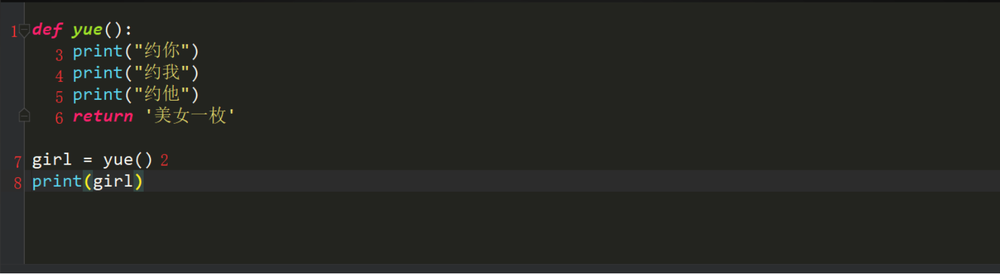

## 一.函数介绍

我们目前为止,已经可以完成一些软件的基本功能了,现在我们自己来实现一个len,但是不能使用len

```python
a = "alexdsb"
count = 0
for i in a:
    count += 1
print(count)
```

我们现在实现了一个求长度,我还想让你们求一下列表和元组的长度 是不是就要将我们写的内容再次拿过来

我们在求一个字典的长度,也需要将我们写好的内容拿过来使用 好像咱们这个程序中好多都是一样的啊,我们能不能把这些代码封装起来,用的时候拿过来就用啊

## 二.函数定义

def 是python中关键字主要用来定义函数的

len这个是函数的名字

()这个括号是个神奇的东西,咱们后边会详细**盘**它

: 冒号是表示咱们这个语句写完了

函数体就是有4个空格的缩进

```python
def len():
  a = "alexdsb"
  count = 0
  for i in a:
      count += 1
  print(count)
```

我们来看一下函数的定义在内存空间发生了什么:


是的你没有看错,内存开辟了一个空间,但是里边存放是代码.

这样我就将咱们写的代码封装起来了,我们现在执行一下程序看看它会不会进行求长度,它并没有执行,我们来看看怎么能够执行上呢?

## 三.函数的调用

使用函数名加小括号就可以调用了  写法:函数名()  这个时候函数的函数体会被执行

```
def len():
  a = "alexdsb"
  count = 0
  for i in a:
      count += 1
  print(count)
 
len()  # 函数的调用
```

当我们调用执行的时候,才会执行func这个空间里的代码,执行的时候在开辟空间,这次是在func里边开辟的空间


现在就实现了求一次长度,我想要多求几次我就只需要

```
len()
len()
len()
```

直接调用定义好的函数就可以了 **大家都练习一下**

当我们执行完函数后,函数里开辟的空间就销毁了,我们如果想用函数里的值就需要从函数中传递出来

## 四. 函数的返回值

我们现在换一下例子,都是男同胞 大家都有哪方面的想法,就需要使用交友社交软件,我们现在来模拟一下使用社交软件的流程吧

```python
 def yue():
    print("掏出手机")
    print("打开默默")
    print("约一个妹子")  
yue()
```

咱们约完之后的得有个结果吧, 比如约的是萝莉小姐姐,还是大妈啊总得有个结果,那么这个结果

怎么来描述和获得呢? 这就涉及到函数的返回值啦

执行完函数之后,我们可以使用return来返回结果

```python
def yue():
    print("约你")
    print("约我")
    print("约他")
    return   
yue()
```

返回的是什么结果,返回的东西给谁了?? 返回值返回给了函数调用者 yue()就是函数的调用者 那就是返回给它了,我们来看看返回的什么

```python
def yue():
    print("约你")
    print("约我")
    print("约他")
    return   
ret = yue()
print(ret)
```

返回的结果是None,想想我们有的时候操作列表的方法 打印的结果就是None,我们所有用的字符串,列表的方法都是函数.

函数中遇到return,此函数就立马结束了.不在继续执行

```python
def yue():
    print("约你")
    print("约我")
    print("约他")
    return
  	print("大家一起约")
yue()
```

我们现在给return后边写一个返回值,我们试试返回个东西

```python
def yue():
    print("约你")
    print("约我")
    print("约他")
    return  "美女一枚"   
yue()
```

我们现在返回了一个字符串,我们来看一下

```python
def yue():
    print("约你")
    print("约我")
    print("约他")
    return '美女一枚'
girl =  yue()
print(girl)

结果:
约你
约我
约他
美女一枚
```

肯定好多朋友还是不明白上边怎么就打印美女一枚了,莫慌看下图:



```
1.定义了一个函数yue
2.调用函数
3.执行函数里的约你
4.执行函数里的约我
5.执行函数里的约他
6.返回给调用者一个字符串,这个调用者就是yue()
7.将返回的字符串通过一个等号赋值给白变量girl
8.打印变量girl的值
```

**函数的返回值可以有多个结果:**

```python
def yue():   
    print("约你")   
    print("约我")   
    print("约他")   
    return "美女一枚", "萝莉一枚"
girl = yue()
print(type(girl))   # tuple
```

当函数的返回值是多个的时候,返回的就是一个元组

### 4.1 总结

　　1.遇到return,此函数结束,return下面的代码将不会在执行

　　2.return 返回值

　　　　关于返回值:

　　　　　　如果return什么都不写或者干脆就没写return,返回的结果就是None

　　　　　　如果return后面写了一个值,返回给调用者这个值

　　　　　　如果return后面写了多个结果,返回给调用者一个tuple(元祖),调用者可以直接使用解构获取多个变量


OK,完美 可以得到结果了 但是我们约的方式是不是有点问题啊?陌陌现在还能约到吗?约不到了 我们换探探 那要是过几天探探也不行了

是不是会有一个新的替代品,那你们想有一个替代的,你就需要去改代码.是不是有点不合适了  最好的方式是想用什么约就用什么约  ok 我们也是可以实现的 ,我们就要在函数后边的括号里搞点事情了.

