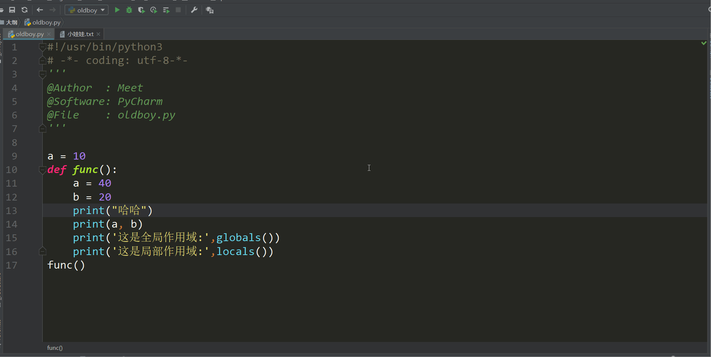

## 一.名称空间

在python解释器开始执行之后, 就会在内存中开辟一个空间, 每当遇到一个变量的时候, 就把变量名和值之间的关系记录下来, 但是当遇到函数定义的时候, 解释器只是把函数名读入内存, 表示这个函数存在了,  至于函数内部的变量和逻辑, 解释器是不关心的. 也就是说一开始的时候函数只是加载进来, 仅此而已, 只有当函数被调用和访问的时候, 解释器才会根据函数内部声明的变量来进行开辟变量的内部空间. 随着函数执行完毕, 这些函数内部变量占用的空间也会随着函数执行完毕而被清空. 

```
def fun():   
    a = 10   
    print(a)
fun()
print(a)    # a不存在了已经..
```

​    我们给存放名字和值的关系的空间起一个名字叫: 命名空间. 我们的变量在存储的时候就 是存储在这片空间中的.   

​    命名空间分类:         

​            1. 全局命名空间--> 我们直接在py文件中, 函数外声明的变量都属于全局命名空间       

​            2. 局部命名空间--> 在函数中声明的变量会放在局部命名空间       

​            3. 内置命名空间--> 存放python解释器为我们提供的名字, list, tuple, str, int这些都是内置命名空间　　

**加载顺序:**

1. 内置命名空间
2. 全局命名空间

​       3. 局部命名空间(函数被执行的时候)

**取值顺序:**

​       1. 局部命名空间

​       2. 全局命名空间

​       3. 内置命名空间

```
a = 10
def func():  
    a = 20   
    print(a)

func()  # 20
```

作用域:  作用域就是作用范围, 按照生效范围来看分为  全局作用域  和   局部作用域   

　　 全局作用域: 包含内置命名空间和全局命名空间. 在整个文件的任何位置都可以使用(遵循 从上到下逐⾏执行).

　　 局部作用域: 在函数内部可以使用.             

作⽤域命名空间:         

1. 全局作用域:    全局命名空间 + 内置命名空间       
2. 局部作用域:    局部命名空间   

我们可以通过globals()函数来查看全局作⽤用域中的内容,也可以通过locals()来查看局部作 ⽤用域中的变量量和函数信息 

```
a = 10
def func():   
    a = 40   
    b = 20   
    print("哈哈")   
    print(a, b)        
    print(globals())    # 打印全局作用域中的内容   
    print(locals())     # 打印当前作用域中的内容
func()    　　
```



