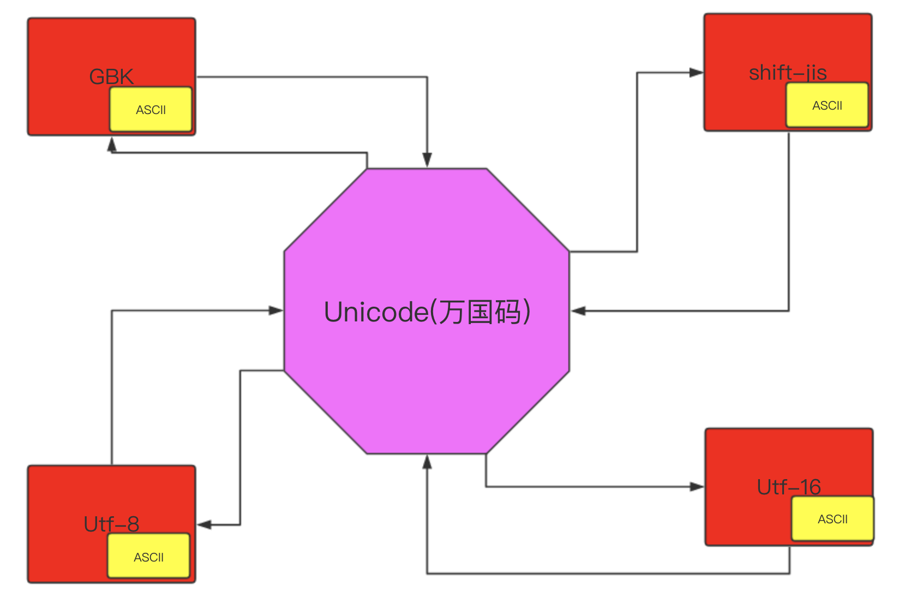

## 一.二次编码

编码回顾:

ASCII : 最早的编码. ⾥⾯有英⽂⼤写字⺟, ⼩写字⺟, 数字, ⼀些特殊字符.
没有中⽂, 8个01代码, 8个bit, 1个byte

GBK: 中⽂国标码, ⾥⾯包含了ASCII编码和中⽂常⽤编码. 16个bit, 2个byte

UNICODE: 万国码, ⾥⾯包含了全世界所有国家⽂字的编码. 32个bit, 4个byte, 包含了 ASCII

UTF-8: 可变⻓度的万国码. 是unicode的⼀种实现. 最⼩字符占8位
　　1.英⽂: 8bit 1byte
　　2.欧洲⽂字:16bit 2byte
　　3.中⽂:24bit 3byte

综上, 除了ASCII码以外, 其他信息不能直接转换.
在python3的内存中. 在程序运⾏阶段. 使⽤的是unicode编码.
因为unicode是万国码. 什么内容都可以进⾏显⽰. 那么在数据传输和存储的时候由于unicode比较浪费空间和资源.
需要把 unicode转存成UTF-8或者GBK进⾏存储. 怎么转换呢.
在python中可以把⽂字信息进⾏编码. 编码之后的内容就可以进⾏传输了.
编码之后的数据是bytes类型的数据.其实啊. 还是原来的 数据只是经过编码之后表现形式发⽣了改变⽽已.

bytes的表现形式:

1. 英⽂ b'alex' 英⽂的表现形式和字符串没什么两样
2. 中⽂ b'\xe4\xb8\xad' 这是⼀个汉字的UTF-8的bytes表现形式

### 1.1 编码

```
s = "alex"
print(s.encode("utf-8")) # 将字符串编码成UTF-8
print(s.encode("GBK")) # 将字符串编码成GBK
结果:
b'alex'
b'alex'
s = "中"
print(s.encode("UTF-8")) # 中⽂编码成UTF-8
print(s.encode("GBK")) # 中⽂编码成GBK
结果:
b'\xe4\xb8\xad'
b'\xd6\xd0'
```

记住: 英⽂编码之后的结果和源字符串⼀致. 中⽂编码之后的结果根据编码的不同. 编码结果也不同.
　　  我们能看到. ⼀个中⽂的UTF-8编码是3个字节. ⼀个GBK的中⽂编码是2个字节.
　　  编码之后的类型就是bytes类型. 在⽹络传输和存储的时候我们python是发送和存储的bytes 类型.
　　  那么在对⽅接收的时候. 也是接收的bytes类型的数据. 我们可以使⽤decode()来进⾏解码操作.
　　 把bytes类型的数据还原回我们熟悉的字符串:

```
s = "我叫李嘉诚"
print(s.encode("utf-8")) #
b'\xe6\x88\x91\xe5\x8f\xab\xe6\x9d\x8e\xe5\x98\x89\xe8\xaf\x9a'
print(b'\xe6\x88\x91\xe5\x8f\xab\xe6\x9d\x8e\xe5\x98\x89\xe8\xaf\x9a'.decod
e("utf-8")) # 解码
```

### 1.2 解码

编码和解码的时候都需要制定编码格式. 

```
s = "我是⽂字" bs = s.encode("GBK") 
# 我们这样可以获取到GBK的⽂字 
# 把GBK转换成UTF-8 
# ⾸先要把GBK转换成unicode. 也就是需要解码 
s = bs.decode("GBK") # 解码 
# 然后需要进⾏重新编码成UTF-8 
bss = s.encode("UTF-8") # 重新编码 
print(bss)
```



unicode就是一个桥梁,可以实现他们之前相互编码,但是我们在编码和解码的时候必须使用同一个密码本.