# 第一章 Python基础

## 第一节 Python 简介

   #### 1. Python的出生

	python的创始人为吉多·范罗苏姆（Guido van Rossum）。1989年的圣诞节期间，吉多·范罗苏姆（中文名字：龟叔）为了在阿姆斯特丹打发时间，决心开发一个新的脚本解释程序，作为ABC语言的一种继承。  

（龟叔：2005年加入谷歌至2012年，2013年加入Dropbox直到现在，依然掌握着Python发展的核心方向，被称为仁慈的独裁者）。


#### 2. Python的今世

2019年6月的TIOBE排行榜，Python占据第三的位置， Python崇尚优美、清晰、简单，是一个优秀并广泛使用的语言。


	据当前来看Python在TIORB排行榜中,位居第三.Python崇尚优美、清晰、简单，是一个优秀并广泛使用的语言.
	
	Python整体呈上升趋势，反映出Python应用越来越广泛并且也逐渐得到业内的认可！

- **Python的主要应用领域:**

  - 云计算: 云计算最火的语言， 典型应用OpenStack

  - WEB开发: 众多优秀的WEB框架，众多大型网站均为Python开发，Youtube, Dropbox, 豆瓣。。。典型WEB框架有Django

  - 科学运算、人工智能: 典型库NumPy, SciPy, Matplotlib, Enthought librarys,pandas

  - 系统运维: 运维人员必备语言

  - 爬虫:通过代码来模拟人进行页面访问,对信息进行批量的获取

  - 金融：量化交易，金融分析，在金融工程领域，Python不但在用，且用的最多，而且重要性逐年提高。原因：作为动态语言的Python，语言结构清晰简单，库丰富，成熟稳定，科学计算和统计分析都很牛逼，生产效率远远高于c,c++,java,尤其擅长策略回测'

  - 图形GUI: PyQT, WxPython,TkInter

    

- **Python在哪些公司被使用:**

  - 谷歌：Google App Engine 、code.google.com 、Google earth 、谷歌爬虫、

  - Google广告等项目都在大量使用Python开发

  - CIA: 美国中情局网站就是用Python开发的

  - NASA: 美国航天局(NASA)大量使用Python进行数据分析和运算

  - YouTube:世界上最大的视频网站YouTube就是用Python开发的

  - Dropbox:美国最大的在线云存储网站，全部用Python实现，每天网站处理10亿个文件的上传和下载

  - Instagram:美国最大的图片分享社交网站，每天超过3千万张照片被分享，全部用python开发

  - Facebook:大量的基础库均通过Python实现的

  - Redhat: 世界上最流行的Linux发行版本中的yum包管理工具就是用python开发的

  - 豆瓣: 公司几乎所有的业务均是通过Python开发的

  - 知乎: 国内最大的问答社区，通过Python开发(国外Quora)

  - 春雨医生：国内知名的在线医疗网站是用Python开发的

  - 除上面之外，还有搜狐、金山、腾讯、盛大、网易、百度、阿里、淘宝 、土豆、新浪、果壳等公司都在使用Python完成各种各样的任务。

    

#### 3. Python的历史

1989年，为了打发圣诞节假期，Guido开始写Python语言的编译器。Python这个名字，来自Guido所挚爱的电视剧Monty Python’s Flying Circus。他希望这个新的叫做Python的语言，能符合他的理想：创造一种C和shell之间，功能全面，易学易用，可拓展的语言。

1991年，第一个Python编译器诞生。它是用C语言实现的，并能够调用C语言的库文件。从一出生，Python已经具有了：类，函数，异常处理，包含表和词典在内的核心数据类型，以及模块为基础的拓展系统。

- Granddaddy of Python web frameworks, Zope 1 was released in 1999
- Python 1.0 - January 1994 增加了 [lambda](https://en.wikipedia.org/wiki/Lambda_calculus), [map](https://en.wikipedia.org/wiki/Map_(higher-order_function)), [filter](https://en.wikipedia.org/wiki/Filter_(higher-order_function)) and [reduce](https://en.wikipedia.org/wiki/Fold_(higher-order_function)).
- Python 2.0 - October 16, 2000，加入了内存回收机制，构成了现在Python语言框架的基础
- Python 2.4 - November 30, 2004, 同年目前最流行的WEB框架Django 诞生
- Python 2.5 - September 19, 2006
- Python 2.6 - October 1, 2008
- Python 2.7 - July 3, 2010
- In November 2014, it was announced that Python 2.7 would be supported until 2020, and reaffirmed that there would be no 2.8 release as users were expected to move to Python 3.4+ as soon as possible
- Python 3.0 - December 3, 2008
- Python 3.1 - June 27, 2009
- Python 3.2 - February 20, 2011
- Python 3.3 - September 29, 2012
- Python 3.4 - March 16, 2014
- Python 3.5 - September 13, 2015
- Python 3.6 - December 16,2016


#### 4.  Python是什么编程语言

编程语言主要从以下几个角度为进行分类，编译型和解释型、静态语言和动态语言、强类型定义语言和弱类型定义语言，我们主要通过编译型和解释性来划分Python是什么编程语言

- **编译型与解释型**

  编译器是把源程序的每一条语句都编译成机器语言,并保存成二进制文件,这样运行时

  计算机可以直接以机器语言来运行此程序,速度很快; 

  而**解释器**则是只在执行程序时,才一条一条的解释成机器语言给计算机来执行,

  所以运行速度是不如编译后的程序运行的快的. 

  为什么会有编译型好解释型语言是因为计算机不能直接认识并执行我们写的语句,它只能认识机器语言(是二进制	的形式)	


- **编译型**
  - 优点：
    - 编译器一般会有预编译的过程对代码进行优化。因为编译只做一次，运行时不需要编译，所以编译型语言的程序执行效率高。可以脱离语言环境独立运行。
  - 缺点：
    - 编译之后如果需要修改就需要整个模块重新编译。编译的时候根据对应的运行环境生成机器码，不同的操作系统之间移植就会有问题，需要根据运行的操作系统环境编译不同的可执行文件。

- **解释型**
  - 优点：
    - 有良好的平台兼容性，在任何环境中都可以运行，前提是安装了解释器（虚拟机）。灵活，修改代码的时候直接修改就可以，可以快速部署，不用停机维护。
  - 缺点：
    - 每次运行的时候都要解释一遍，性能上不如编译型语言。


- **动态语言和静态语言**

  - 动态类型语言：

    - 动态类型语言是指在运行期间才去做数据类型检查的语言，也就是说，

      在用动态类型的语言编程时，永远也不用给任何变量指定数据类型，该语言会在你第一次赋值给变量时，

      在内部将数据类型记录下来。Python和Ruby就是一种典型的动态类型语言，其他的各种脚本语言如

      VBScript也多少属于动态类型语言。

      

  - 静态类型语言：

    - 静态类型语言与动态类型语言刚好相反，它的数据类型是在编译其间检查的，

      也就是说在写程序时要声明所有变量的数据类型，C/C++是静态类型语言的典型代表，

       其他的静态类型语言还有C#、JAVA等。

      

- **强类型定义语言和弱类型定义语言**

  - 强类型定义语言：

    - 强制数据类型定义的语言。也就是说，一旦一个变量被指定了某个数据类型，如果不经过强制转换，那么它就永远是这个数据类型了。

      举个例子：如果你定义了一个整型变量a,那么程序根本不可能将a当作字符串类型处理。

      强类型定义语言是类型安全的语言。

  - 弱类型定义语言：

    - 数据类型可以被忽略的语言。它与强类型定义语言相反, 一个变量可以赋不同数据类型的值。强类型定义语言在速度上可能略逊色于弱类型定义语言，但是强类型定义语言带来的严谨性能够有效的避  免许多错误。另外,“这门语言是不是动态语言”与“这门语言是否类型安全”之间是完全没有联系的！

      例如：Python是动态语言，是强类型定义语言（类型安全的语言）; VBScript是动态语言，是弱类型定义语言（类型不安全的语言）; JAVA是静态语言，是强类型定义语言（类型安全的语言）。

      通过上面这些介绍，我们可以得出. 

      **Python是一门动态解释性的弱类型定义语言。**

      

#### 5.  Python的种类

- **Cpython**

  - Python的官方版本，使用C语言实现，使用最为广泛，CPython实现会将源文件（py文件）

  - 转换成字节码文件（pyc文件），然后运行在Python虚拟机上。

    

- **Jyhton**

  - Python的Java实现，Jython会将Python代码动态编译成Java字节码，然后在JVM上运行。

    

- **IronPython**

    - Python的C#实现，IronPython将Python代码编译成C#字节码，然后在CLR上运行。（与Jython类似）

        

- **PyPy（特殊）**

  - Python实现的Python，将Python的字节码字节码再编译成机器码。


看了这么多内容,感觉好厉害已近迫不及待的想要动手去试试了,我不得不说,还是需要在稍等一下.我们需要安装一下Python解释器


#### 6. Python环境安装

- **打开官网：http://www.python.org 点击`Downloads`下载,如下图**


- **下拉页面，选择对应版本：Python3.6.3，如下图**


向下查找,找到Python 3.6.3

- **根据系统选择对应的安装包,如下图**


 根据当前系统的选择对用的,红色的是windows32位,绿色的是windows64位

- **下载完成，如下图**


下载完成后找到下载的目录,然后用鼠标左键双击

- **安装**


- **执行下一步**


- **勾选安装**


- **安装进度**


- **安装成功**


- **验证是否配置成功**

打开电脑的终端(黑窗口),输入 python回车进去python解释器,返回的结果入下图:


- **退出终端中的Python**

在终端中 >>> 输入exit() 如下图:


#### **7.  输出**

- Windows系统使用**Notepad++**创建一个文本,文本中的内容如下:

  ```python
  print("hello world")
  ```
  
  写完后一定要记得保存,保存完后我们打开我们的终端,Windows系统的找到图下的两个键:

  
  
  然后会弹出运行的窗口,我们在运行的窗口中输入cmd.
  
  

- Mac系统的电脑首先打开 启动台 — 其他 — 终端 — 输入 vim 文件名字 然后按键盘i 进行输入然后退出的时候按一下esc键 发现文件的左下角有个**:** 然后在这个位置输入wq! 回车就行了,具体的请看图下实例

	

	我们现在都打开了终端后再终端中输入以下命令:

  ```python
python 文件名.py
  ```

  注意点:python和文件名是有空格的,再次确定一下大家的现在是不是都是这个样子的:

  

  print() 括号里面的内容就是要输出的内容,如果是文字和字母需要用英文的引号引起来,数字直接写就可以啦

  ```PYTHON
python2写法:      
       print  'hello world'

  python3写法:    
       print('hello world')
  我们学习的python3版本,python2版本是什么样也要知道
  ```

  我们现在成功的将英文的打印出来了,现在我们使用这种方式打印一下中文的内容吧!

  ```python
  print("你好 世界")
  ```

  然后将文件保存了,保存后我们在来终端上运行一次.是不是都出现报错了,出现报错这个是正常的,我们只需要在加上一句话就可以了.

  ```python
  #conding:utf-8
  ```

  这局话必须要加在文件的第一行,这个是告诉解释器当文件中出现中文的时候使用utf-8的编码进行查看
  
  

#### 8. 变量

什么是变量?

**变量**就是把程序运行的中间结果临时存在内存中,以便后续代码使用

这个知识点用在哪呢?
变量在我们后期中经常会被使用

变量如何使用?

```
name = "meet"  
```

这样就是在定义一个变量,我们具体说一下定义变量

```python
name 是一个变量名
=    是一个赋值操作  赋值就是将值交给name
'Meet'  是一个值
```

变量的作用:**昵称,就是代指内存中某个地址中的内容**


我们定义变量的时候,可以任意起名字吗? 应该是有规则的吧,我们来看看变量定义的规则

- **变量的定义规则**

   - 变量名由字母,数字,下划线组成

   - 变量名禁止使用数字开头

   - 禁止使用Python中的关键字以及内置函数的名字

    关键字如下:

    ```
    ['False', 'None', 'True', 'and', 'as', 'assert', 'break', 'class', 'continue', 'def', 'del', 'elif', 'else', 'except', 'finally', 'for', 'from', 'global', 'if', 'import', 'in', 'is', 'lambda', 'nonlocal', 'not', 'or', 'pass', 'raise', 'return', 'try', 'while', 'with', 'yield']
    ```

  - 不建议使用中文和拼音
  - 变量名要具有意义
  - 变量名区分大小写
  - 推荐写法:

    - 驼峰体: AgeOfOldboy = 56
    - 下划线:age_of_oldboy = 56

  这是两种写法,你们觉得那种的比较清晰.是不是第二种看着比较清晰,第一种猛的一看还以为是AngelaBaby呢

  我们现在定义一个变量知道了,看看定义多个变量
  
  

-	**变量的赋值**

    ```python
    name1  =  'Meet'
    name2  =  'Guo'
    ```

    此时的name1的值是Meet,name2的值是Guo,我们来看看下边的这个变量

    

    现在我们在内存中开辟了两个空间,分别给不同的内存地址贴上不同的标签,我们来看看下边的代码

    ```python
    name1  =  'Meet'
    name2  =  name1
    ```

    

    现在的这个name1是meet,name2是name1 也就是name2现在用的是name1的值,name2的值就是meet
    
    


- **变量的小高级**

    ```python
    age1 = 18
    age2 = age1
    age1 = 12
    age3 = age2
    print(age1,age2,age3)
    ```

    我们先来分析一下这个结果是怎样的,在运行看结果是否和你想的一样

    如果结果和你想的不一致,你需要注意了.咱们代码的运行是从上至下的执行,并且在内存中只能用一个名字相同的标签.

    

    ```python
    age = 12
    age = 12 + 1
    age1 = age + 1
    print("我今年:",age1)
    name1 = 'alex'
    name2 = name1
    name1 = 'wusir'
    name3 = name2
    打印name1,name2name3分别对应的值是什么
    ```

    通过上边的小高级和练习我们可以得出一个宗旨,代码是从上向下执行,并且便签只能有一份,相当于一个变量名只能代指一个值

    

#### 9. 常量

常量就是将变量名大写,尽量保持不更改的一种量
这个常量有是干什么的呢   其实我生活中就有一些定死了的量
比如生日,身份证等
咱们代码中，也应该有一些这样的东西，咱们从设计之初就是不让任何人改变的，所以这个东西就是常量。


#### **10. 注释**

在你写代码时，有些代码写的比较经典，或者过于复杂，你一眼看不出来，怎么办，比如在文言文中，有些出处或者偏难怪的文字，你是不是不理解？
那么怎么办呢？是不是就得有简单说明。

注释就是做这个的,我们来看一下怎么用

```python
# 这个就是给这一行进行注释,注释后的代码不会执行
'''
这种的是多行注释, 什么是多行注释啊,其实很简单就是咱们注释的内容可以
进行换行
'''
```

  看个示例:

```python
# print('hello') 这样就是对这个代码进行注释,并且这个代码不会执行
```
```python
'''
print(1)
print(2)
这种就是多行注释,这样的注释也不会执行
'''
```


#### 11. 基础数据类型:

什么是数据类型？

我们人类可以很容易的分清数字与字符的区别，但是计算机并不能呀，计算机虽然很强大，但从某种角度上看又很傻，除非你明确的告诉它，1是数字，“汉”是文字，否则它是分不清1和‘汉’的区别的，因此，在每个编程语言里都会有一个叫数据类型的东西，其实就是对常用的各种数据进行了明确的划分，你想让计算机进行数值运算，你就传数字给它，你想让他处理文字，就传字符串类型给他。Python中常用的数据类型有多种，今天我们暂只讲3种， 数字、字符串、布尔类型

int是整型;也就是我们从小就接触的数学中的整数,整型在计算机中运于计算和比较

在32位机器上int的范围是:   -2\*\*31～2**31-1，即-2147483648～2147483647

在64位机器上int的范围是: -2\*\*63～2**63-1，即-9223372036854775808～9223372036854775807

目前这些数字已经够你用了吧. 注意这些是整数.


-	整型

  ```python
  num1 = 2
  num2 = 3
  print(num1 + num2)
  # 结果: 5   
  # 整型就和我们学的数学一样可以进行加减乘除
  ```
- 字符串
  str是字符串也就是我们从小就接触的中文,如果我们在程序中直接把中文写入,程序是不能分辨这是个什么鬼东西.所以我们要遵循一种规则让计算机能够识别,这个规则就是只要是用引号引起来就是字符串

  在Python中,凡是用引号引起来的,全是字符 .

  字符  可以用单引号，双引号，或者三引号引起来，没有什么区别，只是一些特殊的格式需要不用的引号 比如：

  ```python
  msg = "My name is Alex , I'm 22 years old!" 这个就需要单双引号配合。
  msg =""" 今天我想写首小诗，
  
  来歌颂我的同桌，
  
  你看他那乌黑的短发，
  
  好像一只炸毛鸡。
  
  """
  #想写多个内容还需要使用换行的时候,就需要三引号。
  ```

  数字类型可以做运算,字符串可以吗??

  -	字符串加法

    ```python
    #字符串的拼接
    s1 = 'a' 
    s2 = 'bc'
    print(s1 + s2)
    ```

  - 字符串乘法

    ```PYTHON
    str*int name = '坚强'
    print(name*8)
    ```

- **布尔值**

  bool是布尔值,布尔值中一共分为俩个状态

  True    就是真

  False   就是假

  例如我们想让计算机帮我们计算一下两个数的比较大小

  ```python
  print(3>7)
  
  结果: False
  
  print(7>3)
  
  结果: True
  
  ```

  我们现在简单的认识了这三个基础数据类型,我们在学习一下用户输入

  

#### 12. 输入

咱们在登录一些网页和QQ的时候是不是常常会让咱们输入账户或者密码的情况,

这样的情况在程序中会大量的存在，接下来咱们自己实现一个登录时候要输入的功能

```PYTHON
s = input('请输入你喜欢的东西') 
```

input就是固定格式,他是输入的意思 括号里边的内容是提示是给用户看的提示语句,用户输入的内容让input接收了然后赋值给了字符串s

- **输入用户名**

  

  ```PYTHON
  #!/usr/bin/env python
  #-*- coding:utf-8 -*-

  #将用户输入的内容赋值给name变量
  python2的写法
  name = raw_input("请输入用户名:")
  print name

  python3的写法
  name = input("请输入用户名:")
  print(name)
  ```

  需要注意的是input程序交互获取到的内容都是字符串,我们看下面的简单示例:

  ```PYTHON
  num = input('请输入数字:')
  print(num + 5)

  结果:
  请输入数字:6
  Traceback (most recent call last):
    File "D:/python_object/test.py", line 350, in <module>
      print(num + 5)
  TypeError: must be str, not int
  ```

  报错了,提示我们类型错误,数字和字符串是不能相加的.可是我们输入的明明是数字啊.其实我们看着输入的是
  数字,但是input获取到的都是字符串

  这个知识点用在哪里?

  在工作中如果需要用户输入一些个人信息比如账号，密码，性别，爱好等，即是你需要将你输入的信息传递给程序当中，那么就需要用到用户交互input。

  **注意**   

  ```python
  在Python2 中使用raw_input              获取的都是字符串
在Python3 中使用input                  获取的都是字符串
  ```


#### 13. 流程控制

你在生活中是不是经常遇到各种选择，比如玩色子，猜大小，比如选择走那条路回家？Python程序中也会遇到这种情况，这就用到了if语句。

这个功能就是Python中的流程控制语句if。
那么如何使用这个功能呢？（下面就是）

```PYTHON
if 条件: #引号是将条件与结果分开。
  结果# 四个空格，或者一个tab键，这个是告诉程序满足这个条件的结果。切记空格和tab键不能混合使用
```

- 判断条件 if

```PYTHON
age = input("输入年龄:")
if int(age) >= 18:
    print("成年了,能干成年人的事了")
```

- 二选一 if else

```PYTHON
age = input('请输入您的年龄:')
if int(age) > 18:
    print('你可以去网吧尽情的嗨皮了')
else:
    print('你现在还不行啊!')
```

以上这种写法是让用户输入内容,然后进行比较,如果一个条件成立那就执行print,为了明确的区分改执行哪些部分,当条件成立后执行缩进的代码

然后程序就退出了.下边的else就不会在执行了

- 多个选项进行单选或不选 if elif 

```PYTHON
num = input('请输入要比较的数字:')
if int(num) >= 22:
    print('可以扯证了')
elif int(num) >= 18:
    print('成年了,可以干一些成年的事了')
elif int(num) < 18:
    print('还是小屁孩')
```

以上写法就是我们做的单选题一样,三个分支判断中只要有个成立,其余都不在执行  

- 多个选项进行单选(必选) if elif else

```python
num = input("请输入要比较的数字:")
if num > 60:
  print("大了")
elif num < 60:
  print("小了")
else:
  print("猜对了")
```

- 嵌套if 

```PYTHON
name = input('请输入名字:')
if name == 'meet':
    age = input('请输入年龄:')
    if int(age) == 18:
        print('输入全部正确')
    else:
        print('年龄输入错误!')
else:
    print('名字输入错误!')
```

这样写法很常用,这样我们就可以明确的知道用户输入的名字和年龄那个是错误的,并且还做一个判断如果名字正确后在进行判断密码


## 第二节 运算符

#### 1. Pycharm使用

- 下载Pycahrm

首先要下载Pycharm这个软件，官网的下载地址是: <http://www.jetbrains.com/pycharm/download/#section=windows>

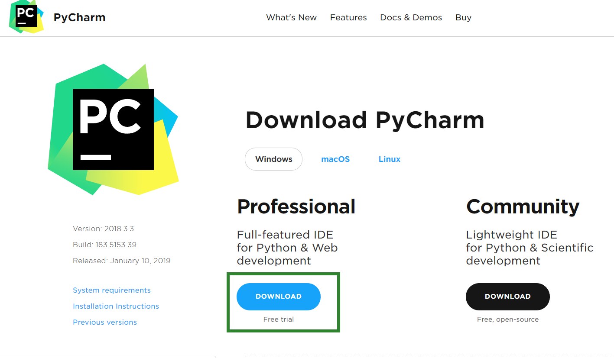

选择左边的点击进行下载,左边的是专业版右边是社区版

- 下载中


出现这个页面就是正在下载,稍微喝杯茶等等

- 找到文件


- 安装


选择Next 点击

- 选择要安装到那个目录

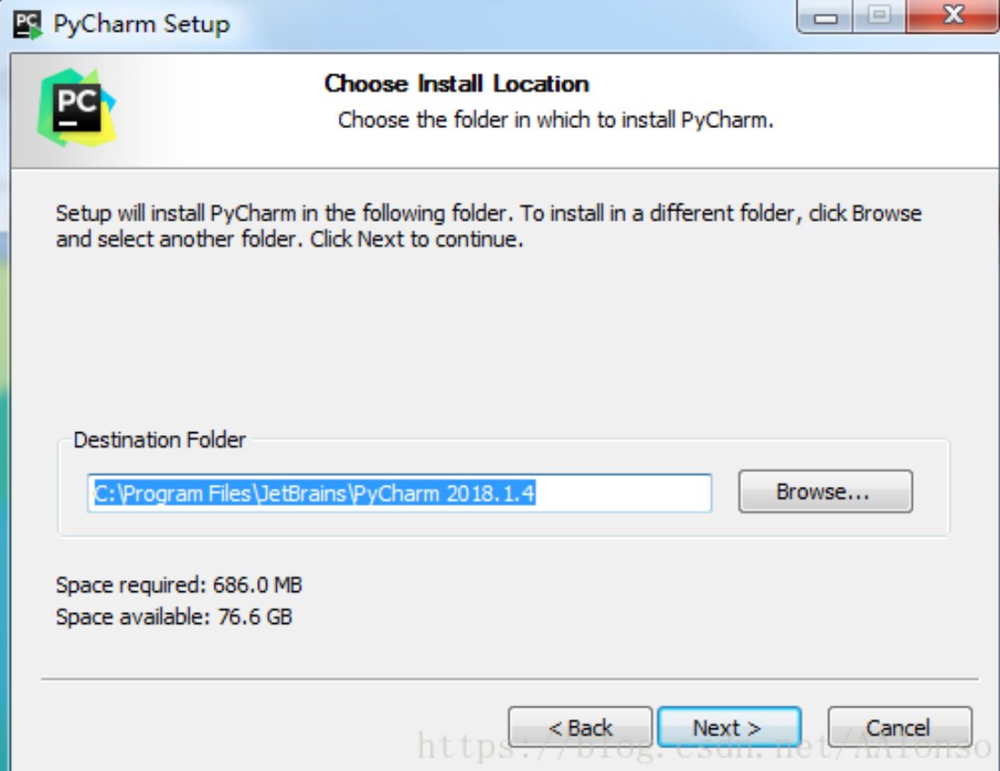

- 选择配置


我是64位机器,我选择了64,如果是32的就选择32 [不管64还是32剩下的都选择]

- 点击安装

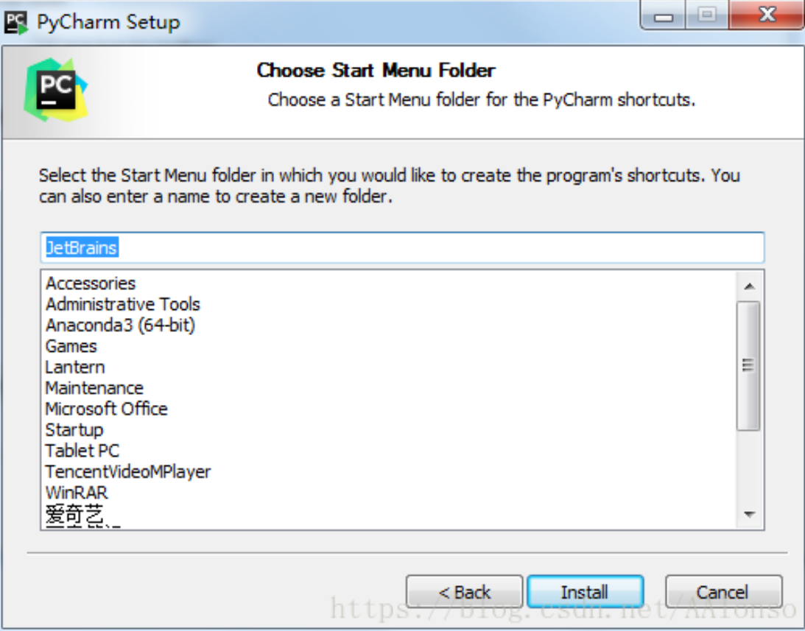

- 安装中

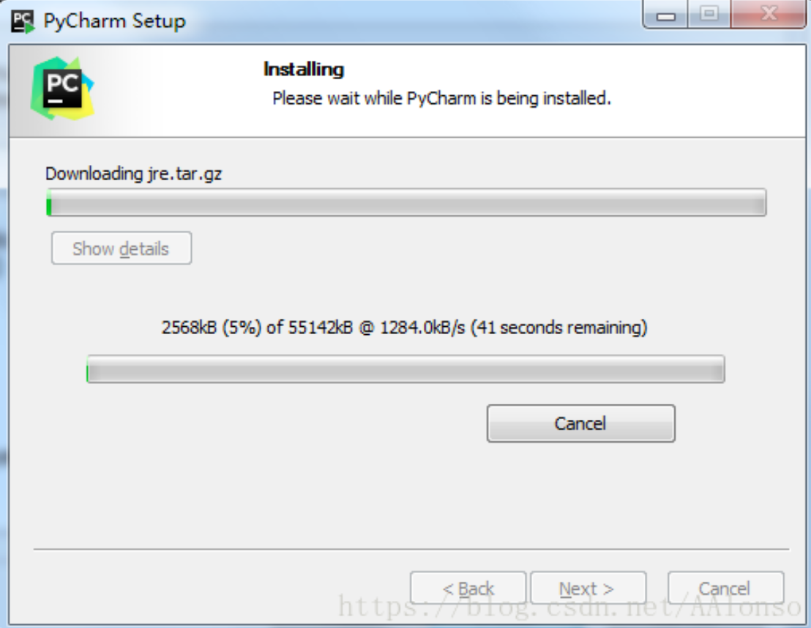

- 安装成功


出现这个界面的直接点击Finish关闭就可以了. 我们现在切换到桌面

- 使用Pycharm


找到这个图标然后双击

- 首次使用Pychram

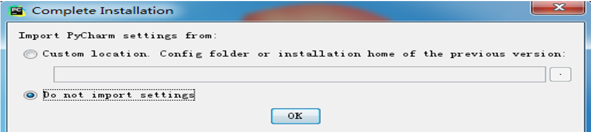

- 用户许可证


- 激活Pycharm

激活详情<http://idea.lanyus.com/>页面


点击选择的内容生成激活码,然后将激活码复制到code选项中

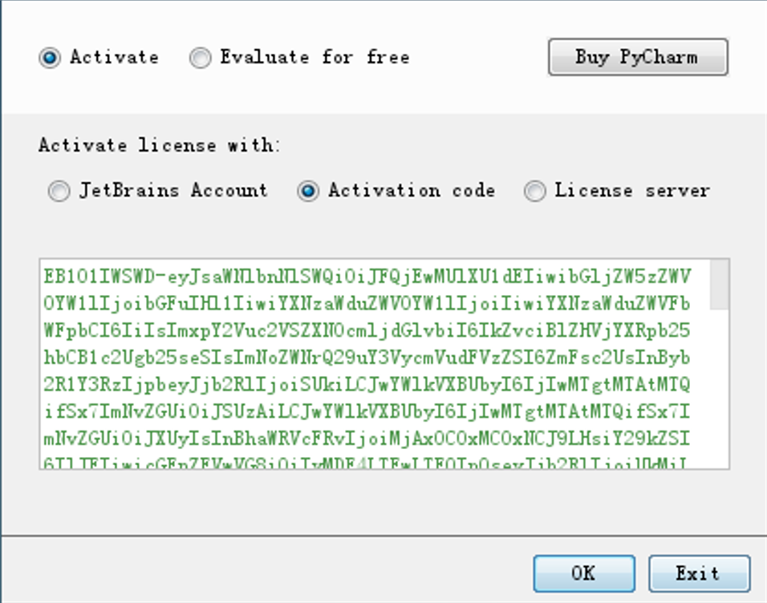

- 个性化设置


这个直接关闭就可以了

- 启动成功


如果你的激活码没问题的话，会在个性化，主题设置完毕之后，经过短暂的加载（加载速度取决于电脑性能）进入如图页面，到这一步，PyCharm安装完成了

- 创建文件

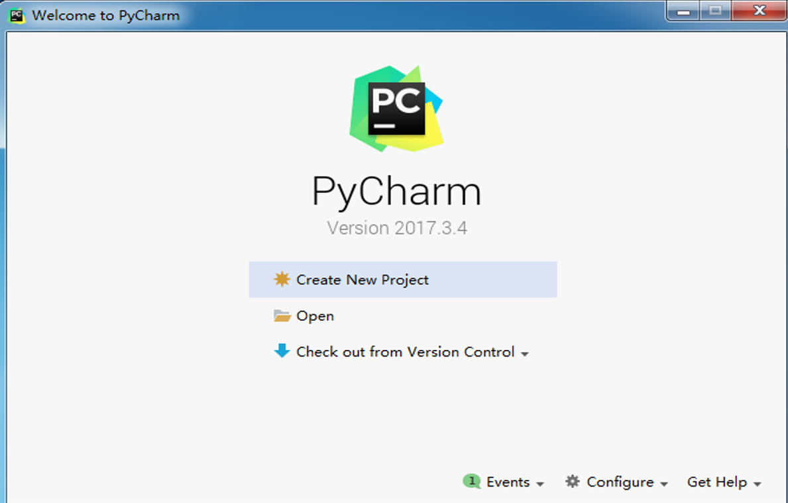

- PyCharm选择解释器

File -- Settings -- Project -- Project Interpreter,这里会显示当前系统默认的解释器，如果要添加别的解释器，点击工具图标，Add local -- Existing environment,点击三点图标，在打开的本地文件目录中选择解释器文件的.exe文件。就行了，如果你没有选择， PyCharm会自动选择当前环境默认的解释器

- PyCharm创建py文件


鼠标放到大纲然后右键鼠标,出现一个New然后鼠标向右滑动选择python file点击左键


直接写文件的名字就可以了,写完后回车就搞定了.

#### 2. while循环

while 循环
在生活中，我们遇到过循环的事情吧？比如循环听歌。在程序中，也是存才的，这就是流程控制语句 while

- 基本循环

```python
while 条件:
    # 循环体
    # 如果条件为真，那么循环则执行
    # 如果条件为假，那么循环不执行
```


条件如果为真就会一直执行下去  也就人们常说的死循环,我们想要停止就点那个红色的方块,如果点击的x的话,程序并没有停止,还在继续运行着

我们可以使用while循环进行内容循环,我们怎么能够让程序停止运行?

刚刚说到,死循环是因为条件一直都为真的时候,如果想让while循环停止最简单的方式就是将条件修改成假的,看下面示例

```python
flage = True
str_num = input("请输入要比较的数字:")
print("进入循环")
while flage:
  if "3" > str_num:
    print("在执行循环")
  else:
    print("要终止循环")
    flage = False
print("退出循环")
```

我们现在知道可以通过变量的形式改变while循环,我们还可以通过计数的方式来控制循环执行循环的次数,先来看一下

- 使用while计数

```python
count = 0
while True:
	count = count + 1
	print(count)
```


这样下去我就会执行下去,但是我想到100就停了

- 控制while循环的次数

```python
count = 0
while count < 100:
	count = count + 1
	print(count)
```


while 关键后边的是条件,这样就可以通过条件成功的控制住循环的次数,我们现在知道通过修改while后边的内容来终止循环,这是咱们自己想的办法,python这个编程语言中是不是应该也得有个终止循环的关键字什么的吧,我们来找一下试试      

- break关键字

我们除了可以使用条件能够让循环停止,其实Python还给我们提供了一个break关键字来停止循环

```python
num = 1
while num <6:
    print(num)
    num+=1
    break
    print("end")
```


当程序执行到break的时候就结束了.break就是结束当前这个while循环的 break以下的代码都不执行

- continue关键字

continue 用于退出当前循环，继续下一次循环

```python
num = 1
while num <6:
    print(num)
    num+=1
    continue
    print("end")
```


**注意:break是终止循环,continue是跳出本次循环,继续下次循环**

- while else使用

```python
# 循环一
while True:
    if 3 > 2:
        print('你好')
        break
else:
    print('不好')


# 循环二
while True:
    if 3 > 2:
        print('你好')
print('不好')

# 大家看到的这个是不是感觉效果是一样的啊,其实不然
# 当上边的代码执行到break的时候else缩进后的内容不会执行
```


这个执行的效果是因为

	循环一执行了循环也执行了if条件打印了你好然后碰到break循环结束了
	
	循环二执行了循环也执行了if条件打印了你好,但是没有break 就继续重复执行了
	
	循环一将3>2改成3<2这个条件就不成立,然后执行了else里打印了不好

- while else 练习

首先让用户输入序号选择格式如下:

```python
0.退出
1.开始登录
如果用户选择序号0 就提示用户退出成功
如果用户选择序号1就让用户输入用户名密码然后进行判断,正确就终止循环,错误重新输入
```

#### 3. 格式化输出

现在有个需要我们录入我们身边好友的信息,格式如下:

```python
------------ info of Alex Li ----------
             Name  : Alex Li
             Age   : 22
             job   : Teacher 
             Hobbie: girl
    ------------- end ----------------    
```

我们现在能想到的办法就是用一下方法:

```python
name = input('请输入姓名:')
age = input('请输入年龄:')
job = input('请输入职业:')
hobby = input('请输入爱好:')
a = '------------ info of Alex Li ----------'
b = 'Name:'
c = 'Age:'
d = 'Job:'
e = 'Hobby:'
f = '------------- end ----------------'
print(a+
      '\n'+
      b+
      name+
      '\n'+
      c+
      age+
      '\n'+
      d+
      job+
      '\n'+
      e+
      hobby+
      '\n'+
      f)

# 运行结果
------------ info of Alex Li ----------
Name:meet
Age:18
Job:it
Hobby:3
------------- end ----------------
```

这样写完全没有问题,但是会不会比较繁琐呢,有些大佬肯定会想这不都实现了吗,还逼叨逼什么啊,那是没有体验过格式化输出有多霸道,我们现在来体验下霸道的姿势

- %s

```python
name = input('请输入姓名:')
age = input('请输入年龄:')
job = input('请输入职业:')
hobby = input('请输入爱好:')
msg = '''
------------ info of Alex Li ----------
Name  : %s
Age   : %s 
job   : %s 
Hobbie: %s 
------------- end ----------------
    
'''
print(msg%(name,age,job,hobby))
```

我们但从代码的数量来看,这样就比那样的少,看到这里有细心的老铁们肯定在想%s这是啥玩意?

% 是一个占位, 回想下我们小时候给朋友占位子的场景,是的这个就是占位.那s又是什么呢?  s代码的字符串类型;


- %d|%

```python
name = input('>>>')
s1 = '1234%d'%int(name)
s2 = '1234%i'%int(name)
print(s1)
print(s2)

结果:
>>>89
123489
123489
# %d和%i这种格式化只能用数字来填补占位
```

- %%

```python
num = input('>>>')
s= '目前学习进度:%s%%'%num
print(s)

结果:
>>>80
目前学习进度:80%

# 如果我们字符串中想要显示单独的%就需要用来个%%来转义,不然程序会认为那是一个占位
```

#### 4. 运算符

计算机可以进行的运算有很多种，可不只加减乘除这么简单，运算按种类可分为算数运算、比较运算、逻辑运算、赋值运算、成员运算、身份运算、位运算.

今天我们暂只学习 算数运算、比较运算、逻辑运算、赋值运算、成员运算

- 算数运算

以下假设变量：a=10，b=20

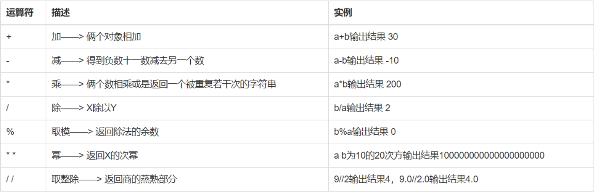


- 比较运算

以下假设变量：a=10，b=20

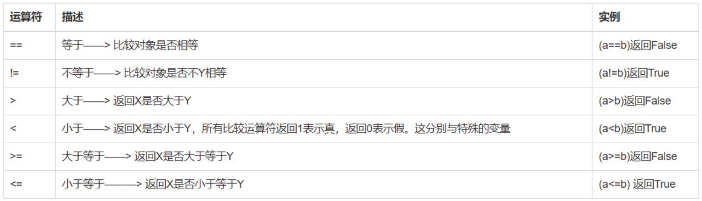

- 赋值运算

以下假设变量：a=10，b=20


- 逻辑运算

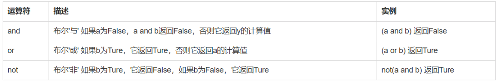

针对逻辑运算的进一步研究：

在没有()的情况下not 优先级高于 and，and优先级高于or，即优先级关系:

( )>not>and>or，同一优先级从左往右计算。

例题：

判断下列逻辑语句的True，False。

x or y , x为真，值就是x，x为假，值是y；

x and y, x为真，值是y,x为假，值是x。

```python
3>4 or 4<3 and 1==1
1 < 2 and 3 < 4 or 1>2 
2 > 1 and 3 < 4 or 4 > 5 and 2 < 1
not 2 > 1 and 3 < 4 or 4 > 5 and 2 > 1 and 9 > 8 or 7 < 6
```


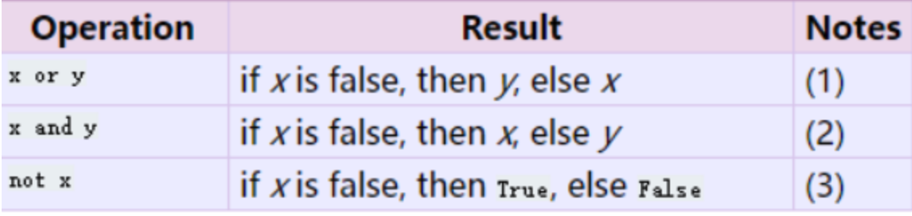

例题：求出下列逻辑语句的值。

```python
8 or 4
0 and 3
0 or 4 and 3 or 7 or 9 and 6
```

- 成员运算

in    not in :

判断子元素是否在原字符串（字典，列表，集合）中：

例如：

```python
#print('喜欢' in 'dkfljadklf喜欢hfjdkas')
#print('a' in 'bcvd')
#print('y' not in 'ofkjdslaf')
```

#### 5. 编码

咱们的电脑，存储和发送文件，发送的是什么？电脑里面是不是有成千上万个二极管，亮的代表是1，不亮的代表是0，这样实际上电脑的存储和发送是不是都是010101啊

我们发送的内容都是010101010这样写的内容比较多就不知道是什么了,所以我们想要明确的区分出来发送的内容就需要

在某个地方进行分段.计算机中设定的就是8位一断句

- ASCII

```PYTHON
计算机:

    储存文件,或者是传输文件,实际上是010101010

    计算机创建初期,美国,是7位一段，但是发明者说为了拓展，留出一位，这样就是8位一段句。8位有多少种可能 ？256

    密码本:

    ascii

         00000001

         01000001 01000010 01000011   ABC
```

随着计算机的发展. 以及普及率的提高. 流⾏到欧洲和亚洲. 这时ASCII码就不合适了. 比如: 中⽂汉字有几万个. 而ASCII 多也就256个位置. 所以ASCII不行了. 怎么办呢? 这时, 不同的国家就提出了不同的编码用来适用于各自的语言环境. 比如, 中国的GBK, GB2312, BIG5, ISO-8859-1等等. 这时各个国家都可以使用计算机了. 

- GBK

GBK, 国标码占用2个字节. 对应ASCII码 GBK直接兼容. 因为计算机底层是用英文写的. 你不支持英文肯定不行. 而英文已经使用了ASCII码. 所以GBK要兼容ASCII. 
这里GBK国标码. 前⾯的ASCII码部分. 由于使⽤两个字节. 所以对于ASCII码⽽言. 前9位都是0

```PYTHON
字母A:0100 0001 # ASCII
字母A:0000 0000 0100 0001 # 国标码
```

随着全球化的普及，发展到欧洲，亚洲等国家，发现这些根本不够用，所以创建了万国码。
因为全球语言很多,ascii不足以存储这么多对应关系,创建了一个超级密码本:万国码unicode

```PYTHON
8 位 == 1个字节.
hello h一个字符,e一个字符,he就不是一个字符.
中国:中是一个字符,国是一个字符.
```

- unicode 

        创建之初,16位,2个字节,表示一个字符.
        英文:  a b c  六个字节   一个英文2个字节
        中文   中国   四个字节  一个中文用2个字节
    
    但是这种也不行，这种最多有65535种可能，可是中国文字有9万多，所以改成 32位,4个字节,表示一个字符.
    
        a  01000001 01000010 01000011 00000001
        b  01000001 01000010 01100011 00000001
        中 01001001 01000010 01100011 00000001
        浪费资源.

- UTF-8

对Unicode进行升级:  utf-8
utf-8 用最少用8位数,去表示一个字符.
    英文:           8位,1个字节表示.
    欧洲文字:       16位,两个字节表示一个字符.
    中文,亚洲文字:   24位,三个字节表示.

utf-16 用最少用16位数。

gbk:
     国标,只能中国人自己用, 一个中文用16位,两个字节表示。

- 单位转化

```PYTHON
8bit = 1byte
1024byte = 1KB
1024KB = 1MB
1024MB = 1GB
1024GB = 1TB
1024TB = 1PB
1024TB = 1EB
1024EB = 1ZB
1024ZB = 1YB
1024YB = 1NB
1024NB = 1DB
常⽤到TB就够了　
```

