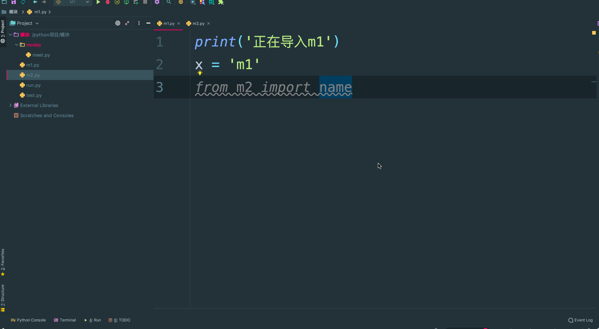

### **一. py文件的两种功能**

编写好的一个python文件可以有两种用途：
   一：脚本，一个文件就是整个程序，用来被执行（比如你之前写的模拟博客园登录那个作业等）
   二：模块，文件中存放着一堆功能，用来被导入使用
​
python为我们内置了全局变量\_\_name\_\_，
当文件被当做脚本执行时：\_\_name\_\_ 等于'\_\_main\_\_'
当文件被当做模块导入时：\_\_name\_\_等于模块名
​
作用：用来控制.py文件在不同的应用场景下执行不同的逻辑（或者是在模块文件中测试代码）

```
if __name__ == '__main__':
```

```python
print('from the meet.py')

__all__ = ['name', 'read1',]

name = '郭宝元'

def read1():
   print('meet模块：',name)

def read2():
   print('meet模块')
   read1()

def change():
   global name
   name = '宝浪'
   
if __name__ == '__main__':  
   # 在模块文件中测试read1()函数
   # 此模块被导入时 __name__ == meet 所以不执行
   read1()
```

### **二. 模块的搜索路径**

当你引用一个模块时，不见得每次都可以import到：

当咱们导入同一个目录下的模块的时候就能够使用import成功,不是同一个目录下的导入就会报错



上面的示例可以得知，引用模块也是按照一定规则进行引用的。

​    Python中引用模块是按照一定的规则以及顺序去寻找的，这个查询顺序为：先从内存中已经加载的模块进行寻找找不到再从内置模块中寻找，内置模块如果也没有，最后去sys.path中路径包含的模块中寻找。它只会按照这个顺序从这些指定的地方去寻找，如果最终都没有找到，那么就会报错。

​    **内存中已经加载的模块->内置模块->sys.path路径中包含的模块**

**模块的查找顺序**

1. 在第一次导入某个模块时（比如meet），会先检查该模块是否已经被加载到内存中（当前执行文件的名称空间对应的内存），如果有则直接引用（ps：python解释器在启动时会自动加载一些模块到内存中，可以使用sys.modules查看）
2. 如果没有，解释器则会查找同名的内置模块
3. 如果还没有找到就从sys.path给出的目录列表中依次寻找meet.py文件。

**需要特别注意的是：我们自定义的模块名不应该与系统内置模块重名。虽然每次都说，但是仍然会有人不停的犯错**

```python
#在初始化后，python程序可以修改sys.path,路径放到前面的优先于标准库被加载。
​
> > > import sys
> > > sys.path.append('/a/b/c/d')
> > > sys.path.insert(0,'/x/y/z') #排在前的目录，优先被搜索
> > > 注意：搜索时按照sys.path中从左到右的顺序查找，位于前的优先被查找，sys.path中还可能包含.zip归档文件和.egg文件，python会把.zip归档文件当成一个目录去处理，
​
#首先制作归档文件：zip module.zip foo.py bar.py 
import sys
sys.path.append('module.zip')
import foo,bar
​
#也可以使用zip中目录结构的具体位置
sys.path.append('module.zip/lib/python')
​
#windows下的路径不加r开头，会语法错误
sys.path.insert(0,r'C:\Users\Administrator\PycharmProjects\a')
​
#至于.egg文件是由setuptools创建的包，这是按照第三方python库和扩展时使用的一种常见格式，.egg文件实际上只是添加了额外元数据(如版本号，依赖项等)的.zip文件。
​
#需要强调的一点是：只能从.zip文件中导入.py，.pyc等文件。使用C编写的共享库和扩展块无法直接从.zip文件中加载（此时setuptools等打包系统有时能提供一种规避方法），且从.zip中加载文件不会创建.pyc或者.pyo文件，因此一定要事先创建他们，来避免加载模块是性能下降。
```

明天我们就开始讲解Python常用的内置模块，由于Python常用的模块非常多，我们不可能将所有的模块都讲完， 所以只针对于工作中经常用到模块进行讲解。剩下的模块可以在课余时间自学。

