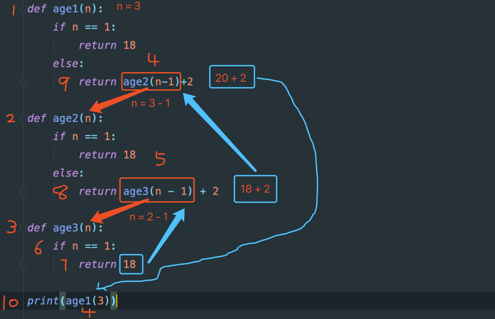

### 一.递归

什么是递归,我们通过名字先来分析一波,递类似于传递,我给你个东西你们一直向下传递,归就是将我给你们传递过去的东西,你们在传到我的手上.这是我们生活上递归

程序中的递归有点不太一样,程序中的递归就是不断调用自己本身

我们说到了调用,你们能想到什么??函数对吧,递归就是用函数实现的,我们来写一个递归

```python
def func():
    print(1)
    func()
func()
```

这个就是递归,你们肯定有人在写函数的时候碰到过这个问题,现在和大家说一下它为什么会报错,是因为这样一直执行下去的话就是一个死循环了,Python这个语言当初设定递归的时候就不是让大家这么用的,Python中使用递归要满足两个条件才是有意义的递归

- 不断的调用自己本身
- 有明确的终止条件

我们用一个例子来说一下递归,你们问我alex多大,我不告诉你alex多大,但是alex比wusir大2岁,你们问我wusir多大,我不告诉,但是wusir比我大两岁,你们我多大,我今年18岁.你们现在知道alex多大吗?我们就可以画个表来推算alex多大.

| 1     | alex        | 18+2+2   |
| :---- | ----------- | -------- |
| **2** | **wusir**   | **18+2** |
| **3** | **baoyuan** | **18**   |

Alex22岁是咱们人计算的,用程序怎么来计算呢?

```python
def age(n):
    if n == 1:
        return 18
    else:
        return age(n-1)+2
print(age(3))
```

我们想知道alex多大,一共问了三次,age(3)就是咱们询问的次数,if n==1 这是一个结束条件,是因为最后一次我告诉你们我多大了,知道我多大了就需要计算wusir多大,知道wusir多大就需要计算alex多大.在问的时候就是递一共递了3次,知道我18岁的时候要就wusir和alex多大的时候就是归.

到现在为止你们还是不太明白这个是怎么实现的,我们来对递归进行一个拆解

```python
def age1(n):
    if n == 1:
        return 18
    else:
        return age2(n-1)+2

def age2(n):
    if n == 1:
        return 18
    else:
        return age3(n - 1) + 2

def age3(n):
    if n == 1:
        return 18

print(age1(3))
```

看着还是很迷糊,莫慌看以上代码的执行流程图:



图中红色箭头是递的过程,蓝色箭头是归的过程

这个你们大家自己敲一下,体会体会

递归什么时候使用呢?我们之前做了一道题,

li = [1, 3, 4, "alex", [3, 7, 8, "TaiBai"], 5, "RiTiAn"]

这个还有印象吗,我们稍微改改需求

```python
li = [1, 3, 4, "alex", [3, 7, 8, "TaiBai"], 5, "RiTiAn",[4,5,6,[7,[11,12,34,5],10,8,9]]]
```

将以上列表中的每个元素打印出来,我们之前比较少使用的for实现,使用for它有点不兼容,我们现在使用递归实现一下

```python
def func(lst):
    for i in lst:
        if type(i) == list:
            func(i)
        else:
            print(i)
func(li)
```

```python
li = [1, 3, 4, "alex", [3, 7, 8, "TaiBai"], 5, "RiTiAn",[4,5,6,[7,[11,12,34,["alex","wusir","baoyuan"],5],10,8,9]]]
```

我们将结构修改成这样的,用刚刚写的代码也能实现.


