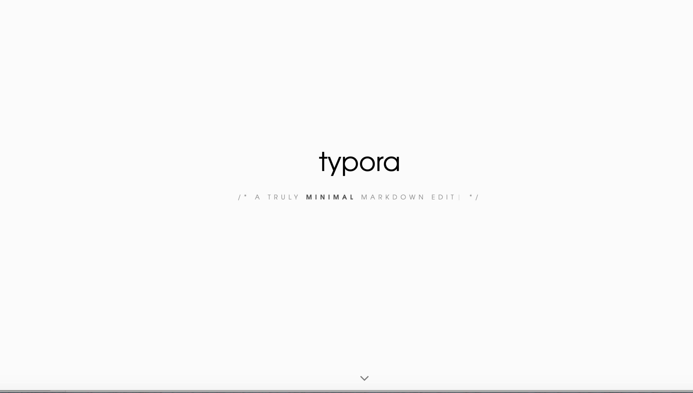
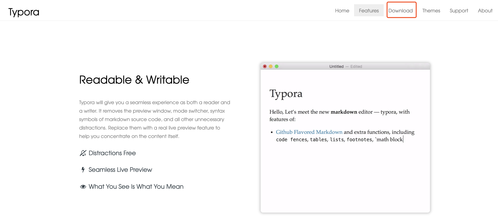
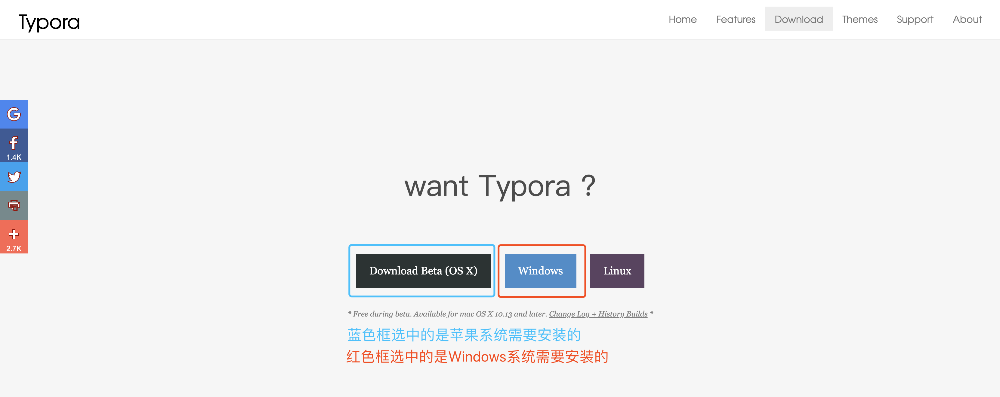
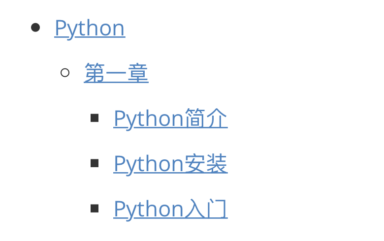
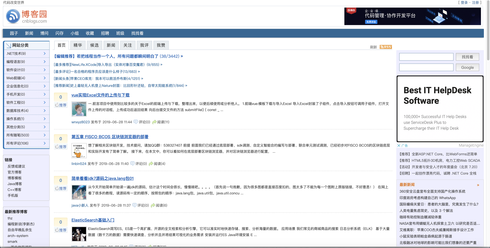
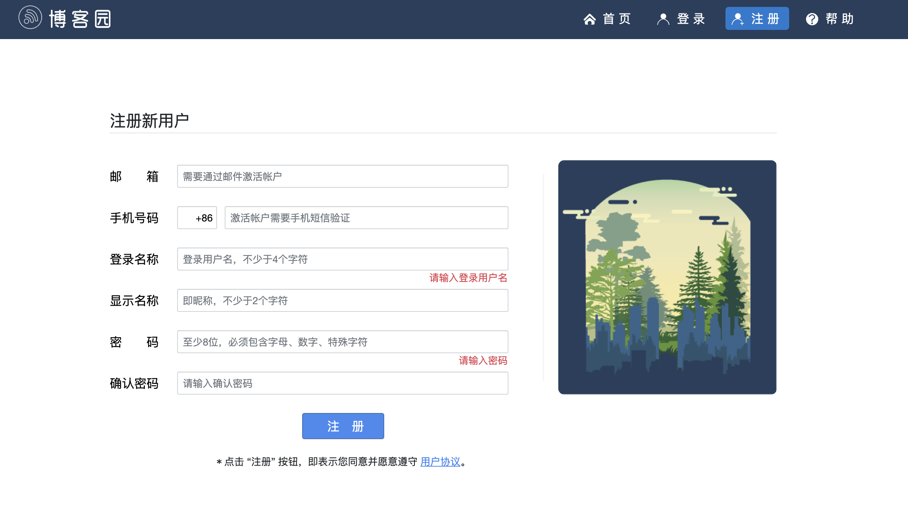

## 一.Typro安装

今天我们先不讲解Python的知识，我们用三天的时间讲解一下程序员必备的软件和使用。

我们在之前的时候记录笔记就是使用word和记事本，从今天开始我们要更换软件，记录笔记使用Typro软件，我们就先对这个软件进行安装

https://typora.io/ 点击左侧进行下载

找到页面中的 `Download` 进行下载，如下图：



点击下边的箭头，效果如下图：



找到图中的 `Download` 点击,效果图如下：



接下来我们下一步下一步的安装

安装完成之后，我们现在学习一下怎么使用

Typora 内部使用的是当下最流行的语法Markdown，我们为什么要学习一个新的东西，之前的也行吗？ 之前的你写普通的文档是没有问题，咱们是程序员，程序员不仅要会写代码，我们每次写的代码都需要写一个README文件，这个文件是说明你的程序使用了什么，用户怎样运行等等。这个README就是要使用Markdown的语法

## 二.Markdown语法

''' # 一级标题 '''

''' ## 二级标题 '''

''' ### 三级标题 '''

''' #### 四级标题 '''

''' ##### 五级标题 '''

''' **文字加粗**  '''

''' *你好*  斜体 '''

''' 转义 \''' 

标题这个部分我们一般都是用到五级标题,有的时候我们需要列一些内容,就需要使用到序号,我们看看序号怎么使用

''' 1.+ Tab键 ''' 这样就是一个有序序号,当编辑完这一行的时候换行后序号自动增加

刚刚我们说的是有序的序号,现在来看看无序的序号

''' - + Tab键 ''' 这样就是一个无序序号

如果我们想要在某一行的下面继续写内容,如图:



就按下键盘的Tab键,然后继续编辑,说我编辑完了,想要回到第一章同级的位置找到键盘的Tab和Shift键同时按下,或者多按几次回车

我们是程序员,记录的笔记中不可能全是文字,一定会有代码,代码直接粘贴到这里不易查看,我们学习一下怎么存放代码

''' ```python ''' 然后回车的时候就出现一下的内容

```python
存放代码块
```

我们直接在里边写代码就行了

现在我们知道了怎么编写文字,怎么编写代码,但是这两个完全不能满足我们的需求啊,我先弄个图片怎么办啊,很是简单图片我们直接粘贴过来就行了,但是有个需要注意的地方,我们设置一下图片都存在哪个地方,这样方便我们查找.

设置完图片的存放位置,我们有时候需要写一个表格来记录一些内容, …….

我们现在已经知道以上的方法了,我们需要做一个最重要的设置,自动保存 如果不自动保存,我们写了好久的内容突然间软件闪退了 真心是欲哭无泪啊

Typora这个软件的强大之处不仅仅能够写内容还可以导出pdf,word等格式

这个软件我就学习完毕了, 以后我们课程的笔记都必须使用这个软件来记录

## 三.博客园使用

我们讲解完本地的笔记怎么编写,后我们现在讲解一下线上的笔记怎么记录,有人肯定会有疑问 不是都说了本地的编写了吗?怎么还要写线上的笔记啊,要知道我们都是技术人员,搞技术的人员都是要有一个技术博客,并且在后期面试的时候有的公司会查看我们的技术博客,这个大家一定要有

我现在带领大家来开通一下 点击 http://cnblogs.com 内容如下图:



找到右上角的注册,接下来的页面如下图:



然后注册就可以了.剩下的就是登陆,登录后我们来创建一个内容,随笔是对外可见的,文章是自己和你给别人链接才能访问的,我建议你们写成随笔 这样别人就能搜到咱们写的内容.

## 四.Notepad++安装

我们在安装一下这个软件,安装这个软件是给咱们写脚本的时候使用,如果用计算机中的记事本创建会有问题,避免你们出现未知的问题,咱们使用notepad++

苹果系统访问 http://www.mediafire.com/file/clb0cdmamc5pkt4/Notepad.v6.5.3.dmg 这个网站进行下载.

Windows系统访问 https://notepad-plus-plus.org/download/v7.7.1.html 这个网站进行下载

然后就下一步下一步进行安装.

