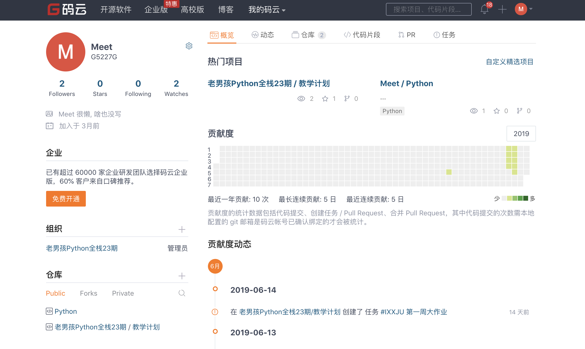
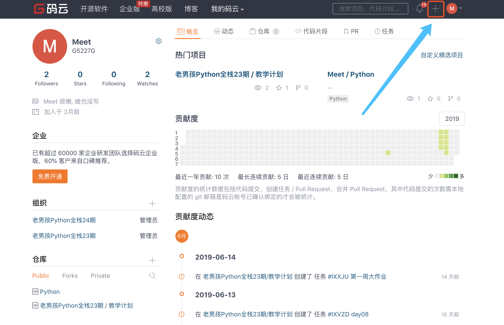
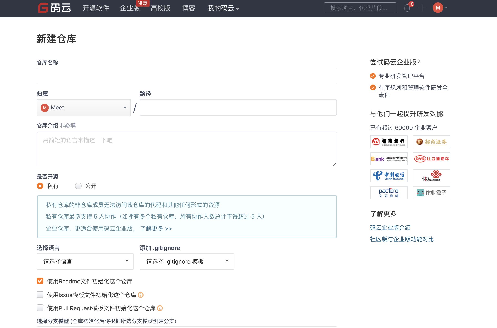
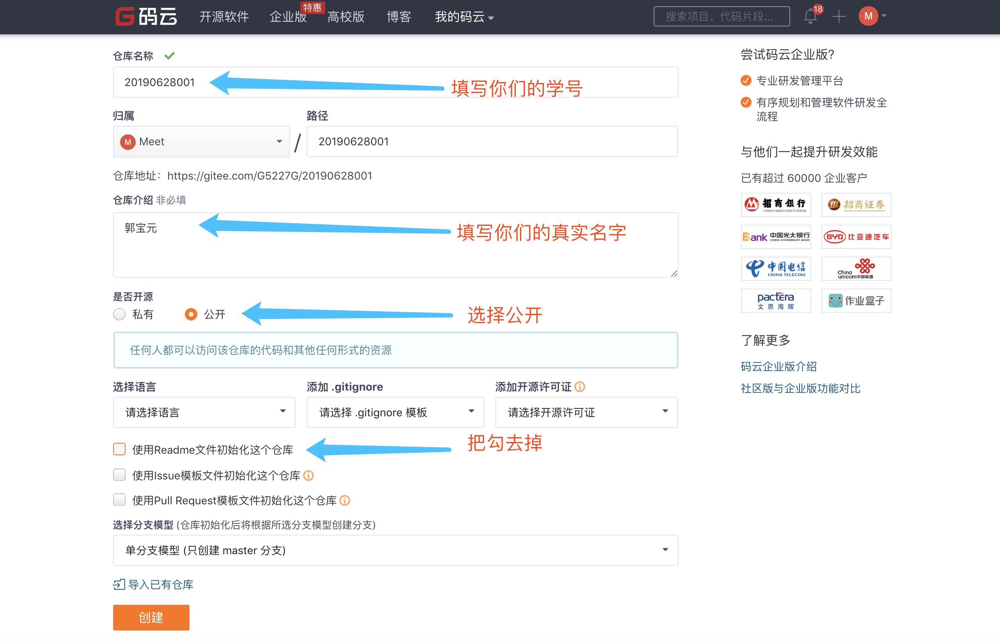
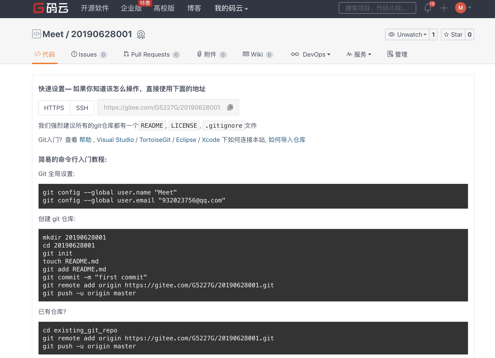

## 一.码云及Git的使用

这个码云和git咱们现在就是简单的讲解,因为在公司中我们开发是协同开发 会频繁使用git,我们从开始就使用不至于上班的时候那么生疏.

现在和大家说说什么是码云?什么又是git?

大家现在都有百度网盘吧,百度网盘是不是就是咱们的一种远程仓库,存放一些小说,音频,片什么的. 我们学习的码云就是一个远程管理的仓库类似于百度网盘. 我们现在想要从百度网盘中上传写内容怎么上传是不是直接点击上传就可以了,下载也是直接点击下载.但是我们现在已经迈入程序员的道路上,我们上传和下载的时候就要用一种装B的方式了,也就是git工具

我们现在使用码云和git干什么呢?? 我每天会把作业上传到码云,你们需要将你们写的作业也上传到码云中,并且还要进行评论.我们每天早上都会查看,你们评论的内容可以写哪道题是不会写,今天学的知识中那些是没有听懂的,我们会针对这些问题给大家进行讲解.你们上传的作业我们会进行查看.

现在我们大家一起访问 https://gitee.com/ 这个地址然后进行注册

有的的就不需要注册了,注册完后我们一定要把账号和密码牢牢的记住

这是登录后的页面,因为我使用过会有内容,你们没有使用过没有内容很正常

然后我们找到右上角的➕

然后选择新建仓库,点击后的效果如下图:

然后进行如下操作:

再三确认没有问题后点击创建

**到了这个页面不要进行任何操作,页面一定不要关闭**

我们现在安装我们的git工具

- Widows系统:
- 苹果系统:
- 

https://gitee.com/organizations/laonanhaipythonquanzhan24qi/invite?invite=fc911cbc286616bd1fae0a3397dbfa02b8fdf60005169706fa1a78571b3930f7d6631b079b611080383038e943f171de